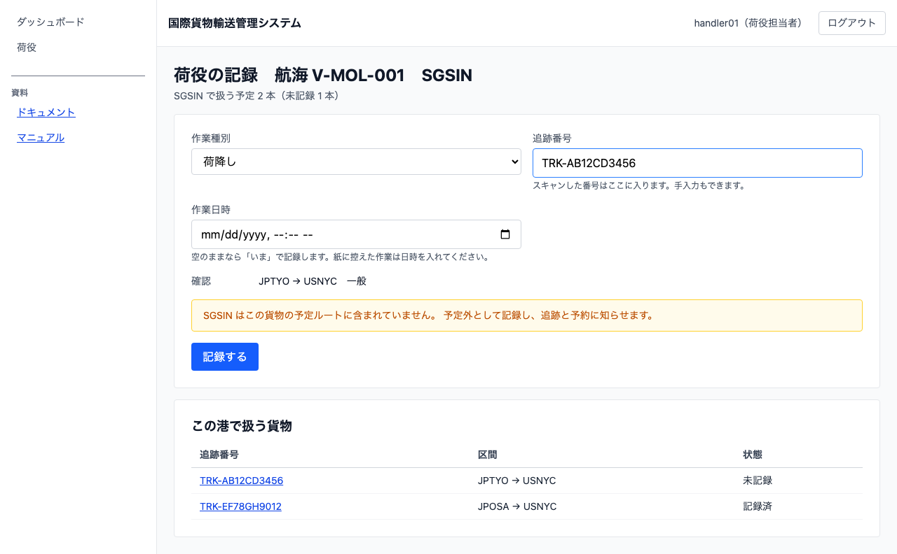
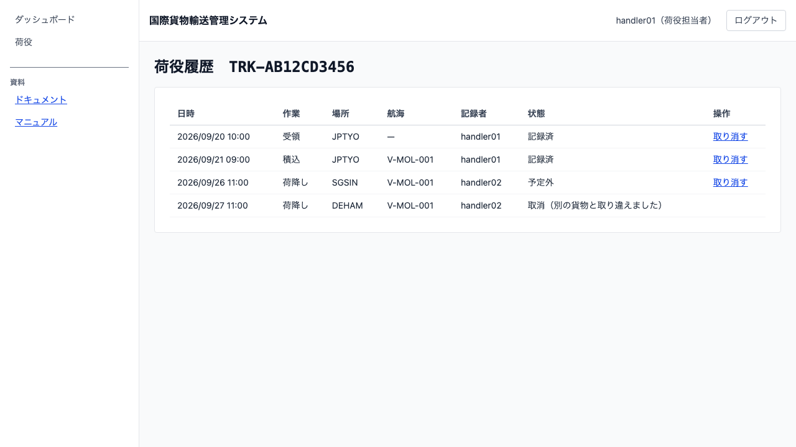

# 13 荷役作業を記録する

## この章でできること

荷役作業員が、港で行った作業（受領・積込・荷降し）を記録します。記録すると貨物の状態が自動で進み、荷主と追跡担当者がその場で読めるようになります。

**1 隻から続けて記録できます。** 航海と港を選ぶと、**その船がその港で扱う貨物**が並びます（積む港でも降ろす港でも出ます）。1 本記録するたびに種別と場所は残るので、貨物の番号だけを入れ替えていきます。

## 記録する（荷役作業員）

1. ダッシュボードの「作業のある航海」から、航海と港を選びます
2. 「荷役の記録」の画面が開きます

   

3. 「作業種別」を選びます（この航海では変えないことがほとんどです）
4. 「追跡番号」にスキャンした番号が入ります。手で入力もできます
5. 「確認」に区間と貨物種別が出るので、その貨物で合っているか確かめます
6. 紙に控えた作業を入れるときは「作業日時」に日時を入れます（空のままなら「いま」）
7. `[記録する]` を押します
8. 貨物の欄だけが空になります。次の貨物に移ってください

**種別と場所は残ります。** 同じ港で続けて記録するので、毎回選び直さずに済みます。

**画面の下に「この港で扱う貨物」が並びます。** 記録するとその行が「記録済」に変わるので、**残り何本か**が分かります。追跡番号を押すと、その貨物の荷役履歴が開きます。

**送信を待ちません。** 押すとすぐ次に移れます。反映は追いかけて行われます。

**同じ番号を二度送っても二重になりません。** 電波が届かず送り直したときのための仕掛けが入っています。

## 予定にない港で作業したとき

「◯◯ はこの貨物の予定ルートに含まれていません」と、**記録する前に**出ます。

**記録は止まりません。** 現場ではすでに作業が終わっているので、記録できないと事実が失われます。**予定外として残し、追跡と予約に知らせます。** 経路設計者がその貨物を組み直します。

## 記録を取り消す（荷役作業員）

取り違えて記録したときは、荷役履歴から取り消します。

1. 記録した貨物の追跡番号を押して、荷役履歴を開きます
2. 取り消したい行の `[取り消す]` を押します
3. 「取り消す理由」を書きます（**理由がないと送れません**）
4. `[取り消しを確定する]` を押します

**元の記録は消えません。** 取り消した印と理由が残ります。現場で起きたことを後から無かったことにはしないためです。取り消すと、その貨物は「未記録」に戻ります。

**取り消せるのは記録した現場です。** 追跡担当者は履歴を読めますが、取り消しはできません——何を取り違えたのかは、記録した人でないと分からないためです。

**一度取り消した記録は、二度は取り消せません。** `[取り消す]` はその行から消えます。

## 履歴を見る（荷役作業員・追跡担当者）

1. サイドナビの「荷役」を押します
2. 「追跡番号」を入れて `[履歴を見る]` を押します

   

3. その貨物の作業が起きた順に並びます

**取り消した記録も出ます。** 消えていると、現場で何が起きたのかを突き合わせられません。

## うまくいかないとき

### 「この追跡番号の貨物が見つかりません」と出る

番号をお確かめください。追跡番号は予約が確定して発行されたあとに使えます。まだ発行されていない貨物は記録できません。

### 「港を選んでください」と出る

航海だけでは、その船がどの港で積み降ろすかが決まりません。ダッシュボードから航海と港を選んで開き直してください。

### 「作業日時に未来は指定できません」と出る

まだ起きていない作業は記録できません。**過去の日時は入れられます**——通信が届かない場所で紙に控えて、後から入れる使い方のためです。

### 「同じ貨物の◯◯が 5 分以内に記録されています」と出る

読取機が二度読んだか、ほかの人が同じ貨物をすでに記録しています。**履歴を確かめてください。** 取り違えでなければ、前の記録を取り消してから記録し直します。

### 「引取は荷受人の確認と通関の検査が要るため、まだ記録できません」と出る

引取（荷受人への引き渡し）は、荷受人の確認と通関済みの検査が要ります。**その検査はまだ作られていません。** 引取の記録は次のイテレーションで使えるようになります。

### 記録したのに貨物の状態が変わらない

反映は数秒遅れます。しばらく待っても変わらないときは、**順序が飛んでいる**かもしれません（受領していない貨物の積込など）。荷役履歴を確かめてください。

## 関連する章

- [12 貨物の輸送状況を追う](12-貨物の輸送状況を追う.md)
- [11 予約を確定して追跡番号を発行する](11-予約を確定して追跡番号を発行する.md)
