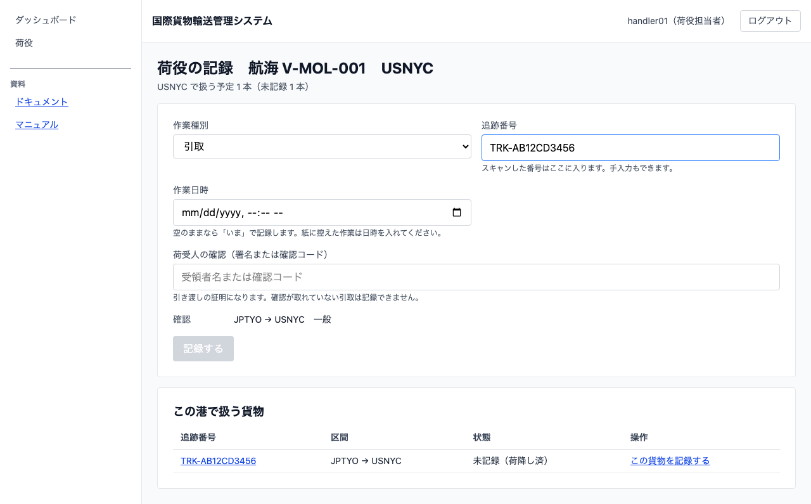
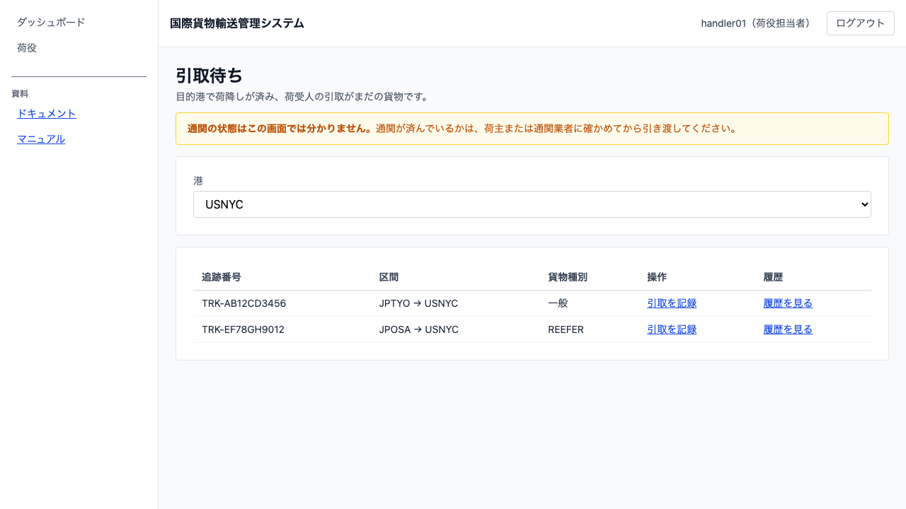
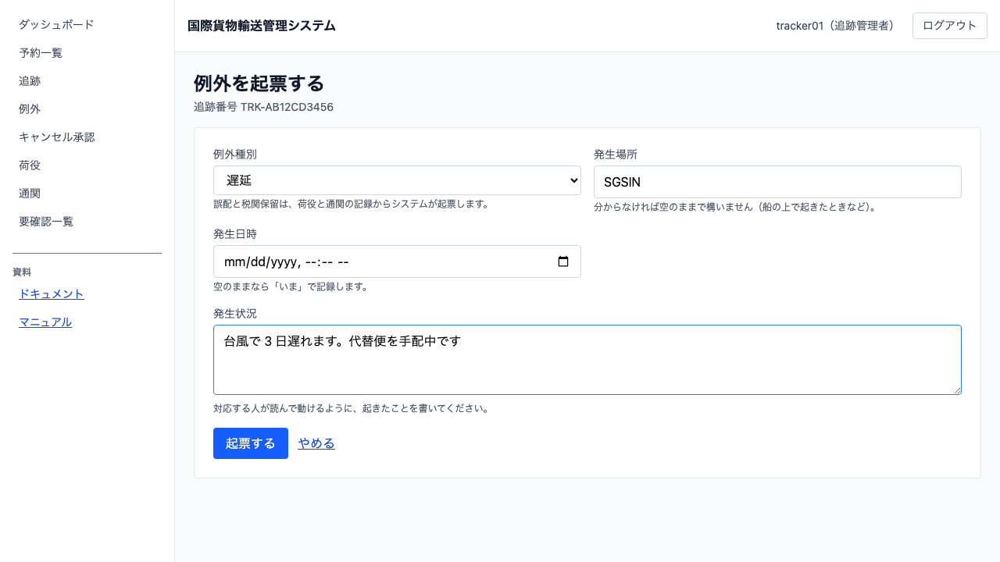
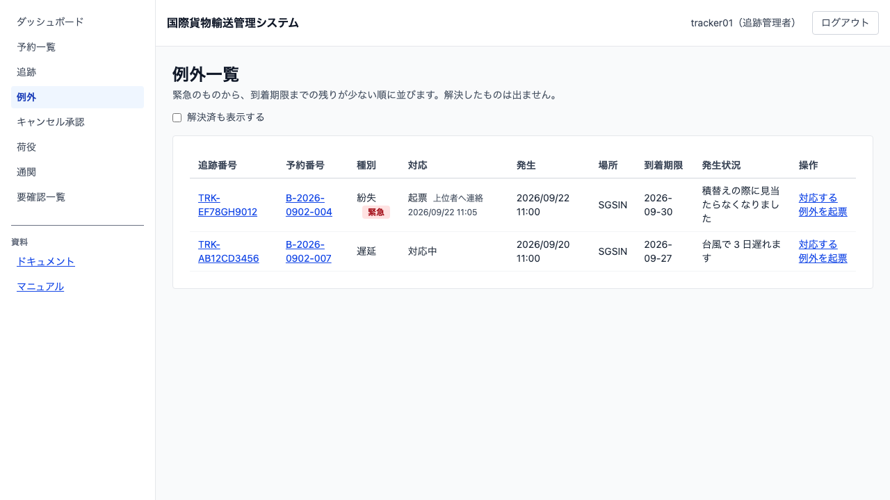

# 14 引取と例外を扱う

## この章でできること

- 荷役作業員が、荷受人の確認を取って**引取**を記録します。記録すると貨物が「引取済」になり、予約は「配送完了」に変わって精算が始まります
- 追跡担当者が、輸送中に起きた**例外**（遅延・破損・紛失）を起票し、対応して解決します。解決すると貨物の状態は**例外が起きる前に戻ります**
- 紛失のときは**緊急**として扱われ、管理者も例外一覧で気づけます

## 引取を記録する（荷役作業員）

引取は目的港で、荷受人に貨物を引き渡すときの作業です。**受け取った証明が要る**ので、ほかの作業と違って荷受人の確認を入れます。

**引取待ちの一覧から始めるのがいちばん早い道です**（次の節）。航海から入ることもできます。

1. ダッシュボードの「作業のある航海」から、航海と目的港を選びます
2. 「作業種別」で「引取」を選びます。「荷受人の確認（署名または確認コード）」の欄が出ます

   

3. 「追跡番号」を入れ、「確認」の区間で合っているか確かめます
4. 紙に控えた引取を後から入れるときは「作業日時」に日時を入れます（空のままなら「いま」）
5. 荷受人から受け取った署名または確認コードを「荷受人の確認」に入れます
6. `[記録する]` を押します

**確認を入れないと押せません。** 引取は貨物を「引取済」——精算の始まる状態——まで進め、そこからは戻せません。

**引取済になると、予約は「配送完了」になります。** 輸送の「引取済」と予約の「配送完了」は別の呼び名です。予約の画面で見ているのか輸送の画面で見ているのかを、呼び名で見分けられるようにしてあります。

### 引取待ちの貨物を探す

引取は船から降りたあとの作業なので、**どの航海の仕事でもありません。** 航海を選ぶ画面からは辿り着けないので、専用の一覧があります。

1. ダッシュボードの「引取待ちの貨物を見る」を押します（携帯電話では画面の下のタブ「引取待ち」）
2. 港を選びます。**港を選ぶまで一覧は出ません**——どの港に居るかが決まらないと、引取待ちの貨物を出せないためです

   

3. その港で荷降しが済み、まだ引き取られていない貨物が並びます
4. 荷受人が来た貨物の行で `[引取を記録]` を押すと、追跡番号が入った状態で引取の記録が開きます
5. あとは前の節の手順 5・6（荷受人の確認を入れて `[記録する]`）と同じです

**通関の状態はこの画面では分かりません。** 通関が済んでいるかは、荷主または通関業者に確かめてから引き渡してください（システムで通関を扱えるようになるのは後のイテレーションです）。

## 例外を起票する（追跡担当者）

輸送中に遅れや破損が起きたとき、その事実を記録します。記録すると貨物の状態が「例外発生」になり、対応が済むまで荷役では進まなくなります。

1. 追跡詳細（[12 章](12-貨物の輸送状況を追う.md)）を開きます
2. 「例外を起票する」を押します

   

3. 「例外種別」を選びます（遅延・破損・紛失）
4. 分かれば「発生場所」を入れます。**船の上で起きたときは空のままで構いません**。入れるときは港コード（英大文字 5 文字。例: `SGSIN`）で入れてください——「シンガポール港」のような書き方を許すと、同じ港が何通りにも増えて一覧の突き合わせが合わなくなります
5. 「発生状況」に、対応する人が読んで動ける内容を書きます
6. `[起票する]` を押します

**誤配と税関保留は選べません。** どちらも荷役と通関の記録からシステムが自動で起票します。手で選べるようにすると、起きていない誤配を記録できてしまいます。

**発生状況が空では起票できません。** 起票だけあって理由が無いと、対応する人は電話で聞き直すところから始めることになります。

## 例外に対応する（追跡担当者）

### 未解決の例外を見る

1. サイドナビの「例外」を押します

   

2. 未解決の例外が、**緊急のものから、到着期限までの残りが少ない順**に並びます
3. 「対応」の列が、その例外にもう手が付いているかを表します（「起票」＝まだ誰も着手していない、「対応中」＝担当が付いて荷主へ知らせた）
4. 追跡番号を押すと、その貨物の追跡詳細が開きます

**「到着期限」は、対応で新しい予定日を入れるとその日付に変わります。** 並び順もその日付で決まります。

**緊急は「紛失」だけです。** 遅れや破損は業務を続けられますが、見つからない貨物は探すこと自体が仕事になります。

**「予約番号」の列で、どの荷主の貨物かを照合できます。** 荷主からの電話は「A 社の予約の件で」から始まります。

**緊急なのに「未連絡」と出ている行は、上位者へまだ知らせていません。** 紛失を起票すると自動で知らせた記録が残るので、この印が出ているときは記録が届いていないということです。

**管理者もこの一覧を開けます。** 紛失が起きたことに気づくための入口で、起票や解決の操作は追跡担当者が行います（管理者の画面には操作のリンクが出ません）。

**既定では解決したものは出ません。** 決着したものが混ざると、一覧全体が「まだ手を入れる場所」に見えなくなります。**あとから確かめたいときは `[解決済も表示する]` にチェックを入れてください**——解決した例外は未解決のあとに並びます。誤配や破損の記録は、料金を調整するときの根拠になります。

**一覧の行から `[例外を起票]` を押せます。** 遅延の対応中に破損が見つかることはあり、そのとき追跡番号を書き写して探し直さずに済みます。

### 荷主へ知らせた記録を残す

**通知そのものは電話やメールで行います。** システムが送るのではなく、伝えた記録を残します。荷主から「聞いていない」と言われたときに突き合わせる材料になります。

1. 追跡詳細の「例外」の欄で `[荷主へ知らせた]` を押します
2. 「伝えた手段」（電話・メールなど）と「伝えた内容」を入れます
3. `[記録を残す]` を押します

### 対応を始める

1. `[対応を始める]` を押します
2. 「新しい到着予定日」と「対応方針」を入れます
3. `[対応の開始を記録する]` を押します

**対応の開始は飛ばせます。** 連絡したらもう着いていた、ということが現場にはあります。手順のためにボタンを 2 度押させると、記録が実態から遅れます。

### 解決する

1. `[解決にする]` を押します
2. 「対応内容」に、何をしたかを書きます
3. `[解決を確定する]` を押します

**解決しても例外は消えません。** 起きた事実は残り、あとで料金を調整するときの根拠になります。消えるのは「対応が要る」という状態だけです。

**貨物の状態は、例外が起きる前に戻ります。** 受領済で遅延が起きたなら受領済に戻ります。

**未解決の例外が残っているあいだは戻りません。** 遅延と破損が同時に起きているとき、遅延だけ解決しても「例外発生」のままです。1 件解決しただけで戻すと、まだ手を入れる場所が「正常」に見えてしまいます。

## うまくいかないとき

### 「引取には荷受人の確認（署名または確認コード）が必要です」と出る

作業種別で「引取」を選ぶと確認の欄が出ます。荷受人から受け取った署名または確認コードを入れてください。

### 「解決した例外は変更できません」と出る

その例外はすでに解決しています。**解決した記録は書き換えません。** 新しく起きたことなら、別の例外として起票してください。

### 「対応内容は必須です」と出る

何をしたかが読めない記録を残さないためです。代替便に振り替えた、荷主と再調整した、など具体的に書いてください。

### 「引き渡し済みの荷役は取り消せません」と出る

引取は精算と予約にも伝わっているため、取り消すには別の手続きが要ります。誤って記録した場合は、追跡担当者に連絡してください。

### 解決したのに貨物の状態が「例外発生」のまま

**ほかに未解決の例外が残っています。** 追跡詳細の「例外」の欄を確かめて、すべて解決してください。

### 例外を起票したのに一覧に出ない

反映は数秒遅れます。しばらく待っても出ないときは、起票したときの画面にエラーが出ていなかったか確かめてください。

## 関連する章

- [13 荷役作業を記録する](13-荷役作業を記録する.md)
- [12 貨物の輸送状況を追う](12-貨物の輸送状況を追う.md)
