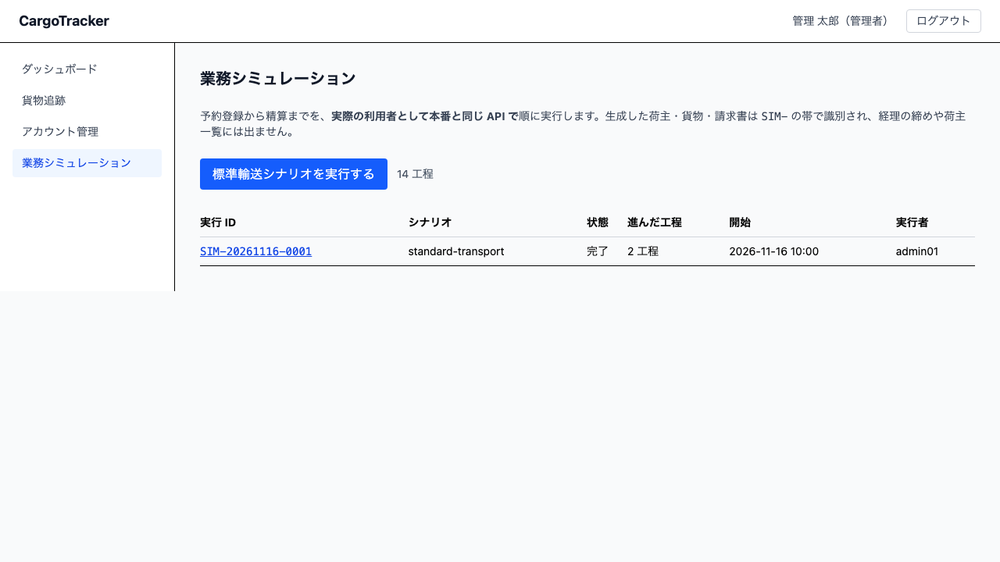
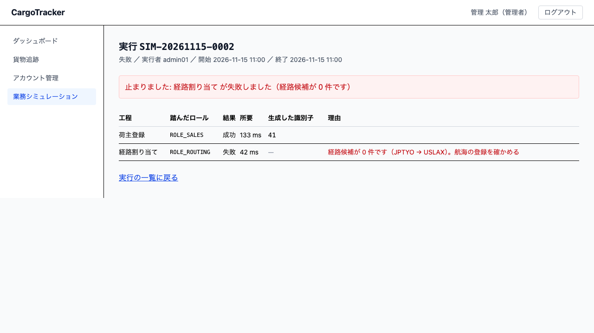

# 15 業務シミュレーション

**予約登録から精算まで**を自動で順に実行し、結果を工程ごとに確かめる画面です。
**システム管理者**が使います。

本章は [01 業務フロー](01-業務フロー.md#steps) の「業務シミュレーションを実行する」に
あたります。

## 画面の開き方

メニューの **[業務シミュレーション]** を押します。URL は `/admin/simulations` です。

> **この画面はシステム管理者だけが開けます。** 業務データを作る操作であり、
> 業務の担当者が誤って踏める場所には置いていません。

## 何のための画面か

予約から精算まで手で追うには、**5 つのロールでログインし直し、20 以上の画面を操作**します
（営業担当者・経路設計者・荷役作業員・追跡管理者・経理担当者の 14 工程）。
実演のたびに手順が揺れ、配備した直後に「どこが切れているか」を切り分ける手段もありません。

この画面から 1 回指示すると、同じ道のりを自動で通します。

> **実際の利用者として、本番と同じ API を通ります。** シミュレーション専用の書き込み経路は
> ありません。専用の経路を作ると、「シミュレーションは通るのに実際の操作は通らない」状態を
> 検出できなくなるためです。工程ごとに、その工程を踏む担当者としてログインし直します。

## 15.1 シナリオを実行する {#run}

### この画面でできること

定義済みのシナリオを選んで実行し、過去の実行を一覧します。

### 画面の説明

| 項目 | 説明 |
| :--- | :--- |
| シナリオ（選択） | 実行するシナリオを選びます。右に**そのシナリオの工程数**が出ます |
| 実行 ID | `SIM-` で始まる番号。押すと工程ごとの結果を見られます |
| シナリオ | 実行したシナリオ（標準輸送・遅延・破損・誤配・税関保留・輸送中キャンセル） |
| 状態 | 実行中・完了・失敗 |
| 進んだ工程 | 記録された工程の数 ／ 全工程の数（例: 14 / 14 工程） |
| 開始 | 実行を指示した日時 |
| 実行者 | 指示した利用者 |

### 操作の手順

1. **[シナリオ]** から実行するものを選びます（既定は標準輸送）
2. **[実行する]** を押します
3. 実行が終わると、一覧の先頭にその実行が現れます
4. 実行 ID を押すと、工程ごとの結果を確認できます（URL は `/admin/simulations/{実行 ID}`）

### 選べるシナリオ

| シナリオ | 何を通すか |
| :--- | :--- |
| 標準輸送 | 予約から精算まで（14 工程）。例外は起こしません |
| 遅延 | 予定より遅い日時で荷降しを記録し、起きた遅延を解決してから精算まで通します |
| 破損 | 荷役中に破損を起票し、追跡管理者が解決してから精算まで通します |
| 誤配 | **予定と違う港で荷降しを記録**します。誤配が検知されたあと、**その港から目的地へ向かう航海を登録**し、現在地から経路を組み直して輸送を再開します |
| 税関保留 | 通関を保留にし、解除してから引取・精算まで通します |
| 輸送中キャンセル | 輸送中にキャンセルを申請し、追跡管理者が承認します。**引取と精算は行いません**（キャンセルした貨物は引き取れないためです） |

> **例外は専用の操作では起こしません。** 誤配は「予定と違う港での荷役記録」、
> 遅延は「予定より遅い日時での記録」——**実際に起きる操作をそのまま行います**。
> 専用の入口を用意すると、実際の業務では検知されない状態を「通った」と読んでしまいます。
>
> **実行は選んだシナリオの工程を順に行い、終わるまで画面はそのまま待ちます。**
> 工程ごとにログインし直して業務 API を呼ぶため、通常は 10 秒前後かかります。
> 途中で画面を離れても実行は続きます。戻ってきたら一覧を再読み込みしてください。

> **二重実行を指示すると、こう出ます。**
>
> > 実行を開始できませんでした。同じシナリオが実行中です: SIM-20261116-0001
> > [実行中の SIM-20261116-0001 を見る]
>
> リンクを押すと、いま動いている実行の結果を確認できます。

> **同じシナリオを二重に実行することはできません。** 実行中に指示すると断られ、
> **実行中の実行への案内**が出ます。押すとその実行の結果を確認できます。

> **本番環境では実行できません。** 実行を許す設定になっていると、そもそも
> アプリケーションが起動しません。設定の読み違いで本番に架空の輸送が生まれることを
> 防ぐためです。

## 15.2 工程ごとの結果を確認する {#detail}

### この画面でできること

どの工程まで進んだか、どこで止まったか、何が生成されたかを確認します。

### 画面の説明

| 項目 | 説明 |
| :--- | :--- |
| （表の上の赤い帯） | 実行が止まったときだけ出ます。「止まりました: 〈理由〉」の形で、最初に読む場所です |
| 工程 | 予約登録・経路割り当てなど、業務の工程名 |
| 踏んだロール | その工程を実行した担当者のロール |
| 結果 | 成功・失敗 |
| 所要 | その工程にかかった時間（ミリ秒） |
| 生成した識別子 | 番号の左に**何番号か**が付きます。**追跡番号は押すと照会画面へ移ります**。右の「コピー」で番号をそのまま写せます |
| 理由 | 止まった理由。「失敗しました」だけにしません |

> **途中で失敗しても、それまでに作られたデータは消しません。** どこまで通ったかが
> 分からなくなるためです。失敗した工程より後ろは実行しません。
>
> **番号は「コピー」から写してください。** この画面を開けるのはシステム管理者だけで、
> 予約詳細や精算書は営業・経理にしか開かれていません。番号を確かめたあとは
> **担当者に伝える**ことになるため、手で書き写すと写し間違いが相手の作業を止めます。

## シミュレーションが作ったデータ

シミュレーションが作る荷主は、荷主コードが **`SIM-`** で始まります。

| 一覧 | 出るか |
| :--- | :--- |
| 荷主一覧（営業担当者） | **出ません** |
| 精算の締め対象（経理担当者） | **出ません** |
| 未解決の例外（追跡管理者） | **出ません**。件数にも一覧にも入らないため、追跡管理者への一報は不要です |
| 航海一覧（経路設計者） | 出ます。航海番号が `V-SIM-` で始まります |

> **航海と例外は今のところ見えます。** 航海はシミュレーションが割り当てる相手そのもので、
> 隠すと経路候補にも出なくなるためです。名前で見分けられるようにしています。

## 15.3 継続実行を回す {#continuous}

### この画面でできること

バックエンドが乱数でシナリオと入力を選び、一定間隔で実行し続けます。
複数の予約が並行して進む、実運用に近い状態を作るためのものです。

### 操作の手順

1. **[継続実行]** の欄で、必要なら **[種（省略可）]** に数値を入れます
2. **[継続実行を開始する]** を押します
3. 動いているあいだは、セッション・状態・**種**・設定が表示されます
4. 止めるときは **[停止する]** を押します

> **種は必ず記録されます。** 省略した場合はシステムが作り、画面に表示します。
> **落ちた実行を追うときは、この種を控えてください**——同じ種を指定して開始すると、
> 同じシナリオの並びが再現されます。
>
> **「停止する」で止まるのは新しい実行だけです。** 進行中の実行は最後まで走り、
> そのあいだ状態は **停止処理中** と表示されます。途中で止めると業務データが
> 中途半端な状態で残るためです。進行中が尽きると **停止済み** に変わります。
>
> **種で再現できるのは「何を試みたか」までです。** そのとき業務データがどうなって
> いたか（航海が登録済みか、通関が滞留しているか）までは再現しません。
> 落ちた実行を追うときは、種に加えて**実行 ID と工程の記録**を併せて読んでください。

### 統計の説明

| 項目 | 説明 |
| :--- | :--- |
| 実行件数 | 直近の実行の数 |
| 成功 ／ 失敗 ／ 実行中 | 状態ごとの内訳 |
| 失敗した工程 | **どの工程で落ちているか**の分布（多い順）。件数だけでは直す場所が決まりません |

> **業務は止まりません。** 継続実行の負荷はシミュレーション専用のスレッドで
> 捌かれ、ヘルスチェックと実利用者の操作には掛かりません。同時に走る本数にも
> 上限があり、設定できる上限そのものにも上限を置いています。
