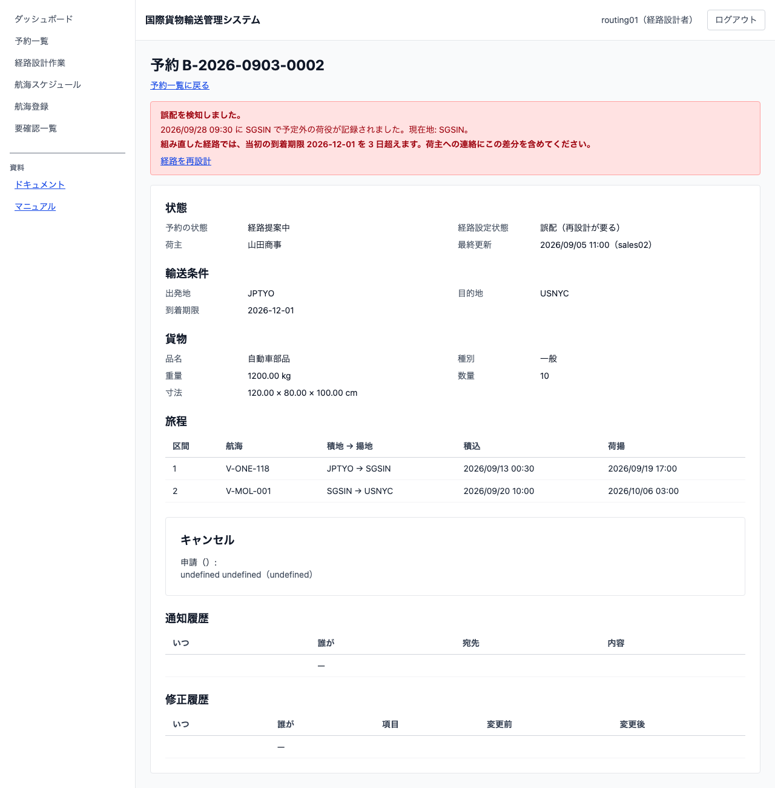
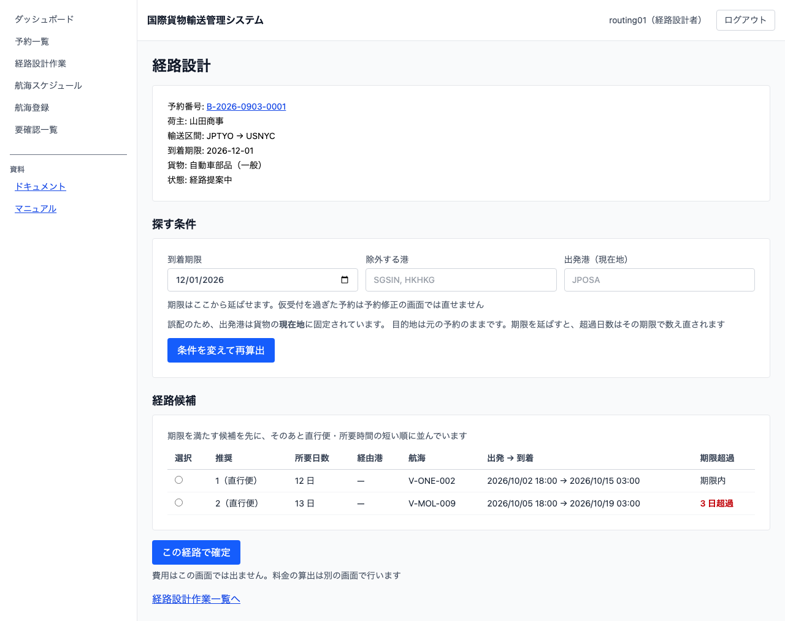

# 15 誤配を検知して経路を組み直す

## この章でできること

- 荷役作業員が、**予定と違う港で荷役を記録しようとしたときに警告で気づきます**（記録そのものは止めません）
- 記録すると、その貨物は「誤配」になり、**例外が自動で起票されます**
- 経路設計者が、**貨物のいまいる港を出発地として**経路を組み直します
- 組み直した経路が当初の期限に間に合わないときは、**何日遅れるかが画面に出ます**

## 誤配はなぜ急ぐのか

誤配は、発見が遅れるほど納期の遅れと輸送費が膨らみます。**その場で気づいて組み直せること**が被害をいちばん小さくします。だからこの章の仕組みは、荷役の現場（気づく）と経路設計（組み直す）の 2 つの持ち場にまたがります。

## 予定外の荷役に気づく（荷役作業員）

1. いつもどおり荷役を記録します（[13 章](13-荷役作業を記録する.md)）
2. 場所を選んだ直後に、その貨物の予定ルートと突き合わせます
3. 予定に無い港なら、**記録ボタンを押す前に**警告が出ます

**警告が出ても記録は止めません。** 実際にその港で作業したのは事実で、記録できないと現場の作業が止まります。止めるのではなく「予定外である」と伝えて、追跡と予約に知らせます。

**取り違えに気づいたら、記録せずにやり直してください。** 追跡番号を読み間違えていることがあります。

## 誤配になったあと

記録すると、次のことが自動で起きます。

| どこで | 何が起きるか |
| :--- | :--- |
| 予約（[5 章](05-貨物予約を登録する.md)の予約詳細） | 経路が「誤配（再設計が要る）」になり、警告バナーが出る |
| 輸送（[12 章](12-貨物の輸送状況を追う.md)の追跡詳細） | 状態が「誤配」になり、続けて「例外発生」になる |
| 例外一覧（[14 章](14-引取と例外を扱う.md)） | 種別「誤配」の例外が並ぶ |

**誤配の例外は手で起票できません。** 荷役の記録から自動で起票されます。手で選べるようにすると、起きていない誤配を記録でき、経路設計者はそれを組み直そうとしてしまいます。

## 予約詳細で状況を読む（営業・経路設計者）

予約詳細を開くと、いちばん上に赤い警告が出ます。

- **いつ・どこで**予定外の荷役が記録されたか
- 貨物の**現在地**
- 組み直したあとに期限を超えるなら、**何日超えるか**

**「経路を再設計」は経路設計者にだけ出ます。** ほかの担当には「経路設計者に再設計を依頼済みです」と出ます。押せない操作を並べると、その画面でできることが読めなくなるためです。

## 経路を組み直す（経路設計者）

1. 予約詳細（または追跡詳細）の `[経路を再設計]` を押します
2. 経路設計ワークベンチが開きます。「探す条件」の**「出発港（現在地）」に貨物のいまいる港が入り、書き換えられません**——予定ルートを外れた貨物は、もう出発地にはいません
3. **目的地は元の予約のまま**です。組み直しても「どこへ」は変わりません。**到着期限はここから延ばせます**（荷主と合意できた場合）。延ばすと、次の手順の超過日数はその期限で数え直されます
4. 候補の一覧に「**期限超過**」の列が出ます

   

   - 「期限内」＝当初の期限に間に合います
   - 「3 日超過」＝当初の期限を 3 日超えます

5. 候補を 1 つ選んで `[この経路で確定]` を押します
6. 期限を超える候補を選んだときは、**超過日数を再掲した確認**が出ます。`[超過を承知で確定する]` を押すと確定します。押す前に、超過日数が荷主へ伝える数字と合っているか確かめてください

**期限に間に合わない候補も出します。** 現在地からでは間に合わないのが普通で、間に合う候補だけを出すと**一覧が 0 件になって貨物が動かせなくなります**。判断できる材料（何日遅れるか）を添えて、選ぶのは人に任せます。

**並びは「期限を満たす候補が先」です。** 超過は業務上の妥協であって、進んで選ぶものではありません。そのあとは直行便・所要時間の短い順です。

## 荷主へ伝える

確定したあと、予約詳細に「当初の到着期限を N 日超えます」と出ます。**この差分を荷主への連絡に必ず含めてください。** 誤配でいちばん困るのは、間に合わないことに誰も気づけないまま船が動くことです。

通知そのものは電話やメールで行い、伝えた記録は予約詳細の通知履歴に残します（[10 章](10-荷主に経路を通知する.md)）。

## 誤配の例外を解決する（追跡担当者）

組み直しが済んだら、例外一覧から誤配の例外を解決します。手順は[14 章](14-引取と例外を扱う.md)の「解決する」と同じです。

**解決しても誤配の記録は消えません。** あとで料金を調整するときの根拠になります。例外一覧で `[解決済も表示する]` にチェックを入れると読めます。

**例外の対応中に届いた荷役は、解決したあとにまとめて反映されます。** 組み直した経路で船が動き出していても、記録が失われることはありません。

## うまくいかないとき

### 予定外の警告が出ない

貨物の予定ルート（旅程）がまだ確定していない可能性があります。経路が決まっていない貨物には、比べる予定がありません。

### `[経路を再設計]` が出ない

経路設計者の権限が要ります。ほかの担当には「経路設計者に再設計を依頼済みです」と出ます。

### 出発港を別の港に変えたい

**誤配の再設計では変えられません。** 貨物がいまいる港からしか船に載せられないためです。別の港から出したいときは、まずその港まで運ぶ手配（陸送など）を行い、到着してから荷役を記録してください。記録すると現在地が変わります。

### 誤配のバナーがいつ消えるのか

**経路を組み直しただけでは消えません。** 貨物はまだ予定外の港にいるためです。**新しい経路で最初の荷役（積み込みまたは荷降し）を記録した時点**で、追跡詳細のバナーが消えます。予約詳細のバナーは、経路を確定した時点で消えます。

### 候補が 1 件も出ない

現在地からその目的地へ行く航海が登録されていない可能性があります。航海スケジュール（[7 章](07-航海スケジュールを登録する.md)）を確かめてください。**期限が理由で 0 件になることはありません**——再設計では期限を超える候補も出します。

## 関連する章

- [13 荷役作業を記録する](13-荷役作業を記録する.md)
- [14 引取と例外を扱う](14-引取と例外を扱う.md)
- [9 経路を設計する](09-経路を設計する.md)
