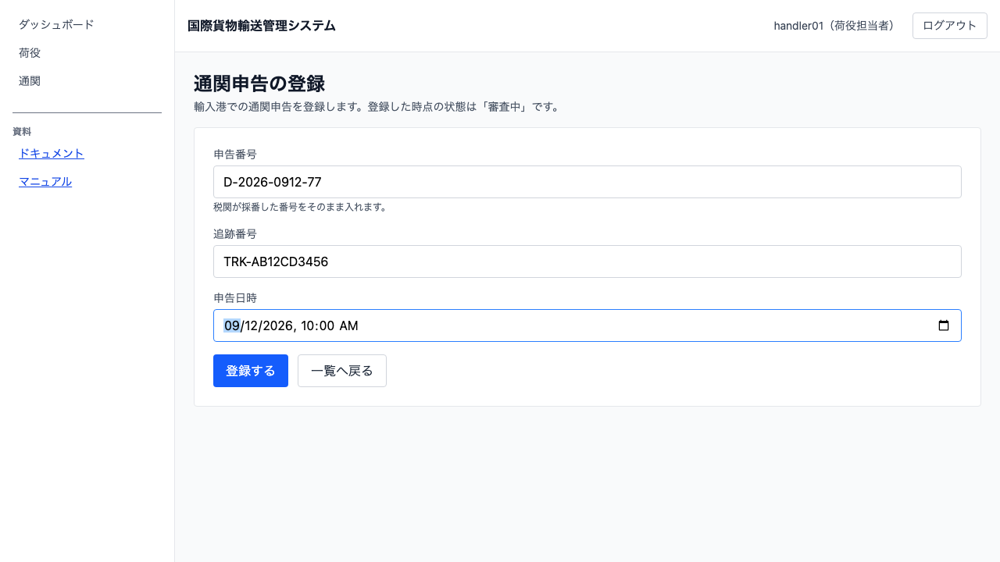
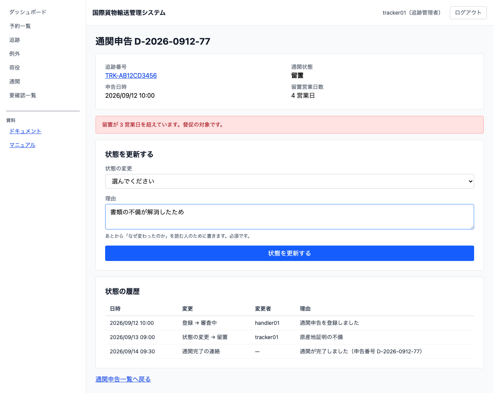
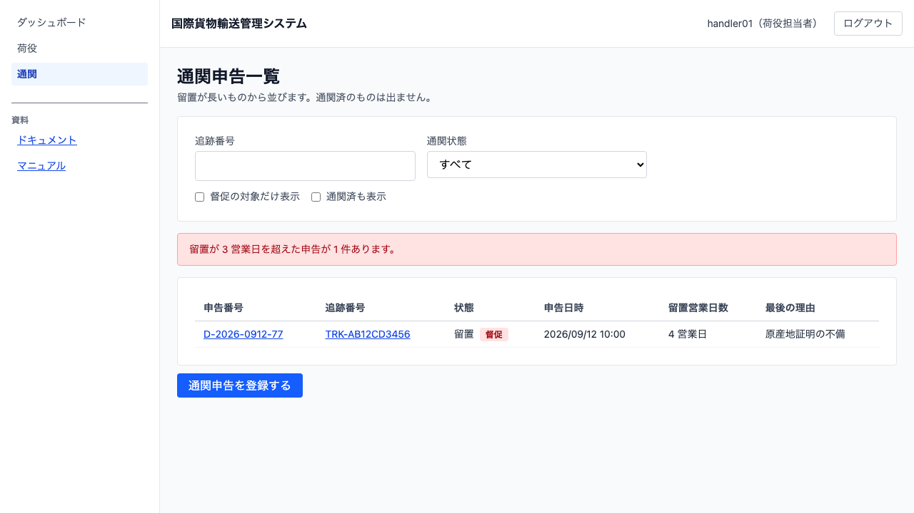

# 16 通関を通す

## この章でできること

- 荷役作業員が、輸入港での**通関申告を登録します**（登録した時点では「審査中」です）
- 追跡管理者が、**理由を書いて通関状態を更新します**（通関済・留置・不可）
- 通関が済んでいない貨物の**引取は断られます**——断られたときに何をすればよいかも出ます
- 留置になると**税関保留の例外が自動で起票されます**
- 留置が**3 営業日を超えた申告**が、一覧とダッシュボードで督促の対象として出ます

## なぜ通関を追うのか

通関が下りないと荷受人に渡せません。どの貨物がどの段階にあるかが分からないと引き取り作業の計画が立たず、留置が長引けば保管料が発生します。**この章の仕組みは「いま止まっているのはどれか」を出すためにあります。**

扱うのは**輸入通関だけ**です。輸出通関はこのシステムでは扱いません。

## 通関申告を登録する（荷役作業員）

1. サイドナビの `通関` を開きます（モバイル幅では下部タブの `通関`）
2. `[通関申告を登録する]` を押します
3. 3 つを入れます

| 項目 | 入れるもの |
| :--- | :--- |
| 申告番号 | **税関が採番した番号をそのまま**入れます。書式は検査しません——国ごとに違うためです |
| 追跡番号 | その貨物の追跡番号です |
| 申告日時 | 税関へ出した日時です |

4. `[登録する]` を押すと、申告詳細が開きます。状態は「審査中」です

**同じ貨物に決着していない申告は 1 件だけです。** 審査中や留置の申告が残っているうちに 2 件目を出そうとすると、断られます。断りの文に**その申告の番号**が入るので、先にその申告の状態を更新してください。

「不可」になった申告は決着しているので、**出し直せます**（税関がもう一度採番します）。出し直すのは荷役作業員なので、**追跡管理者は「不可にした」ことを荷役の担当へ伝えてください**——いまは画面から知らせる手段がありません（IT13 で用意します）。

## 通関状態を更新する（追跡管理者）

1. サイドナビの `通関` から申告を開きます
2. 「状態の変更」で、変更後の状態を選びます（**はじめは未選択**です。選ばないと押せません）

| 状態 | どんなとき |
| :--- | :--- |
| 通関済 | 通関が下りた |
| 留置 | 書類の不備などで税関に留め置かれた |
| 不可 | 通らなかった |

3. **理由は必須です。** あとから「なぜ変わったのか」を読む人のために書きます
4. `[状態を更新する]` を押します。**押したあとは「送信中…」になります**——複数の担当が同じ申告を触るので、先に画面だけ変えることはしません

**「審査中」には戻せません。** 選択肢にも出ません。**いまと同じ状態も出ません**（留置の申告に「留置」は並びません）。決着した申告（通関済・不可）には**更新の欄そのものが出ません**——押せるのに断られる操作を並べないためです。

## 通関が済んでいない貨物は引き取れない

引取（[14 章](14-引取と例外を扱う.md)）を記録しようとすると、通関状態を見て断ります。

- **申告がまだ無いとき**: 「通関申告がありません」と出ます。**申告の登録から始めてください**
- **審査中・留置・不可のとき**: **その時点の通関状態**と、**いつの判定か**が出ます

**判定した時刻が出るのは、直前に通関済になっていることがあるためです。** 状態の更新は反映まで数秒かかるので、通関済にした直後の引取は断られることがあります。その場合はもう一度お試しください。

## 留置になったとき

留置に更新すると、次のことが自動で起きます。

| どこで | 何が起きるか |
| :--- | :--- |
| 例外一覧（[14 章](14-引取と例外を扱う.md)） | 種別「税関保留」の例外が並ぶ |
| 輸送（[12 章](12-貨物の輸送状況を追う.md)の追跡詳細） | 状態が「例外発生」になる |

**税関保留の例外は手で起票できません。** 通関状態の更新から自動で起票されます。

**通関済に更新すると、この例外は自動で解決します。** 解決しないと貨物が「例外発生」のままになり、通関済にしても引取が届きません。

**「不可」では自動で解決しません。** 留置からは出ていますが、業務としては終わっていません——返送・再申告・廃棄のどれにするかを荷主と決めるまで貨物は港に残り、そのあいだ保管料が積み上がります。引取も断られたままです。例外を未解決のまま残すので、**決まったことを対応内容に書いて、追跡管理者が閉じてください**（[14 章](14-引取と例外を扱う.md)）。

**留置 → 審査中 → 再度留置**も起こりえます。2 度目も税関保留として起票され、状態は「例外発生」に戻ります。

例外一覧の税関保留の行には `[通関を更新]` があり、その貨物の通関申告一覧へ移れます。**追跡詳細ではできることがありません**——税関保留に対する対応は通関状態の更新です。

## 留置が長引いたとき（督促）

留置のまま **3 営業日を超えた**申告は督促の対象です。

- **通関申告一覧**: 留置が長いものから並びます。督促の対象には「督促」の印が付き、一覧の上に件数が出ます
- **ダッシュボード**: 追跡管理者の「今日の作業」に件数が出て、そこから一覧へ行けます

**日数は営業日で数えます。** 港の所在国の休日と土日を除きます——暦日で数えると、金曜に留置された貨物が月曜の朝にはもう「3 日超」になってしまいます。画面には「4 営業日」のように書きます。

**留置中の日数は開くたびに数え直されます。** 日が経てば増えます。

## 一覧の絞り込み

| 絞り | 何が変わるか |
| :--- | :--- |
| 追跡番号 | その貨物の申告だけ |
| 通関状態 | その状態の申告だけ |
| 督促の対象だけ表示 | 留置が 3 営業日を超えたものだけ |
| 通関済も表示 | **既定では通関済は出ません**。決着したものが混ざると、一覧が「まだ手を入れる場所」に見えなくなるためです |

## 変更の履歴を読む

申告詳細の下に、状態の履歴が並びます。

| 列 | 何が読めるか |
| :--- | :--- |
| 日時 | いつ変わったか |
| 変更 | 何が起きたか（登録 / 状態の変更 / 通関完了の連絡） |
| 変更者 | 誰が変えたか |
| 理由 | なぜ変えたか |

**「通関完了の連絡」の行に変更者は出ません。** 荷主・荷受人への連絡は電話やメールの手作業で、システムが送ったわけではないためです。システムは「伝えるべきことが起きた」という事実だけを残します。

## うまくいかないとき

実際に出るメッセージをそのまま見出しにしています。

### 追跡番号 … の貨物が見つかりません

その追跡番号の貨物がありません。**予約が確定して追跡番号が発行されるまでは申告できません**（[11 章](11-予約を確定して追跡番号を発行する.md)）。番号の写し間違いも疑ってください（`TRK-` に続く 10 桁）。

### 申告番号 … はすでに登録されています

同じ申告番号で 2 度登録しようとしています。税関が採番した番号は 1 つの申告を指すので、使い回せません。**すでに登録済みの申告を開いて**状態を更新してください（一覧で申告番号を探します）。

### 通関状態はすでに 留置 です

いまと同じ状態に更新しようとしています。履歴に意味の無い行を積まないため断ります。**選択肢にいまの状態は出ません**が、別の画面で先に更新されていた場合はこの断りが出ます。画面を読み直してください。

### 通関状態が 留置 の申告は更新できません

決着した申告（通関済・不可）は動かせません。**出し直しは新しい申告番号で行います**——税関がもう一度採番するので、こちらで番号を使い回すことはできません。決着した申告には更新の欄そのものが出ません。

### 通関状態の更新には理由が必要です

理由は必須です。あとから「なぜ変わったのか」を読む人のために書きます。空白だけでも断ります。

## 関連する章

- [13 荷役作業を記録する](13-荷役作業を記録する.md)
- [14 引取と例外を扱う](14-引取と例外を扱う.md)
- [12 貨物の輸送状況を追う](12-貨物の輸送状況を追う.md)
