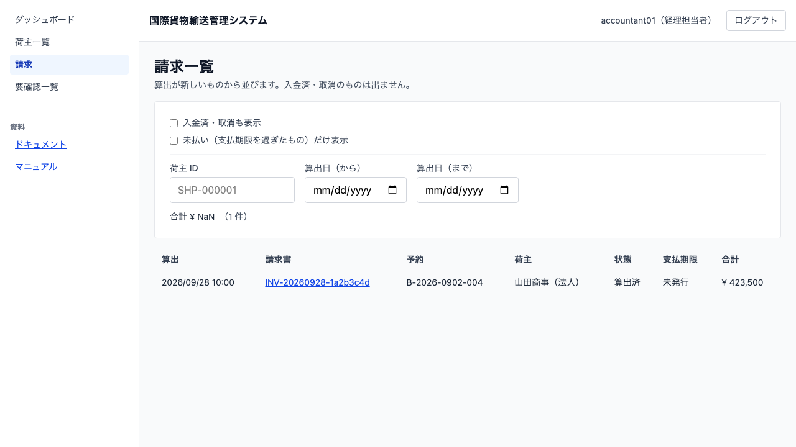
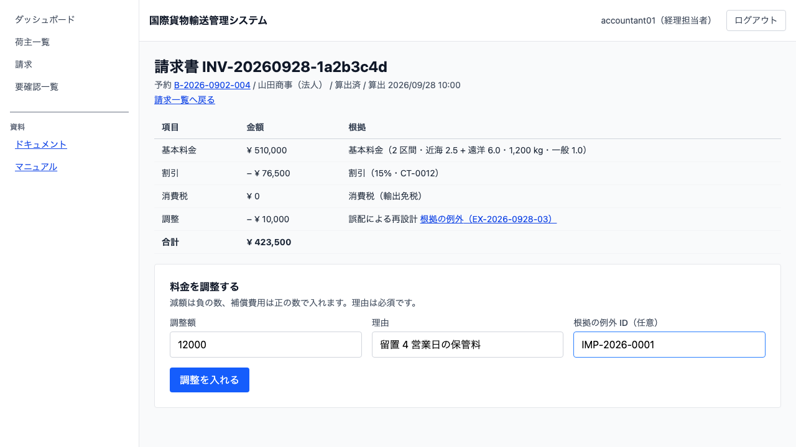

# 17 請求を組み立てる

## この章でできること

- 引取が完了した予約の**輸送料金が自動で算出されます**（経理が始める操作はありません）
- 算出の**根拠**（区間・地域区分・重量・貨物種別）が請求詳細に並びます
- 法人荷主には**契約割引が自動で当たります**（個人荷主には当たりません）
- 輸出（出発地と目的地の国が違う）は**消費税が 0 円**になります
- 遅延・破損・留置があれば、**根拠を指して料金を調整できます**
- 材料が足りず**算出できなかった予約**は、要確認一覧（第 4 章）に出ます

## なぜ自動で算出するのか

請求は引取が終わってから始まります。経理が「どれが終わったか」を探しにいく形にすると、終わった順に処理されず、荷主への請求が遅れます。**引取が終わった予約は、そのまま請求の算出まで進みます。**

経理の仕事は「始めること」ではなく、**出てきた請求を確かめて、例外があれば調整すること**です。ダッシュボードに「確かめていない請求が N 件あります」と出ます。

## 請求一覧を見る（経理担当者）

1. サイドナビの `請求` を開きます（ダッシュボードの案内からも入れます）
2. **算出が新しいものから**並びます
3. **入金済・取消のものは出ません。** 決着したものが混ざると、一覧全体が「まだ手を入れる場所」に見えなくなるためです。`[入金済も表示]` で戻せます

予約詳細（第 5 章）からも `この予約の請求書` で入れます。そのときは**その予約の分だけ**が、決着したものも含めて出ます。

## 請求の根拠を確かめる

行を開くと、明細に**なぜその額になったか**が並びます。

| 項目 | 出るもの |
| :--- | :--- |
| 基本料金 | **区間の数と地域区分**（国内 1.0 / 近海 2.5 / 遠洋 6.0）、重量、貨物種別 |
| 割引 | **割引率と契約番号**。法人荷主のときだけ出ます |
| 消費税 | 10%。**輸出は「輸出免税」として 0 円**で出ます |
| 調整 | 入れた理由と、**根拠になった例外・通関申告へのリンク** |

**距離は出ません。** 料金は区間ごとの地域区分で数えており、距離は使っていないためです。数えていないものを根拠に書くと、読む人が「距離で計算されている」と誤解します。

**見積から作った予約では、見積時の概算と差額が出ます。** 見積を経ない予約では出ません（「見積が無い」ことを「差額 0」と読み違えないためです）。見積は候補経路、請求は実際に通った区間で数えるため、式と料率が同じでも金額は変わります。困るのは差そのものではなく説明できないことなので、**概算・請求・差額**を並べて出します。

## 料金を調整する

遅延・破損・誤配の補償、留置のあいだの保管料は、**調整**として入れます。

1. 請求詳細の「料金を調整する」に入れます

| 項目 | 入れるもの |
| :--- | :--- |
| 調整の向き | **減額（請求を減らす）**か**補償費用（請求を増やす）**を選びます。符号は打ちません——「−」の付け忘れた減額が補償費用として積まれるのを、入り口で防ぐためです |
| 調整額 | **正の数**で入れます。向きは上のセレクトが表します |
| 理由 | 必須です。あとから「なぜその額か」を読む人のために書きます |
| 根拠の例外 ID | 誤配や破損は**例外の ID**（`EX-` で始まります）、留置の保管料は**通関申告の番号**（`IMP-` で始まります）を入れます。明細のリンクは、入れた ID の種類に合わせて例外か通関申告へ飛びます |

2. `[調整を入れる]` を押します。**押したあとは「送信中…」になります**

**調整できるのは「算出済」のあいだだけです。** 入金済・取消の請求書には調整の欄が出ません（押しても断られる操作を並べないためです）。

**0 円の調整は断られます。** 動かない調整を履歴に積むと、読む人が「何が変わったのか」を探すことになります。**請求額が負になる調整も断られます**——それは入力の誤りで、0 円の請求書として出してよいものではありません。

調整を入れると、**消費税も数え直されます**（調整は課税対象そのものを動かすためです）。輸出免税の請求書では 0 円のままです。

## 算出できなかったとき

材料が足りないと請求書は作られません。**黙って安い請求を出すことはしません。**

| 足りないもの | どうなるか |
| :--- | :--- |
| 重量が分からない（古い貨物） | 請求書を作らず、**経理の要確認一覧**に出ます |
| 区間が分からない | 同上 |
| 貨物の写しや荷主の契約がまだ届いていない | しばらく待つと自動で処理されます（届くまで再試行します） |

要確認一覧（第 4 章）は、サイドナビの `要確認一覧` から開きます。**自分（経理）宛の項目だけ**が出ます。

## うまくいかないとき

画面に出る文言そのままで載せます。

**「調整額が 0 円です」** — 動かない調整は記録しません。金額を入れ直してください。

**「調整すると請求額が負になります」** — 減額が大きすぎます。基本料金と割引の合計を超える減額は入れられません。金額を確かめてください。

**「状態 入金済 の請求書は調整できません」** — 決着した請求書は動かせません。**入金の取り消しはまだありません。** 誤って記録した入金は、いまのところ運用で引き取ることになります。

**「状態 請求済 の請求書は調整できません」** — 発行すると額が確定します。直すには請求書を取り消し、**新しく作り直します**（再発行はできません）。

**「入金額が請求額と違います」** — 一部入金は扱いません。請求額どおりの入金だけを記録してください。

**「状態 算出済 の請求書には入金を記録できません」** — 先に発行してください。発行していない請求書への入金は「何に対する入金か」が決まりません。

**「取り消した請求書は再発行しません。新規に発行してください」** — 一度取り消した請求書は生き返りません。荷主に取り消しを伝えたものが、また有効になってしまうためです。

**「理由は必須です」** — あとから「なぜその額か」を読む人のために書きます。空欄では送れません。

## 請求書を発行する（経理担当者）

確かめ終わった請求書を発行します。**発行すると額が確定し、荷主が自分の請求書を読めるようになります。**

1. 請求詳細を開き、`[請求書を発行する]` を押します
2. **支払期限が「発行日 + 30 日」で確定します**
3. 状態が「請求済」になります

**発行後は調整を入れられません。** 直すには請求書を取り消し、新しく作り直します。**取り消した請求書は再発行できません**——荷主に一度取り消しを伝えたものが、また有効になってしまうためです。

**荷主への連絡はシステムが送りません。** 送ったことの記録は残りますが、メールや電話は現行どおり手作業です。荷主は自分の画面（自社請求書）で金額を読めます。

## 入金を記録する（経理担当者）

決済機関との連携はありません。**入金明細を見て記録します。**

1. 発行済の請求詳細を開きます
2. 「入金日」に**入金のあった日**を入れます（記録した日ではありません）
3. `[入金を記録する]` を押します

入金額は請求額がそのまま使われます。**一部入金は扱いません**——残りが誰にも見えないまま精算が終わるのを防ぐためです。

**入金を記録すると、予約も「精算済」になります。** 見積から始まった一連の業務がここで終わります。

## 荷主が自分の請求書を読む（荷主）

発行した請求書は、**荷主が自分の画面で読めます**（自社請求書）。

1. 自社予約の進み具合、または追跡詳細から `この予約の請求書` を開きます
2. ご請求額・明細・支払期限が出ます

**荷主は請求書番号を知りません。** そのため予約から開ける導線を置いています。番号を打たせると、荷主は番号を探しに行くことになります。

**出るのは発行済と入金済だけです。** 算出済は社内の途中経過なので出しません——まだ確定していない金額を見せると、その額で会話が始まります。取り消した請求書も出しません。

**他社の請求書は「ありません」と出ます。** 「権限がありません」と出すと、その請求書が存在することを教えてしまうためです。

**社内の例外 ID は出しません。** 荷主には開く先が無く、出しても行き止まりになります。金額の根拠は明細の説明文で読めます。

**入金の操作はありません。** 入金を記録するのは経理担当者です。

## 未払いを見つける

支払期限を過ぎた請求書は、請求詳細に **「未払い」** と出ます。

**期限当日は未払いになりません。** 当日中に入金されることはふつうにあるためです。翌日から未払いです。

## 請求書を取り消す

宛先や内容を誤って発行したときは取り消します。

1. 請求詳細を開き、「取消の理由」を入れます
2. `[請求書を取り消す]` を押します

**理由は必須です。** 取り消した請求書は荷主からも見えなくなるので、何が起きたかを追えなければ、あとから誰も確かめられません。

**入金済は取り消せません。** 決着したものを動かすと、入金の事実と請求書の状態が食い違います。

## 覚えておくこと

- **有効な請求書は予約ごとに 1 通です。** 同じ引取の連絡が 2 度届いても、請求書は増えません
- 請求書番号は `INV-` ＋ 算出日（`YYYYMMDD`）＋ **英数字 8 文字**の形です（例: `INV-20260928-1a2b3c4d`）。経理どうしの問い合わせにはこの番号を使ってください
- 請求書の**発行**と**入金の記録**は下の節のとおりです
