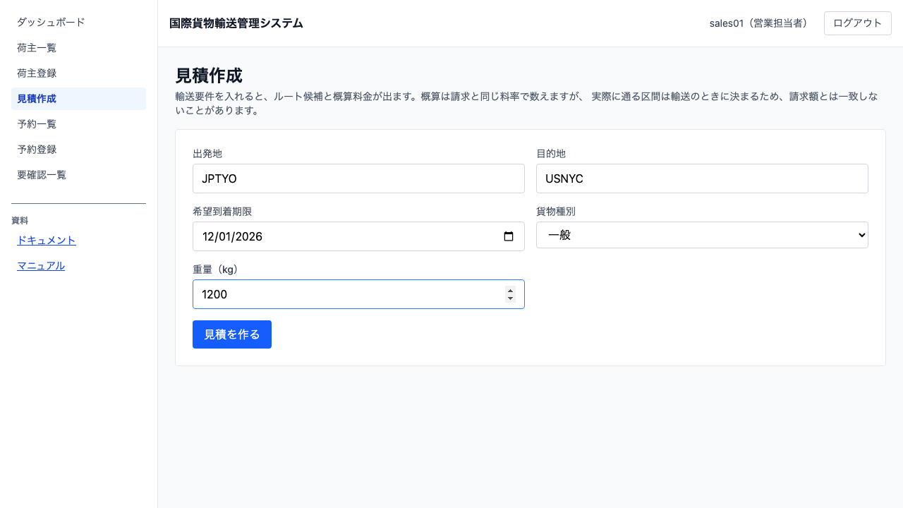
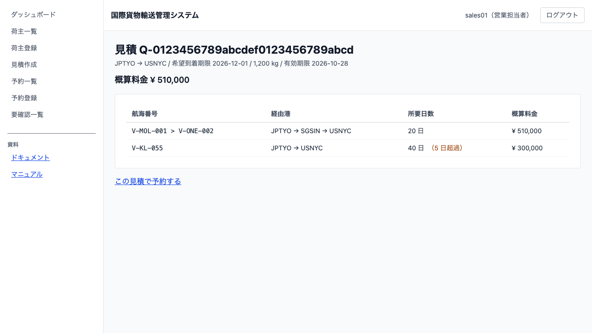

# 18 輸送見積を作る

## この章でできること

- 荷主の輸送要件から**ルート候補と概算料金**を出せます
- 候補ごとに**経由港・所要日数・概算料金・航海番号**が読めます
- **見積番号**が発行され、荷主との会話に使えます
- その見積から**そのまま予約に進めます**（5 項目が写ります）
- 見積と違う条件で予約しても**断られません**。違いが項目名で知らされます

## なぜ見積から始めるのか

荷主は「いくらで、いつ着くのか」を知らないと依頼を決められません。予約を先に取ってから金額を出す形にすると、金額を見た荷主が断ったときに予約を消して回ることになります。

**見積は予約の前段にあり、予約に至らない見積が存在します。** だから見積は予約とは別のものとして残ります。

## 見積を作る（営業担当者）

1. サイドナビの `見積作成` を開きます
2. **5 項目**を入れます

| 項目 | 入れるもの |
| :--- | :--- |
| 出発地 | UN/LOCODE（例: `JPTYO`）。**目的地と同じにはできません** |
| 目的地 | UN/LOCODE（例: `USNYC`） |
| 希望到着期限 | 日付。**当日着は間に合う扱い**です |
| 貨物種別 | 一般 / 危険物 / 冷凍・冷蔵 |
| 重量（kg） | 概算料金の材料になります |

3. **危険物を選ぶと**、IMO クラスと UN 番号の欄が出ます。ここで入れておかないと、予約のときに初めて断られて出し直しになります
4. `[見積を作る]` を押すと、見積詳細に移ります



**寸法・数量・品名は聞きません。** 概算には効かないためです（予約のときに聞きます）。

## 候補を読む

見積詳細には、候補ごとに 4 つが並びます。

| 項目 | 意味 |
| :--- | :--- |
| 航海番号 | 経由する航海の並び（`V-MOL-001 > V-ONE-002`） |
| 経由港 | 出発地から目的地までの港の並び（`JPTYO > SGSIN > USNYC`）。**候補ごとに違います** |
| 所要日数 | 積込から荷揚まで |
| 概算料金 | その経路で運んだ場合の概算 |



**画面の上に出る「概算料金」は、期限に間に合う候補のうちいちばん安いもの**です。

## 期限に間に合う候補が無いとき

**見積は作れます。** 「希望期限に間に合う経路がありません」と出るので、そのまま荷主に返せます——期限を延ばすか、条件を変えるかの判断は荷主のものです。

**間に合わない候補も消しません。** 「40 日（5 日超過）」のように**超過日数を添えて**出します。期限を 5 日延ばせば通せる案があることが分かれば、荷主は判断できます。

## 見積から予約する

見積詳細の `[この見積で予約する]` を押すと、予約登録に移り、**5 項目が写ります**。

**写した項目は変えられます。** 荷主の事情は見積のあとで変わります——重量が増えることも、期限が延びることもあります。

**違いがあっても予約は断られません。** 登録したあとに「見積と異なる項目」として、**何から何へ変わったか**が知らされます。

```text
見積と異なる項目があります
・重量: 1200 kg → 1500 kg
```

**知らせは登録の直後に 1 度だけ出ます。** 予約一覧に移ったところで出るので、そのまま次の作業に進めます。

## 概算と請求はなぜ違うのか

**見積は候補経路、請求は実際に通った区間で数えます。** 同じ料率表を使っていても、次の理由で金額は変わります。

- 区間の数が増減した（積替えが増えた・減った）
- 誤配があって経路を組み直した
- 通関で留置され、保管料が発生した

**困るのは差そのものではなく、説明できないことです。** 請求詳細には「見積時の概算 → 請求 → 差額」が並び、差の理由が読めます（第 17 章）。

## うまくいかないとき

画面に出る文言そのままで載せます。

**「出発地と目的地が同じです」** — 別の港を選んでください。

**「危険物には危険物申告が必要です」** — IMO クラス（1〜9）と UN 番号（`UN` ＋ 4 桁）を入れてください。

**「経路設計サービスに問い合わせられませんでした」** — 候補を数えられませんでした。**「候補 0 件」とは違います**——0 件で保存すると「間に合う経路が無い」と読まれてしまうため、見積そのものを作りません。しばらく待って、もう一度お試しください。

**「見積を受け付けました。反映までしばらくお待ちください」** — 作った直後の表示です。数秒で読めるようになります。

## 覚えておくこと

- 見積番号は `Q-` ＋ 英数字 32 文字の形です。荷主との会話にはこの番号を使ってください
- 見積の**有効期限は作成から 30 日**です
- **見積を経ない予約もできます。** 予約登録を直接開けば、見積の欄は出ません
- 見積番号を打ち間違えても予約は通ります。違いを知らせられないだけです
