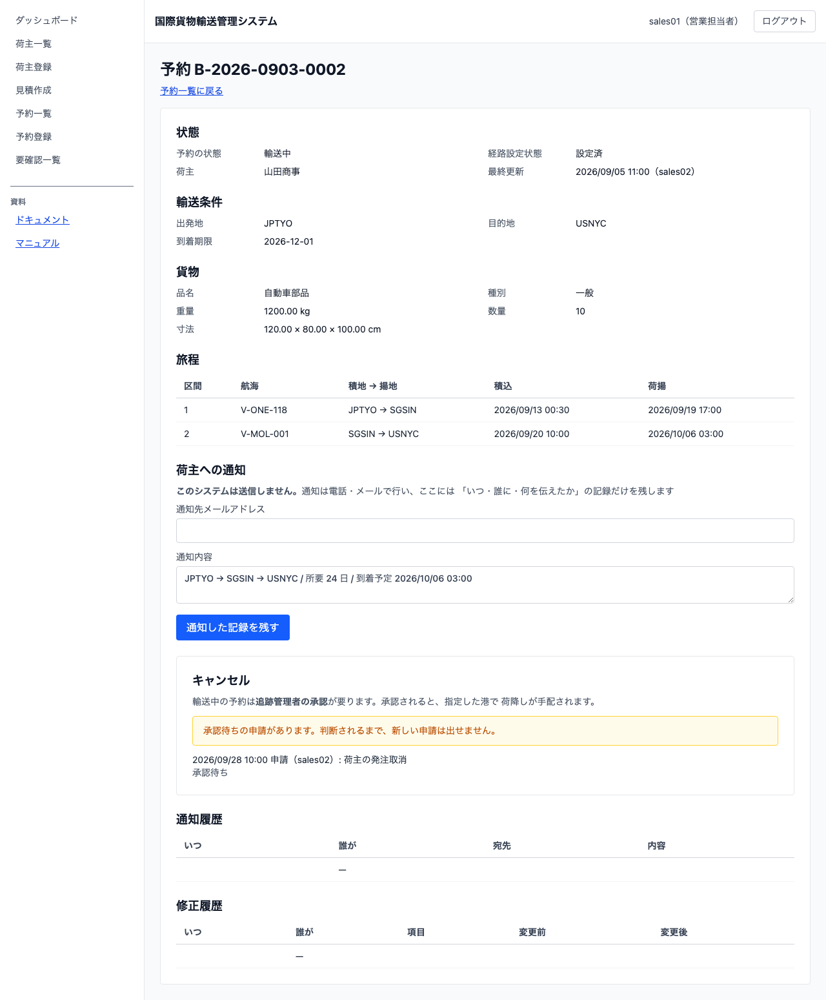
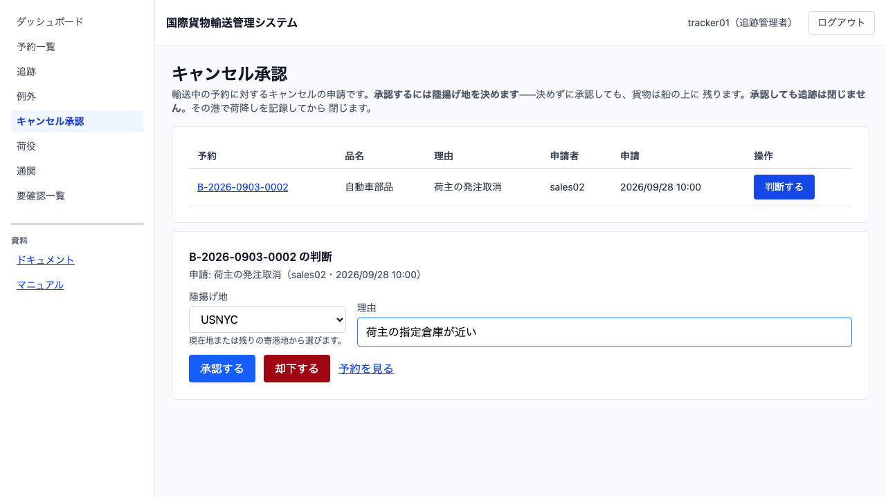

# 19 キャンセルを申請して承認する

## この章でできること

- 営業担当者が、予約の**キャンセルを申し出ます**（輸送が始まる前は、その場でキャンセルになります）
- **輸送中の予約は申請になります**。追跡管理者が**陸揚げ地を決めて承認**します
- 承認しても**追跡はまだ閉じません**。指定した港で荷降しを記録したときに閉じます
- **キャンセル料が請求に載ります**。料率はキャンセルした時点の状態で決まります

## なぜ輸送中だけ承認が要るのか

荷物が船の上にある以上、「やめます」と言うだけでは止まりません。**どこで降ろすか**を決めなければ、貨物は予定の目的港まで運ばれ続けます。降ろす港を決められるのは航海と現在地を見ている追跡管理者なので、判断はその人に渡します。

輸送が始まる前（仮受付から追跡番号発行済まで）は、止めるだけで済むのでその場でキャンセルになります。**どちらの経路になるかはシステムが状態から決めます**——営業は同じ場所から申し出るだけです。

## キャンセルを申し出る（営業担当者）

1. 予約詳細（05 章）を開きます。下の方に「キャンセル」の欄があります
2. 「理由」を入れます。**理由は必須です**——判断する人が、なぜ止めるのかを読めなければ答えられません
3. ボタンを押します

| 予約の状態 | ボタン | 押したあと |
| :--- | :--- | :--- |
| 仮受付・経路提案中・経路通知済・予約確定・追跡番号発行済 | `[キャンセルする]` | その場でキャンセルになります |
| 輸送中 | `[キャンセル（要承認）]` | 追跡管理者の承認待ちになります |

**承認待ちのあいだは、新しい申請を出せません。** 同じ予約に判断待ちが 2 件並ぶと、どちらに答えたのかが分からなくなります。取り下げたいときは、追跡管理者に却下してもらってください。

**履歴はこの欄に残ります。** 誰が・いつ・なぜ申し出て、誰が・いつ・どう判断したか（承認なら陸揚げ地も）が並びます。判断するのは追跡管理者なので、**両方が同じ欄を読めなければ話が噛み合いません**。

## 申請を判断する（追跡管理者）

1. サイドナビの `キャンセル承認` を開きます（モバイル幅では下部タブ）
2. 承認待ちの申請が**申請の古い順**に並びます。待たせているものから答えます
3. `[判断する]` を押すと、その 1 件の判断の欄が開きます

### 承認する

1. 「陸揚げ地」を選びます。**選択肢は現在地と、これから寄る港だけ**です。すでに通り過ぎた港は出ません——船は戻らないからです
2. 「理由」は任意です（なぜそこで降ろすと決めたかを残せます）
3. `[承認する]` を押します

承認すると、その時点で**予約はキャンセル**になり、荷役の作業一覧からも外れます。指定した港での荷降しだけが残ります。

### 却下する

1. 「理由」を入れます。**却下には理由が必須です**——理由が無いと、申し出た営業は次の手を決められません
2. `[却下する]` を押します

却下しても**予約の状態は動きません**。輸送はそのまま続きます。

## 承認したあと何が起きるか

1. 予約が「キャンセル」になります（予約詳細・予約一覧に出ます）
2. **追跡はまだ開いています。** 貨物は船の上にあり、状態は「積込済」のままです
3. 荷役作業員が、指定した港で**荷降しを記録**します（13 章）
4. その荷降しで**追跡が閉じます**。追跡詳細の履歴に「追跡終了」の行が、降ろした港とともに残ります
5. **キャンセル料が請求に載ります**（17 章）

**承認しただけで追跡を閉じません。** 閉じてしまうと、荷役の現場は「もう終わったもの」として扱い、船の上の貨物が降ろされないまま残ります。

## キャンセル料

キャンセル料は「運ぶはずだった基本料金 × 状態別の料率」です。法人割引は当たります（契約は生きているためです）。

| キャンセルした時点の状態 | 料率 |
| :--- | ---: |
| 仮受付 | 0% |
| 経路提案中・経路通知済 | 5% |
| 予約確定 | 10% |
| 追跡番号発行済 | 20% |
| 輸送中 | 50% |

**輸送料金は請求しません。** 運んでいないからです。できるのは**キャンセル料だけの請求書**で、明細には「キャンセル料（輸送中・50%）」のように、どの状態でのキャンセルか（と料率）が入ります。料率だけでは、なぜこの額かが読めないためです。

**料率が 0% のときは請求書を作りません**（仮受付）。0 円の請求書は、経理に「請求する相手」として見えてしまいます。

## うまくいかないとき

### 「承認待ちの申請があります。判断されるまで、新しい申請は出せません。」

同じ予約に判断待ちの申請が残っています。追跡管理者に承認か却下をしてもらってください。

### 「この予約はキャンセルできません」

引取が済んだ予約や、すでにキャンセルされた予約は止められません。予約詳細の状態を確かめてください。

### 陸揚げ地の選択肢が現在地しか出ない

最後の寄港地まで来ています。そこで降ろすしかありません。

### キャンセルしたのに請求書ができない

契約（荷主）や貨物の情報が請求側へ届いていないことがあります。**04 要確認一覧**に理由つきで出ますので、そこから対応してください。

## 関連する章

- [05 貨物予約を登録する](05-貨物予約を登録する.md) — 予約詳細からキャンセルを申し出ます
- [12 貨物の輸送状況を追う](12-貨物の輸送状況を追う.md) — 追跡が閉じたことを確かめます
- [13 荷役作業を記録する](13-荷役作業を記録する.md) — 指定した港での荷降しを記録します
- [17 請求を組み立てる](17-請求を組み立てる.md) — キャンセル料の請求書を扱います
