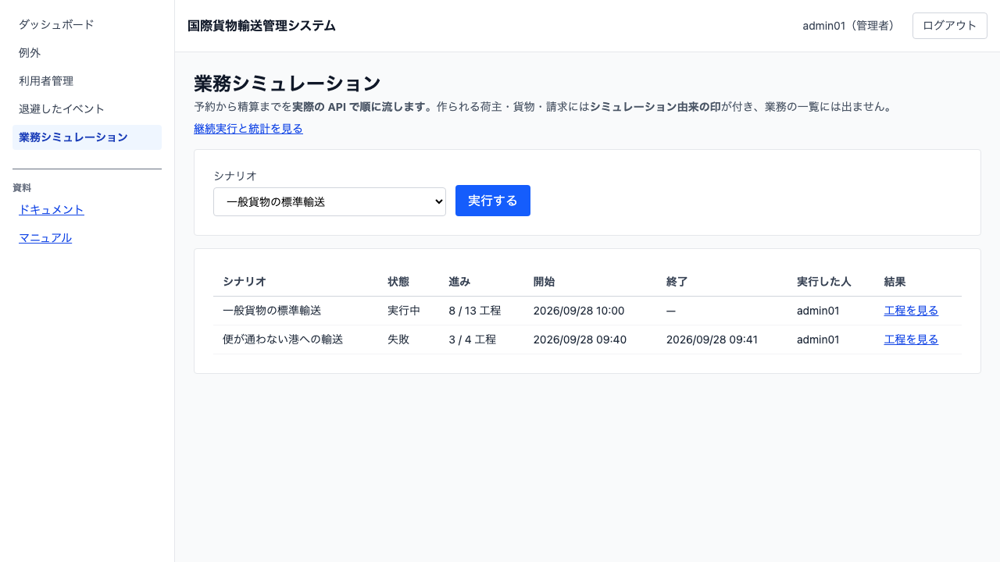
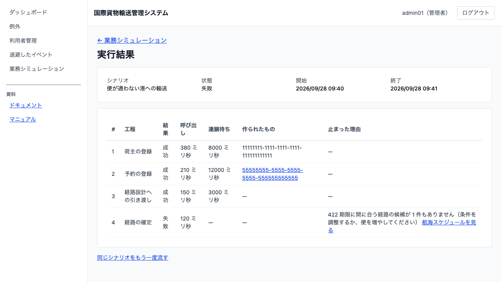
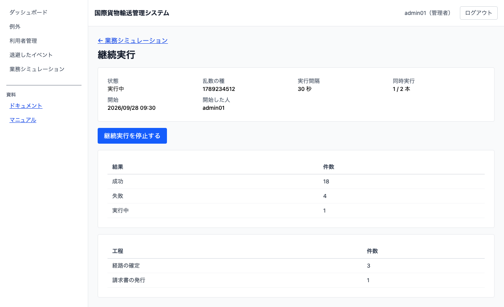

# 20 業務シミュレーションを流す

## この章でできること

- システム管理者が、**予約から精算までを自動で一通り流します**
- **例外が起きたあとの対応**（遅延・破損・誤配・税関保留・輸送中キャンセル）まで流します
- 乱数で選んだシナリオを**放っておいても流し続けます**（継続実行）
- **どこまで進んだか**を一覧で見ます。止まったときは**どの工程で・なぜ**止まったかを読みます
- 作られた予約・貨物・請求書を、**そのまま業務画面で開いて**確かめます

## 何のための機能か

このシステムは 7 つのサービスに分かれています。1 つ 1 つの画面が動いていても、**つないだときに端から端まで通るかは別の話**です。荷主を登録して、経路を組んで、荷役を記録して、請求を出して、入金を記録する——その一続きが通らなければ、業務は回りません。

業務シミュレーションは、その一続きを**人と同じ API で**自動的に流します。専用の裏口は使いません。裏口を作ると「シミュレーションは通るのに、実際の操作は通らない」状態に気づけなくなるからです。

**確かめる手段であって、業務ではありません。** 作られたデータは業務の一覧には出ません（後述）。

## 使える環境

**実行を許可した環境でだけ動きます。既定は無効です。** 実データに紛れる貨物を作らないための守りで、**本番では有効にしません**。許可されていない環境で実行しようとすると次のメッセージが出ます。

> この環境では業務シミュレーションを実行できません（実データに紛れる貨物を作らないため）

同じ設定は**荷主の登録側にも効きます**。許可していない環境では「シミュレーション由来」の印を付けた荷主を登録できません——印の付いた荷主は業務の一覧に出ないので、誰でも立てられると本物の荷主を静かに見えなくできてしまうからです。

## シナリオを選んで実行する

1. サイドナビの `業務シミュレーション` を開きます（**システム管理者だけ**に出ます）
2. 「シナリオ」のチェックを付けます。**複数選べます**
3. `[実行する]`（複数選んだときは `[選んだ n 件を一斉に実行する]`）を押します

1 つだけ選んだときは、押すとすぐその実行の結果の画面に移ります。**複数選んだときは一覧に留まります**——移ってしまうと、他の実行がどうなったか読めないからです。

選べるシナリオは 7 つです。

| シナリオ | 工程数 | 何を確かめるか |
| :--- | :--- | :--- |
| 一般貨物の標準輸送 | 14 | 予約から精算まで**通ること** |
| 便が通わない港への輸送 | 5 | 経路が組めないときに**その工程で止まること** |
| 遅延の発生と対応 | 11 | 例外を起票し、対応して、解決するまで |
| 破損の発生と対応 | 11 | 同上（**違うのは例外の種別だけ**） |
| 誤配の発生と経路の組み直し | 12 | 経路外で荷役が記録され、**現在地から経路が組み直される**まで |
| 税関保留の発生と対応 | 11 | 申告が留置され、対応して解決するまで |
| 輸送中のキャンセルと指定港での荷降し | 12 | 承認で**指定した港で荷降しされ、追跡が閉じる**まで |

**どのシナリオも「便の用意」から始まります。** 便が 1 本も無い環境（作り直した
直後のクラスタ）では、どのシナリオも「経路の確定」で止まってしまうためです
——確かめたいのは業務の連鎖であって、環境の品揃えではありません。

**同じ区間を同じ貨物種別で運べる便がすでにあれば、足しません。** 便は荷主に
属さないので**シミュレーション由来の印を付けられず**、航海スケジュールの一覧に
本物として並びます。毎回登録すると、流すほど一覧が埋まります。工程の結果には
「既にある便を使います」と出ます。

**失敗するシナリオも要ります。** 成功するものしか流せないと、「どこで止まったか」を出す仕組みそのものが確かめられません。

### 誤配と税関保留は「起票」しません

この 2 つは**荷役と通関が決めること**です。手で起票できるようにすると、起きていない誤配を記録でき、経路設計者はそれを組み直そうとします。シミュレーションも同じ守りを通るので、**本番と同じ出来事から起こします**——誤配は旅程に無い港での荷役、税関保留は申告の留置です。

### 輸送中キャンセルは、先に輸送中にします

**輸送前のキャンセルは承認を要りません**（その場で決着します）。承認と陸揚げ地の指定を確かめたいので、受領と積込を先に記録して輸送中にしてから申請します。

### 一覧の読み方

| 列 | 意味 |
| :--- | :--- |
| シナリオ | 流した段取りの名前 |
| 状態 | 実行中 / 成功 / 失敗 |
| 進み | **成功した工程数 / 予定の工程数**。走っているあいだも増えます |
| 開始・終了 | 実行中は終了が「—」です |
| 実行した人 | 誰が流したか |
| 結果 | `[工程を見る]` でその実行の詳細へ |

一覧は**新しい順**で、開いたままでも数秒ごとに更新されます。

### 複数のシナリオを一斉に流す

シナリオ 1 本は連鎖の追いつきを待ちながら進むので、**数分かかります**。7 種類を順に流すと待ち時間が積み上がるので、確かめたいものをまとめて選んでください。

**違うシナリオは同時に流して構いません。** 断るのは「同じシナリオが 2 本」だけです（次の節）。

押したあと、選んだシナリオごとの結果が出ます。

| 出るもの | 意味 |
| :--- | :--- |
| `[実行を開く]` | 始まりました。押すとその実行の工程が読めます |
| 赤い文（断りの理由） | 始められませんでした。**たいていは「そのシナリオが実行中」です** |

**1 件断られても、残りは流れます。** 実行中の 1 本のせいで他の 6 本まで流せない、ということにはしていません。**断られたシナリオも必ず画面に出ます**——出さないと、選んだのに何も起きていないシナリオが画面から消え、流れたものと区別できなくなります。

**同じシナリオを 2 つ選ぶことはできません。** 2 つ目は必ず「実行中です」で断られるので、要求として成立していないからです。

### 同じシナリオは同時に 1 本だけ

走っているシナリオをもう一度実行しようとすると断られます。

> シナリオ「一般貨物の標準輸送」は実行中です（実行 SIM-…）。その結果を開いてください

**実行中の識別子が添えられます。** その番号の実行を一覧から開けば、いまの進み具合が読めます。

## 実行結果を読む

`[工程を見る]` を押すと、工程ごとの結果が出ます。

| 列 | 意味 |
| :--- | :--- |
| # | 工程の順番。**この順に実行します** |
| 工程 | 業務の言葉（「予約の登録」「料金の算出」など） |
| 結果 | 成功 / 失敗 / **これから**（まだ実行していない工程） |
| 呼び出し | その工程の API を叩いていた時間 |
| 連鎖待ち | **結果がほかのサービスへ届くのを待った時間** |
| 作られたもの | その工程が生成した識別子。**押すと業務画面へ行けます** |
| 止まった理由 | 失敗した工程だけに出ます（応答コードとメッセージ） |

**予定の工程が先に並びます。** 連鎖待ちは 1 工程あたり最大 30 秒あるので、記録済みだけを出すと「進んでいるのか固まったのか」が読めません。これからの工程は薄い字で並びます。

**所要時間は 2 つに分かれています。** 呼び出しと連鎖待ちを足し合わせると「14 工程が数ミリ秒ずつ」と読めてしまい、実際に時間を使っている場所が見えません。**待ちのほうが桁違いに長い**のが普通です。

**止まった工程から下は実行されません。** 止まったあとに業務データを増やさないためです。

### 止まったところから、次の行動へ

止まった工程には、原因の種類に応じた行き先が出ます。

| 止まり方 | 出るリンク | そこで何を見るか |
| :--- | :--- | :--- |
| 「…の結果が読めるようになりませんでした」 | 退避したイベントを見る | 投影が止まっていないか（06 章） |
| 経路が組めない | 航海スケジュールを見る | その区間の便が登録されているか（07 章） |

**分からない止まり方にはリンクを出しません。** 当てずっぽうの行き先は、開いた先で何もできず手間だけ増やします。

### 同じシナリオをもう一度流す

実行結果の下に `[同じシナリオをもう一度流す]` があります。切り分けは「直す → 流す」を何度も回す作業なので、一覧へ戻ってシナリオを選び直さずに済みます。

**それまでに作られたものは取り消しません。** どこまで進んだかを追えることがこの画面の目的なので、途中まで作られた予約や貨物はそのまま残ります。実行結果の識別子から開いて、実物を確かめてください。

### 識別子から業務画面へ

| 工程 | 押すと開く画面 |
| :--- | :--- |
| 予約の登録 | 予約詳細（05 章） |
| 追跡番号の発行 | **追跡詳細**（12 章。その貨物の単票） |
| 料金の算出 | **請求書詳細**（17 章。その請求書の単票） |

**一覧ではなく単票へ送ります。** 一覧はシミュレーション由来を既定で外すので、一覧へ送ると**その貨物も請求書も絶対に出ません**。

荷主 ID のように開く画面が無いものは、文字のまま出ます。

## 作られたデータは、いまのところ次の一覧に出ません

シミュレーションが作った荷主には**印が付きます**。その荷主の貨物と請求書も印を引き継ぎ、次の一覧には出ません。

- 営業の**荷主一覧**（03 章）
- 営業の**予約一覧**（05 章）
- 経理の**請求一覧**（17 章）
- 経路設計の**作業一覧**（09 章）

経理の締めにシミュレーションの請求書が並んだり、経路設計者の朝の一覧に偽の依頼が積み上がったりすると、業務の判断を誤らせるからです。

- 追跡管理者の**追跡一覧**（12 章）
- 荷役の**作業一覧**・ダッシュボード・引取待ち（13 章）
- **要確認一覧**（04 章）
- 追跡管理者の**例外一覧**（14 章）
- 追跡管理者の**キャンセル承認待ち**（19 章）
- **通関一覧**（16 章）

**単票は出ます。** 実行結果の識別子から開けば、どの貨物も請求書も実物として読めます——一覧から消しているのは「毎日の仕事の邪魔にならないため」であって、隠すためではありません。

**荷主で絞る一覧は外しません。** 確認用の利用者でログインすれば、自分の一覧からシミュレーションの貨物を辿れます。

**画面を閉じても実行は続きます。** 実行はサーバー側で進むので、あとから一覧を開けば進み具合を読めます。

## 放っておいても流し続ける（継続実行）

一覧の `継続実行と統計を見る` を開きます。**乱数で選んだシナリオを一定間隔で流し続けます。**

### 始める

1. 「乱数の種」を入れます（空欄でもかまいません）
2. `[継続実行を開始する]` を押します

**種は必ず記録されます。** 空欄なら自動で作ります——記録しないと、たまたま出た失敗をもう一度起こせません。**同じ種を入れて始め直せば、同じ並びが再現します**（シナリオ・出発地・目的地・貨物種別・重量・期限まで。実行の時刻と採番された識別子は再現しません）。

### 読む

| 項目 | 意味 |
| :--- | :--- |
| 状態 | 実行中 / **停止処理中** / 停止中 |
| 乱数の種 | 同じ並びを再現するときに入れる数 |
| 実行間隔 | 次を流すまでの間隔 |
| 同時実行 | いま走っている本数 / 上限 |
| 開始・開始した人 | いつ・誰が始めたか（止めてよいか判断する材料） |
| 実行の内訳 | 成功・失敗・実行中の件数 |
| 止まった工程 | **どの工程で止まりやすいか**（多い順） |

**「止まった工程」がいちばん見たい表です。** 件数だけでは、次に何を直せばよいか決まりません。

**止めたあとも読めます。** 夜通し流して翌朝に結果を読むのが本来の使い方なので、止めた稼働の種・件数・止まった工程はそのまま残ります。

### 止める

`[継続実行を停止する]` を押します。**すぐには止まりません**——走っている実行は最後まで終えます。そのあいだは「停止処理中」と出て、残りの本数が表示されます。

### 継続実行は、もう 1 段の許可が要ります

実行そのものが許可された環境でも、**継続実行は別の設定**（`CARGOTRACKER_SIMULATION_SCHEDULE_ENABLED`）で許可します。流し続ける側は業務を止めうるので、「実行できる環境＝流し続けてよい環境」にはしていません。

> この環境では継続実行を開始できません（流し続ける側が業務を止めないようにするため）

### 動いている継続実行は 1 本だけです

2 本走ると同時実行の上限が 2 倍になり、「設定した上限を超えて実行しない」という約束が守れません。もう 1 本始めようとすると、動いている稼働の番号を添えて断られます。

## 工程が進むしくみ

工程は**前の工程の結果が読めるようになってから**次へ進みます。このシステムは 7 つのサービスに分かれていて、結果が各サービスに行き渡るまでには少し時間がかかります。待たずに次を叩くと、**通っているはずの経路が失敗として記録されます**。

そのため、標準シナリオは 14 工程すべてが終わるまでに**数十秒**かかります。一覧の「進み」を見ながら待ってください。

## うまくいかないとき

### 「この環境では業務シミュレーションを実行できません」

本番、または実行が許可されていない環境です。設定（`CARGOTRACKER_SIMULATION_ENABLED`）を確かめてください。

### 「シナリオ「…」は実行中です（実行 SIM-…）」

同じシナリオが走っています。添えられた番号の実行を一覧から開いて、終わるのを待ってください。

### 「期限に間に合う経路の候補が 1 件もありません」

「便が通わない港への輸送」では**これが期待した結果**です。標準輸送でこれが出たときは、その区間（JPTYO → USNYC）の航海が登録されていません。07 章の手順で便を登録してください。

### 「…の結果が読めるようになりませんでした（30 秒待ちました）」

前の工程は通ったのに、その結果がほかのサービスへ届いていません。**06 章の退避したイベント**を開いて、投影が止まっていないか確かめてください。

### 「継続実行はすでに動いています（稼働 SCH-…）」

稼働は 1 本だけです。添えられた番号の稼働を `継続実行と統計` で開いて、止めるか終わるのを待ってください。

### 停止を押したのに「停止処理中」のまま

走っている実行が残っています。**最後まで終えてから止まります**——途中で切ると、作りかけの業務データが宙に浮きます。残りの本数が 0 になれば「停止中」に変わります。

### 工程が 404 で止まった

その工程が叩く API の経路が変わった可能性があります。開発チームへ連絡してください（シミュレーションは業務の API を人と同じ経路で叩くので、経路が変わると止まります）。

### 実行が「実行中」のまま終わらない

工程のどれかが応答を待っている可能性があります。しばらく待っても変わらなければ、サービスのログを確かめてください。

## 関連する章

- [05 貨物予約を登録する](05-貨物予約を登録する.md) — 作られた予約を開きます
- [06 利用者を管理する](06-利用者を管理する.md) — 退避したイベントを確かめます
- [07 航海スケジュールを登録する](07-航海スケジュールを登録する.md) — 経路の材料になる便を登録します
- [12 貨物の輸送状況を追う](12-貨物の輸送状況を追う.md) — 作られた貨物を追います
- [17 請求を組み立てる](17-請求を組み立てる.md) — 作られた請求書を開きます
