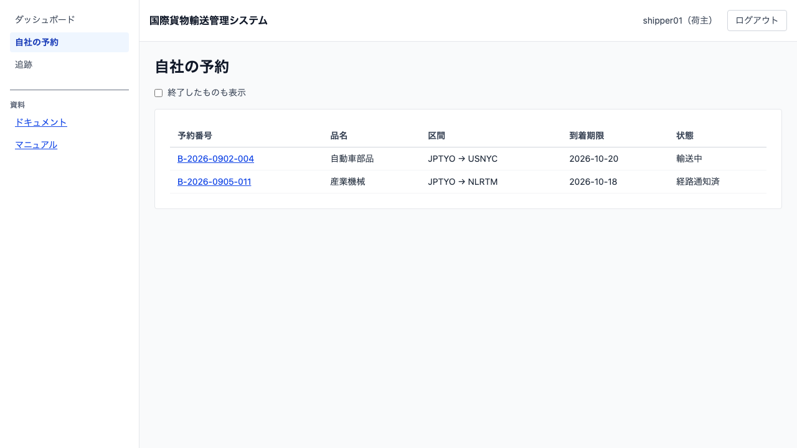
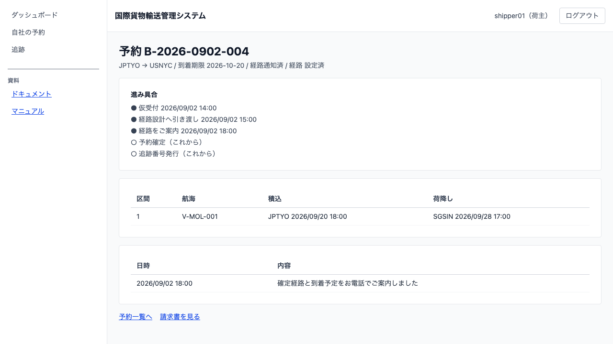
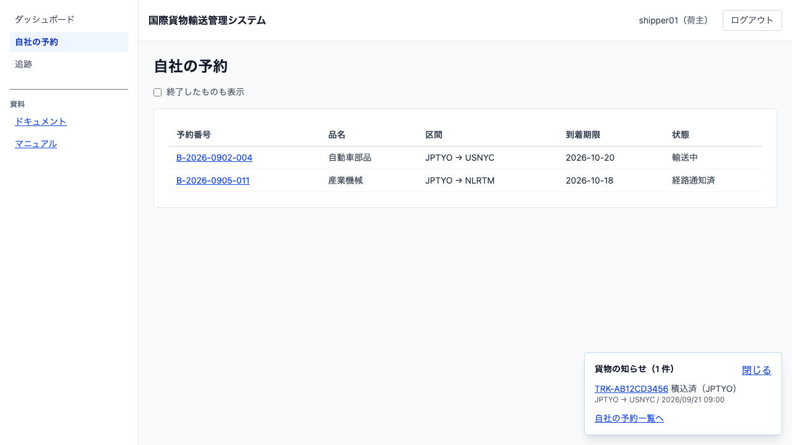

# 21 荷主が自社の貨物を見る

## この章でできること

- 荷主が、**自社の予約の一覧**を見ます
- 予約が**いまどこまで進んでいるか**を読みます（予約から追跡番号が出るまでのあいだも）
- 自社の貨物に新しいことが起きたら、**画面の隅の知らせ**で気づきます

## 何のための機能か

追跡番号は**予約が確定してから**発行されます。そのため、お申し込みから確定までの数日間は、追跡の画面（12 章）では何も見えません——追跡番号が無いからです。

この章の画面は、**その期間を埋めます**。いまどの段階にいるのか、経路は決まったのか、いつご連絡したのかが読めます。

## 自社の予約一覧

サイドナビの `自社の予約` を開きます（**荷主だけ**に出ます）。

| 列 | 意味 |
| :--- | :--- |
| 予約番号 | 押すと進み具合へ |
| 品名 | お申し込みいただいた貨物 |
| 区間 | 出発地 → 目的地 |
| 到着期限 | ご指定いただいた期限 |
| 状態 | 仮受付 / 経路提案中 / 経路通知済 / 予約確定 / 輸送中 / 配送完了 など |

**並びは到着期限が近い順**です。いちばん気にかかるものが上に来ます。

**既定では終了したものを外します。** 精算済とキャンセルは「終わったこと」なので、`終了したものも表示` にチェックを入れたときだけ出ます。

**金額は出ません。** 金額をご覧いただく画面は自社請求書（17 章の荷主向けの節）だけです。

## 進み具合を読む

一覧の予約番号を押すと、その予約の進み具合が出ます。

| 出るもの | 内容 |
| :--- | :--- |
| 進み具合 | 仮受付 → 経路設計へ引き渡し → 経路をご案内 → 予約確定 → 追跡番号発行。**済んだ段には日時**が付きます |
| 確定旅程 | どの船がどの港で積み降ろすか。経路が決まる前は「まだありません」と出ます |
| ご連絡の記録 | いつ・何をお伝えしたか |

**これからの段には「（これから）」と付きます。** 済んだ段と見分けられないと、「止まっているのか進んでいるのか」が読めません。

### 次に行ける先

| リンク | いつ出るか |
| :--- | :--- |
| 予約一覧へ | いつでも |
| 追跡を見る | **追跡番号が発行されてから**（12 章） |
| 請求書を見る | いつでも（請求書がまだ無ければ「ありません」と出ます） |

**追跡番号が出る前にリンクは出しません。** 押しても何も無い行き先を出すと、手間だけ増えます。

### 他社の予約は開けません

予約番号をご存じでも、**自社のものでなければ「見つかりません」**と出ます。「権限がありません」と出さないのは、その予約が在ることをお伝えしないためです。

## 貨物の知らせ

自社の貨物に新しいことが起きると、**画面の隅に知らせが出ます**。ログインしているあいだ、どの画面にいても出ます。

| 出るもの | 内容 |
| :--- | :--- |
| 追跡番号 | 押すと追跡の詳細へ（12 章） |
| 状態 | 受領済・積込済・荷降し済など |
| 区間と日時 | どの貨物が、いつ |

下の `自社の予約一覧へ` から、この章の一覧へ戻れます。

### 一度読んだ知らせは、もう出ません

`[閉じる]` を押すと、そこまでを読んだものとして記録します。**記録はサーバー側にあります**——事務所のパソコンで読んだ知らせが、外出先の端末でもう一度出ることはありません。

### 知らせは数分以内に出ます

システムは**一定の間隔で新しい知らせを見に行きます**（およそ 1 分）。押し出す仕組み（通知）は使っていないので、**画面を開いているあいだの気づき**です。メールなどでの通知は現在のところ行っていません（担当者からのご連絡は「ご連絡の記録」に残ります）。

### 他社の貨物の知らせは届きません

追跡番号をご存じでも、自社の貨物でなければ知らせは出ません。**絞り込みはサーバー側で行います。**

## うまくいかないとき

### サイドナビに `自社の予約` が出ない

荷主のロールでログインしていません。02 章の手順をご確認ください。

### 「荷主の紐付けがありません。担当者にお問い合わせください」

ご利用のアカウントと荷主の紐付けが済んでいません。**全件をお見せするわけにはいかない**ので、断っています。担当者にご連絡ください。

### 予約はあるのに、一覧が空

`終了したものも表示` にチェックを入れてみてください。精算済・キャンセルは既定で外しています。

### 知らせが出ない

- 新しい出来事がまだ起きていません（最後に読んだところから変わっていません）
- 別の端末で読んだ直後です（既読はサーバー側で共有しています）
