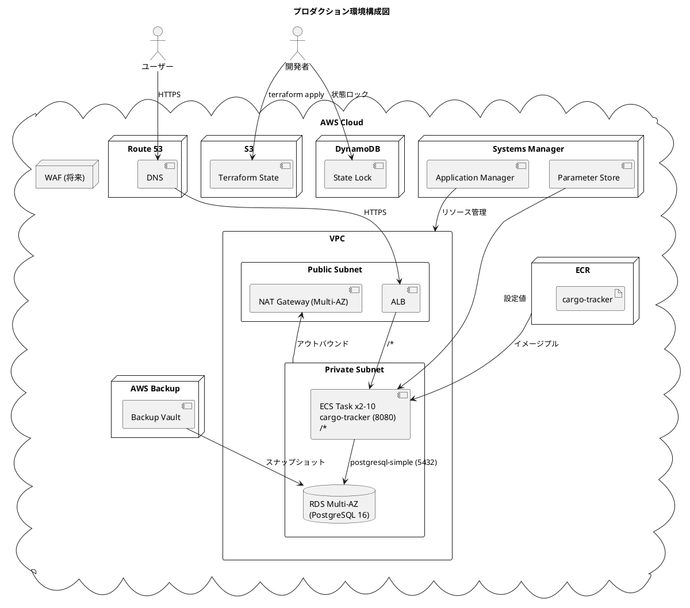
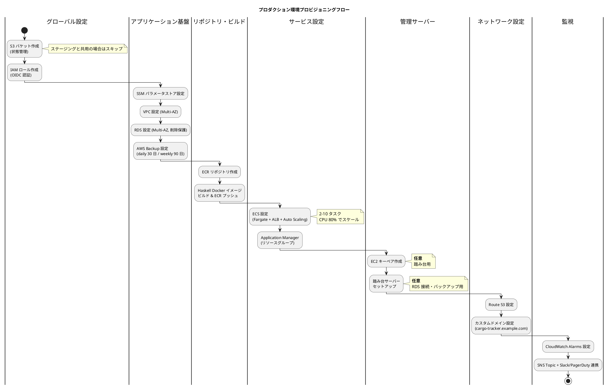
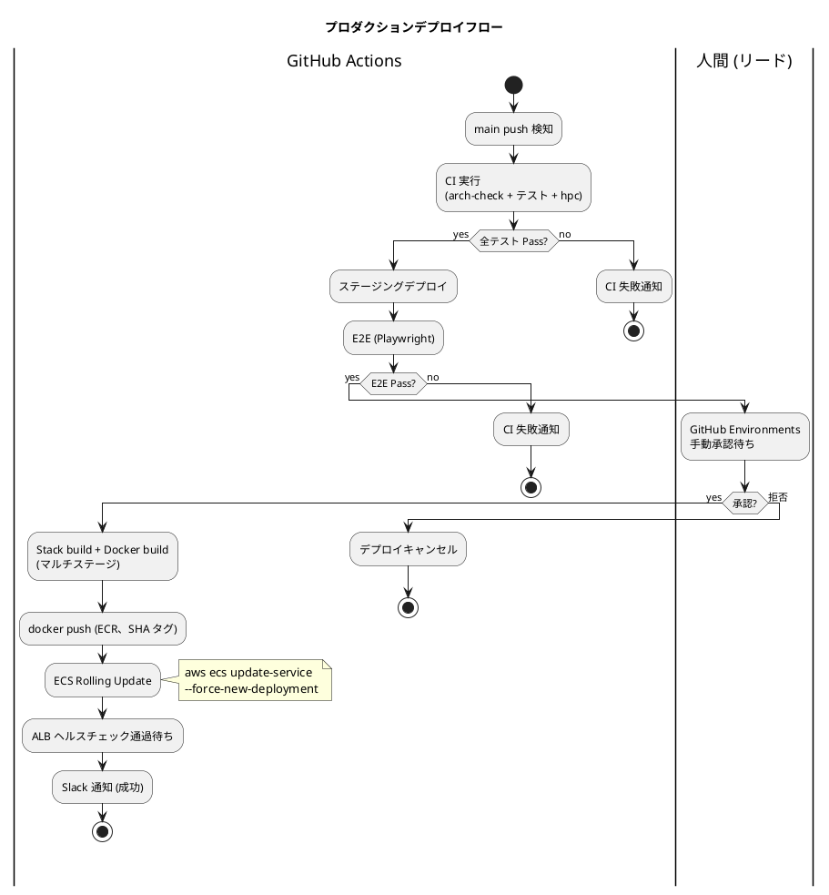
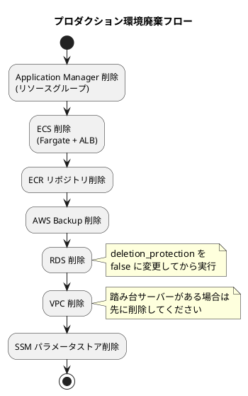

# AWS プロダクション環境セットアップ手順書

## 概要

Terraform を使用して AWS 上に **国際貨物輸送管理システム (Cargo Tracker) Haskell 版** のプロダクション環境を構築するための手順を説明します。

各ステップの設計意図・実装詳細・トラブルシューティングは [AWS ステージング環境セットアップ手順書](AWSステージング環境セットアップ手順書.md) を参照してください。

| サービス | 略称 | コンテナイメージ | ポート | 説明 |
|---------|------|----------------|--------|------|
| cargo-tracker | cargo | cargo-tracker | 8080 | Servant + Warp (Haskell) の貨物輸送管理アプリケーション |

---

## アーキテクチャ



### AWS サービス構成

| サービス | 用途 |
|---------|------|
| Route 53 | DNS 管理・カスタムドメイン (`cargo-tracker.example.com`) |
| ECS (Fargate) | Haskell バイナリコンテナの実行 (Auto Scaling 2-10 タスク) |
| ALB | ECS タスクへのトラフィック分散・TLS 終端 |
| ECR | Docker イメージレジストリ |
| RDS (PostgreSQL 16, Multi-AZ) | データベース (自動フェイルオーバー対応) |
| VPC | ネットワーク分離 (パブリック / プライベートサブネット、Multi-AZ) |
| NAT Gateway | プライベートサブネットからのアウトバウンド通信 (各 AZ) |
| Systems Manager | パラメータストア (DB 接続情報・JWT 鍵) |
| CloudWatch Logs | ECS タスクのコンテナログ (katip JSON 構造化、30 日保持) |
| CloudWatch Logs (監査) | `/ecs/cargo-tracker/audit` (7 年保持) |
| S3 | Terraform 状態ファイル管理 (ステージングと共用) |
| DynamoDB | Terraform 状態ロック (ステージングと共用) |
| Resource Groups | Application Manager 用リソースグループ |
| AWS Backup | RDS スナップショットの自動取得 (日次 30 日 / 週次 90 日) |

---

## 前提条件

- AWS アカウント (適切な IAM 権限)
- Terraform >= 1.0.0, < 2.0.0
- AWS CLI v2
- Docker Desktop (イメージビルド用)
- Git
- GHC 9.10 + Stack (Haskell ビルド用、開発 PC のみ)

> **補足**: AWS CLI・Terraform のインストール、認証設定 (aws-vault / IAM ユーザー) の詳細は [ステージング環境セットアップ手順書 > インストール](AWSステージング環境セットアップ手順書.md#インストール) を参照してください。

---

## ステージング環境との主な差異

| 項目 | ステージング | プロダクション |
|------|------------|--------------|
| 環境名 | `staging` | `production` |
| ディレクトリ | `ops/terraform/live/stage/` | `ops/terraform/live/prod/` |
| AWS Profile | `cargo-tracker-stg` | `cargo-tracker-prd` |
| ドメイン | `stg.cargo-tracker.example.com` | `cargo-tracker.example.com` |
| DB 名 | `cargo_tracker_staging` | `cargo_tracker_production` |
| RDS インスタンス | `db.t3.medium` (Single-AZ) | `db.t3.large` (Multi-AZ) |
| ECS タスク数 | 1 (Auto Scaling なし) | 2-10 (Auto Scaling、CPU 80%) |
| ECS タスクサイズ | CPU 256 / Memory 512 | CPU 512 / Memory 1024 |
| 削除保護 (RDS) | `false` | `true` |
| 自動バックアップ保持 | 7 日 (daily) / 30 日 (weekly) | 30 日 (daily) / 90 日 (weekly) |
| 監査ログ保持 | 30 日 | 7 年 (`/ecs/cargo-tracker/audit`) |
| ログレベル | `INFO` | `INFO` |
| デプロイ承認 | 自動 (main push) | 手動承認 (GitHub Environments) |
| 管理サーバー | 踏み台・その他 | 踏み台のみ (操作監査ログあり) |
| WAF | 未設定 | 将来導入予定 |

---

## Terraform ディレクトリ構成

```text
ops/terraform/
├── live/
│   ├── global/
│   │   ├── variables/          # プロジェクト共通変数
│   │   ├── s3/                 # Terraform 状態管理用 S3 バケット (共用)
│   │   └── iam/                # OIDC 認証用 IAM ロール
│   └── prod/
│       ├── ssm/
│       │   ├── paramstore/     # SSM パラメータストア
│       │   └── appmanager/     # Application Manager リソースグループ
│       ├── vpc/                # VPC・サブネット・NAT Gateway (Multi-AZ)
│       ├── data-stores/
│       │   └── rds/            # RDS PostgreSQL 16 (Multi-AZ)
│       ├── backup/             # AWS Backup (RDS)
│       ├── repository/
│       │   └── ecr/cargo-tracker  # ECR リポジトリ
│       ├── services/
│       │   └── ecs/            # ECS (Fargate + ALB + Auto Scaling)
│       └── variables/          # プロダクション変数
├── modules/                    # ステージングと共有
│   ├── iam/
│   │   └── ecs/                # ECS タスクロール / タスク実行ロール
│   ├── networking/
│   │   └── vpc/                # VPC モジュール
│   ├── data-stores/
│   │   └── rds/                # RDS モジュール
│   ├── backup/                 # AWS Backup モジュール
│   ├── repository/
│   │   └── ecr/                # ECR モジュール
│   └── services/
│       └── ecs/                # ECS モジュール (クラスター・ALB・サービス)
└── test/
```

> **補足**: `modules/` はステージング環境と共有します。環境固有の設定は `live/prod/variables/` で管理します。

---

## タスクランナーによる自動化

プロビジョニング・デプロイ・SSH 運用作業は Gulp タスクランナーで自動化されています。

| 変数 | 説明 | 例 |
|------|------|----|
| `PRD_AWS_PROFILE` | aws-vault で使用するプロファイル名 | `cargo-tracker-prd` |

```bash
# プロビジョニング
npm run prd:provision:all          # 全リソースを順番にプロビジョニング
npm run prd:plan:all                # 全リソースの plan のみ実行
npx gulp --tasks | grep prd         # プロビジョニングヘルプ

# デプロイ
npm run prd:deploy                  # 全サービスの一括デプロイ (ビルド → プッシュ → ECS)
npm run prd:deploy:only             # ECS のみ再デプロイ (イメージ更新後)
npm run prd:status                  # ECS サービス状態を確認

# SSH・踏み台
npm run prd:ssh:tunnel              # RDS への SSH トンネル
npm run prd:db:backup               # DB バックアップ (手動)
```

---

## 1. プロビジョニング

### プロビジョニングフロー



### 1.1 Terraform 状態管理用 S3 バケットの作成

> ステージング環境で作成済みの S3 バケットを共用する場合はスキップしてください。

作業ディレクトリ: `ops/terraform/live/global/s3`

```bash
terraform init
terraform plan
terraform apply
```

### 1.2 GitHub Actions 用 IAM ロールの作成

作業ディレクトリ: `ops/terraform/live/global/iam`

> **詳細**: [ステージング環境セットアップ手順書 > IAM ロールの作成](AWSステージング環境セットアップ手順書.md#4-github-actions-用-iam-ロールの作成) を参照してください。

```bash
aws-vault exec cargo-tracker-prd --no-session -- terraform init
aws-vault exec cargo-tracker-prd --no-session -- terraform plan
aws-vault exec cargo-tracker-prd --no-session -- terraform apply
```

### 1.3 SSM パラメータストアの設定

作業ディレクトリ: `ops/terraform/live/prod/ssm/paramstore`

1. `secret.tfvars` ファイルを作成します

```text
db_username = "cargo_tracker"
db_password = "<強力なパスワード、最低 32 文字>"
jwt_secret  = "<64 文字以上のランダム文字列>"
```

> **重要**: `secret.tfvars` は Git 管理外にしてください (`.gitignore` に追加済み)。
> 本番用パスワードは **ステージングと異なる値** を使用してください。

2. Terraform を実行します

```bash
terraform init --backend-config=backend.hcl
terraform plan --var-file=secret.tfvars
terraform apply --var-file=secret.tfvars
```

### 1.4 VPC の設定

作業ディレクトリ: `ops/terraform/live/prod/vpc`

```bash
terraform init --backend-config=backend.hcl
terraform plan
terraform apply
```

プロダクション環境では各 AZ に NAT Gateway を配置し、AZ 障害時の影響を最小化します:

```hcl
resource "aws_nat_gateway" "main_1a" {
  allocation_id = aws_eip.nat_1a.id
  subnet_id     = aws_subnet.public_1a.id
}

resource "aws_nat_gateway" "main_1c" {
  allocation_id = aws_eip.nat_1c.id
  subnet_id     = aws_subnet.public_1c.id
}
```

### 1.5 RDS の設定

作業ディレクトリ: `ops/terraform/live/prod/data-stores/rds`

```bash
terraform init --backend-config=backend.hcl
terraform plan
terraform apply
```

#### プロダクション固有の RDS パラメータ

| パラメータ | プロダクション値 | 説明 |
|-----------|--------------|------|
| `instance_class` | `db.t3.large` | インスタンスタイプ |
| `allocated_storage` | `100 GB` | ストレージ容量 (自動拡張: 上限 500 GB) |
| `multi_az` | `true` | Multi-AZ 自動フェイルオーバー |
| `backup_retention_period` | `30 日` | 自動バックアップ保持日数 |
| `deletion_protection` | `true` | 削除保護有効 |
| `performance_insights_enabled` | `true` | Performance Insights 有効 (低速クエリ分析) |
| `enabled_cloudwatch_logs_exports` | `["postgresql"]` | PostgreSQL ログを CloudWatch へ |

> **詳細**: RDS 設定パラメータ、Blue/Green Deployment については [ステージング環境セットアップ手順書 > RDS の設定](AWSステージング環境セットアップ手順書.md#7-rds-の設定) を参照してください。

### 1.6 AWS Backup (RDS)

作業ディレクトリ: `ops/terraform/live/prod/backup`

```bash
terraform init --backend-config=backend.hcl
terraform plan
terraform apply
```

プロダクション環境のバックアップポリシー:

| ルール | スケジュール | 保持期間 |
|--------|-------------|---------|
| daily | 毎日 JST 0:00 | 30 日 |
| weekly | 毎週日曜 JST 0:00 | 90 日 |
| monthly | 毎月 1 日 JST 0:00 | 1 年 |

> **詳細**: リストア手順は [ステージング環境セットアップ手順書 > データバックアップ](AWSステージング環境セットアップ手順書.md#データバックアップ) を参照してください。

### 1.7 ECR リポジトリの設定

作業ディレクトリ: `ops/terraform/live/prod/repository/ecr/cargo-tracker`

```bash
terraform init --backend-config=backend.hcl
terraform plan
terraform apply
```

ライフサイクルポリシーで直近 20 イメージを保持 (ステージングは 10):

```hcl
rule {
  rulePriority = 1
  selection = {
    countType   = "imageCountMoreThan"
    countNumber = 20
  }
  action = { type = "expire" }
}
```

### 1.8 Docker イメージ ビルド & ECR プッシュ

ECR リポジトリ作成後、ECS でサービスを作成する前に、Cargo Tracker の Haskell Docker イメージをビルドして ECR にプッシュします。

```bash
# タスクランナー (推奨)
npm run docker:build              # Stack build + Docker build
npm run prd:ecr:push              # ECR にプッシュ (latest + git SHA タグ)
```

> **詳細**: 手動でのビルド & プッシュ手順は [ステージング環境セットアップ手順書 > Docker イメージ ビルド & ECR プッシュ](AWSステージング環境セットアップ手順書.md#10-docker-イメージ-ビルド--ecr-プッシュ) を参照してください。

> **重要**: プロダクションへのデプロイは必ずタグ付き SHA イメージで実施し、`latest` タグへの依存を避ける (ロールバックの追跡性確保)。

### 1.9 ECS の設定

作業ディレクトリ: `ops/terraform/live/prod/services/ecs`

```bash
terraform init --backend-config=backend.hcl
terraform plan
terraform apply
```

#### プロダクション固有の ECS 設定

```hcl
# タスクサイズ (CPU 512 / Memory 1024)
resource "aws_ecs_task_definition" "cargo_tracker" {
  family = "cargo-tracker-production-task"
  cpu    = 512
  memory = 1024
  # ...
}

# サービス: 最小 2 タスク
resource "aws_ecs_service" "cargo_tracker" {
  desired_count = 2
  # ローリングデプロイ設定
  deployment_minimum_healthy_percent = 50
  deployment_maximum_percent         = 200
  # ...
}

# Auto Scaling
resource "aws_appautoscaling_target" "ecs" {
  service_namespace  = "ecs"
  resource_id        = "service/${aws_ecs_cluster.cluster.name}/${aws_ecs_service.cargo_tracker.name}"
  scalable_dimension = "ecs:service:DesiredCount"
  min_capacity       = 2
  max_capacity       = 10
}

resource "aws_appautoscaling_policy" "cpu" {
  name               = "cargo-tracker-cpu-scaling"
  policy_type        = "TargetTrackingScaling"
  resource_id        = aws_appautoscaling_target.ecs.resource_id
  scalable_dimension = aws_appautoscaling_target.ecs.scalable_dimension
  service_namespace  = aws_appautoscaling_target.ecs.service_namespace

  target_tracking_scaling_policy_configuration {
    target_value = 70.0
    predefined_metric_specification {
      predefined_metric_type = "ECSServiceAverageCPUUtilization"
    }
  }
}
```

> **詳細**: ECS の全体構成 (ALB、セキュリティグループ、タスク定義、環境変数) については [ステージング環境セットアップ手順書 > ECS の設定](AWSステージング環境セットアップ手順書.md#11-ecs-の設定) を参照してください。

#### 1.9.1 ECS デプロイ手順

```bash
# タスクランナー (推奨、手動承認後に実行)
npm run prd:deploy                # 全サービス: ビルド → プッシュ → ECS デプロイ
npm run prd:deploy:only           # デプロイのみ (イメージ更新後)
npm run prd:status                # ECS サービス状態
```

> **重要**: プロダクションデプロイは GitHub Environments の手動承認後に実行されます。`.github/workflows/cd-production.yml` で `environment: production` を設定。

### 1.10 Application Manager (リソースグループ)

タグベースのリソースグループを作成し、プロダクション環境の全リソースを一元管理します。

作業ディレクトリ: `ops/terraform/live/prod/ssm/appmanager`

```bash
terraform init --backend-config=backend.hcl
terraform plan
terraform apply
```

#### 確認手順

1. AWS コンソール → Systems Manager → Application Manager でリソースグループ `cargo-tracker-production-app` が表示されることを確認
2. リソースグループ内に VPC、RDS、ECS、ECR 等のリソースが含まれていることを確認

> **補足**: Application Manager はリソースのグルーピングのみを行います。全リソースの作成後 (ECS セットアップ後) に実行してください。

### 1.11 EC2 キーペアの作成 (踏み台サーバー用・任意)

```bash
aws-vault exec cargo-tracker-prd -- aws ec2 create-key-pair \
  --key-name cargo-tracker-prd-bastion \
  --key-type rsa \
  --region ap-northeast-1 \
  --query "KeyMaterial" \
  --output text > cargo-tracker-prd-bastion.pem

chmod 400 cargo-tracker-prd-bastion.pem
```

> **重要**: 秘密鍵ファイル (`.pem`) は再ダウンロードできません。安全な場所に保管してください。

### 1.12 踏み台サーバーのセットアップ (任意)

RDS への直接接続・バックアップが必要な場合のみ実行します。

作業ディレクトリ: `ops/terraform/live/mgmt/prod/bastion`

1. `secret.tfvars` ファイルを作成します

```text
vpc_id     = "<プロダクション VPC の ID>"
subnet_ids = ["<パブリックサブネット 1>", "<パブリックサブネット 2>"]
postgres_config = {
  address = "<RDS エンドポイント>"
  port    = "5432"
}
```

2. Terraform を実行します

```bash
terraform init --backend-config=backend.hcl
terraform plan --var-file=secret.tfvars
terraform apply --var-file=secret.tfvars
```

> **詳細**: 踏み台サーバーの接続方法・DB バックアップ / リストア手順は [ステージング環境セットアップ手順書 > 踏み台サーバーのセットアップ](AWSステージング環境セットアップ手順書.md#14-踏み台サーバーのセットアップ任意) を参照してください。

> **重要**: プロダクション環境では、踏み台サーバーの SSH アクセスを **特定の IP (オフィス IP / VPN IP) に制限** し、AWS CloudTrail で操作ログを記録してください。

### 1.13 Route 53・カスタムドメインの設定

プロダクション環境のカスタムドメイン (`cargo-tracker.example.com`) の DNS 設定を行います。

ALB の DNS 名に対して Route 53 の Alias レコードを作成します。HTTPS は ACM 証明書 (`cargo-tracker.example.com`) を ECS モジュールの `certificate_arn` 変数に設定します。

```hcl
resource "aws_route53_record" "prd" {
  zone_id = var.route53_zone_id
  name    = "cargo-tracker.example.com"
  type    = "A"
  alias {
    name                   = aws_lb.alb.dns_name
    zone_id                = aws_lb.alb.zone_id
    evaluate_target_health = true
  }
}
```

> **詳細**: [ステージング環境セットアップ手順書 > Route 53・カスタムドメインの設定](AWSステージング環境セットアップ手順書.md#15-route-53カスタムドメインの設定) を参照してください。

### 1.14 CloudWatch Alarms と SNS 通知

プロダクション環境では監視アラートを設定します。

| メトリクス | Warning | Critical | アクション |
|-----------|---------|----------|-----------|
| HTTP 5xx エラー率 | ≥ 1% (5 分) | ≥ 5% (5 分) | Slack → PagerDuty |
| レスポンスタイム P95 | ≥ 1.0 s (10 分) | ≥ 3.0 s (5 分) | Slack |
| ECS CPU 使用率 | ≥ 70% (5 分) | ≥ 90% (5 分) | Auto Scaling 発火 |
| ALB HealthyHostCount | ≤ 1 | = 0 | PagerDuty (緊急) |
| RDS 接続数 | ≥ 80 (max の 80%) | ≥ 95 | Slack |
| RDS レプリケーション遅延 | ≥ 30 s | ≥ 60 s | Slack |

詳細は [運用要件](../design/operation.md) を参照。

---

## 2. デプロイ

### 2.1 デプロイフロー



### 2.2 デプロイタスク

```bash
# 典型的なデプロイフロー
npm run docker:build              # 1. ローカルでイメージビルド
npm run prd:ecr:push              # 2. ECR にプッシュ (latest + git SHA)
npm run prd:deploy:only           # 3. ECS をローリングデプロイ

# または一括実行
npm run prd:deploy
```

> **詳細**: デプロイの仕組みの詳細は [ステージング環境セットアップ手順書 > デプロイ](AWSステージング環境セットアップ手順書.md#デプロイ) を参照してください。

### 2.3 ロールバック手順

問題発生時、前バージョンの ECR イメージ SHA で再デプロイ:

```bash
# 前バージョンの SHA を確認
aws-vault exec cargo-tracker-prd -- \
  aws ecs describe-task-definition \
  --task-definition cargo-tracker-production-task \
  --query 'taskDefinition.containerDefinitions[0].image'

# 前バージョンの SHA を指定して再デプロイ
PREV_SHA=<previous-git-sha>
aws-vault exec cargo-tracker-prd -- \
  aws ecs update-service \
  --cluster cargo-tracker-production-cluster \
  --service cargo-tracker-production-svc \
  --task-definition cargo-tracker-production-task:$PREV_SHA
```

---

## アップグレード

### RDS メジャーバージョンアップグレード

Blue/Green Deployment を利用して、ダウンタイムを最小限に抑えたメジャーバージョンアップグレードを実行します。

1. `ops/terraform/live/prod/variables/main.tf` の `db_engine_version` を変更
2. ステージングで先行検証 (最低 1 週間)
3. 本番反映: Terraform を実行

```bash
cd ops/terraform/live/prod/data-stores/rds
terraform init --backend-config=backend.hcl
terraform plan
terraform apply
```

> **詳細**: Blue/Green Deployment の仕組み・前提条件・セッショントークン切れ時のリカバリ手順は [ステージング環境セットアップ手順書 > アップグレード](AWSステージング環境セットアップ手順書.md#アップグレード) を参照してください。

> **重要**: プロダクションでの RDS アップグレードは **メンテナンスウィンドウ (日曜 03:00-05:00 JST)** に実施することを推奨します。

### GHC / ライブラリアップグレード

1. 開発 PC でローカルテスト + arch-check 全件 Pass
2. ステージングデプロイで 1 週間以上の安定性検証
3. プロダクション反映 (手動承認後)

---

## 環境廃棄

プロビジョニング済みのプロダクション環境を廃棄する場合は、**構築時と逆の順序** で実行します。

> **警告**: プロダクション環境の廃棄は十分な確認と承認のもとで実行してください。`deletion_protection = true` の設定を事前に `false` に変更する必要があります。

### 廃棄フロー



### Application Manager の削除

```bash
cd ops/terraform/live/prod/ssm/appmanager
terraform init --backend-config=backend.hcl
terraform destroy
```

### ECS の削除

```bash
cd ops/terraform/live/prod/services/ecs
terraform init --backend-config=backend.hcl
terraform destroy
```

### ECR リポジトリの削除

```bash
cd ops/terraform/live/prod/repository/ecr/cargo-tracker
terraform init --backend-config=backend.hcl
terraform destroy
```

### AWS Backup の削除

```bash
cd ops/terraform/live/prod/backup
terraform init --backend-config=backend.hcl
terraform destroy
```

### RDS の削除

> **重要**: `deletion_protection = true` の場合、先に `false` に変更して `terraform apply` を実行してから `terraform destroy` を実行してください。
> 最終スナップショットは必ず取得すること (`skip_final_snapshot = false`)。

```bash
cd ops/terraform/live/prod/data-stores/rds
# Step 1: 削除保護を解除
# variables の deletion_protection を false に変更
terraform apply

# Step 2: destroy
terraform destroy
```

### VPC の削除

踏み台サーバーが存在する場合は先に削除してください。

```bash
# 踏み台サーバーの削除 (存在する場合)
cd ops/terraform/live/mgmt/prod/bastion
terraform init --backend-config=backend.hcl
terraform destroy --var-file=secret.tfvars

# VPC の削除
cd ops/terraform/live/prod/vpc
terraform init --backend-config=backend.hcl
terraform destroy
```

### SSM パラメータストアの削除

```bash
cd ops/terraform/live/prod/ssm/paramstore
terraform init --backend-config=backend.hcl
terraform destroy --var-file=secret.tfvars
```

---

## セキュリティチェックリスト

- [ ] `secret.tfvars` が `.gitignore` に追加されている
- [ ] DB 認証情報 + JWT 鍵が SSM パラメータストアで管理されている
- [ ] **本番用 DB パスワードがステージングと異なる値**
- [ ] RDS がプライベートサブネットに配置されている
- [ ] RDS の `deletion_protection` が `true` に設定されている
- [ ] RDS の Multi-AZ が `true` に設定されている
- [ ] 踏み台サーバーの SSH アクセスが **特定の IP (オフィス IP / VPN IP)** に制限されている
- [ ] OIDC 認証で GitHub Actions と AWS が連携している
- [ ] S3 バケットの暗号化が有効になっている
- [ ] DynamoDB の状態ロックが設定されている
- [ ] ALB で HTTPS (TLS 1.3) が有効になっている
- [ ] ACM 証明書が設定されている (cargo-tracker.example.com)
- [ ] CloudWatch Logs 監査ログ (`/ecs/cargo-tracker/audit`) が **7 年保持** に設定されている
- [ ] CloudTrail で AWS API 操作ログが記録されている
- [ ] GitHub Environments の手動承認が有効になっている
- [ ] PagerDuty 連携 (Critical アラート) が動作確認されている
- [ ] 月次リストアテストの計画が立てられている
- [ ] 年次 DR 訓練の計画が立てられている

---

## 関連ドキュメント

- [AWS ステージング環境セットアップ手順書](AWSステージング環境セットアップ手順書.md) — 設計意図・実装詳細・トラブルシューティング
- [アプリケーション開発環境セットアップ手順書](アプリケーション開発環境セットアップ手順書.md)
- [開発環境セットアップ手順書](開発環境セットアップ手順書.md)
- [インフラアーキテクチャ](../design/architecture_infrastructure.md)
- [非機能要件](../design/non_functional.md)
- [運用要件](../design/operation.md)
