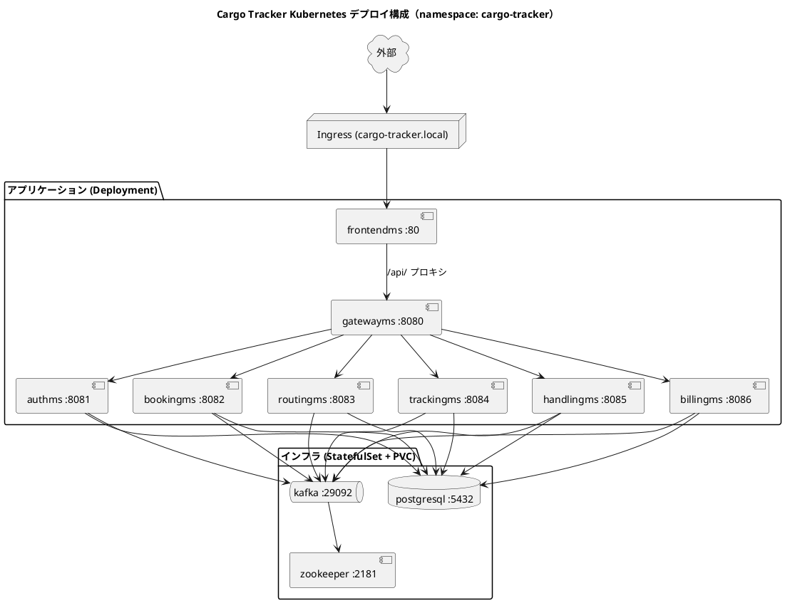

# Kubernetes 運用手順書

## 概要

本ドキュメントは、**国際貨物輸送管理システム（case-study-cargo-tracker）** を Kubernetes 上にデプロイ・運用する手順を説明します。

`apps/docker-compose.yml`（local-docker プロファイル）の構成をそのまま Kubernetes 化したマニフェストを 2 方式で提供しています。

- **Kustomize 版** — `ops/k8s/`（追加ツール不要、`kubectl` 同梱の kustomize を利用）
- **Helm 版** — `ops/helm/cargo-tracker/`（`helm` を別途導入、`values.yaml` でパラメータ化）

どちらも同一のクラスタ内構成（インフラ込み 7 ms + frontend + Ingress）を生成します。本書では両方式の手順を並列に解説し、最後に比較と使い分けを示します。

### Gulp タスク（運用の入口）

本書のコマンドは `ops/scripts/k8s.js` で Gulp タスク化されています。
タスク一覧は次で確認できます。

```bash
npx gulp k8s:help
```

| タスク | 用途 |
| :--- | :--- |
| `k8s:images:build` / `k8s:images:load` / `k8s:images` | 7 ms + frontend イメージのビルド・クラスタへのロード |
| `k8s:kustomize:render:local` / `:render:prod` | Kustomize レンダリング（クラスタ不要） |
| `k8s:kustomize:up:local` / `:up:prod` / `:down:*` | Kustomize のデプロイ・削除 |
| `k8s:helm:lint` / `:render` / `:up` / `:rollback` / `:down` | Helm の検証・デプロイ・ロールバック・削除 |
| `k8s:status` / `k8s:smoke` / `k8s:port-forward` / `k8s:clean` | 共通運用（状態確認・疎通待機・転送・完全削除） |

環境変数（`K8S_NAMESPACE` / `K8S_CLUSTER_TYPE` / `K8S_IMAGE_TAG` 等）で挙動を切り替えられます。
以降の章では各タスクが実行する素のコマンドを示します。

### デプロイ構成

インフラ（Zookeeper / Kafka / PostgreSQL）も含めてすべて `cargo-tracker` namespace に配置します。

| 種別 | リソース | Kubernetes 種別 | 補足 |
| :--- | :--- | :--- | :--- |
| インフラ | zookeeper / kafka / postgresql | StatefulSet + PVC（headless Service） | データを永続化 |
| アプリ | authms / bookingms / routingms / trackingms / handlingms / billingms / gatewayms | Deployment + ClusterIP Service | ステートレス |
| フロントエンド | frontendms（React SPA + nginx） | Deployment + ClusterIP Service | 公開エントリポイント。`/` で SPA を配信し `/api/` を gatewayms へプロキシ |
| 設定 | cargo-config / postgres-init | ConfigMap | 非機密設定・DB 初期化スクリプト |
| 機密 | cargo-secret | Secret | 開発用デフォルト値（本番は要上書き） |
| 公開 | cargo-tracker | Ingress | `/` を frontendms に公開（gatewayms はクラスタ内のまま） |



---

## 1. 前提条件

### 1.1 必要なツール

| ツール | バージョン | 確認コマンド | 用途 |
| :--- | :--- | :--- | :--- |
| kubectl | 1.27+ | `kubectl version --client` | 共通（Kustomize は同梱機能を利用） |
| ローカルクラスタ | minikube 1.32+ / kind 0.22+ / Docker Desktop | `minikube version` 等 | ローカル検証用 |
| Docker | 最新 | `docker -v` | イメージビルド |
| helm | 3.14+ | `helm version` | Helm 版のみ |

> **補足**: Kustomize は `kubectl kustomize` / `kubectl apply -k` として kubectl に同梱されているため、追加導入は不要です。Helm 版を使う場合のみ `helm` を導入してください。

### 1.2 ローカルクラスタの起動例

```bash
# minikube（Ingress アドオン込み）
minikube start --cpus=4 --memory=8192
minikube addons enable ingress

# kind
kind create cluster --name cargo-tracker
```

> **推奨スペック**: 7 ms + Kafka + PostgreSQL をフル起動するため、クラスタに **4 vCPU / 8 GB 以上**を割り当ててください。

---

## 2. 共通前提：イメージのビルドとロード

docker-compose と異なり、Kubernetes は**事前にビルド済みのイメージ**を参照します。両方式に共通の準備です。

各 ms の Dockerfile は `apps/backend/<ms>/Dockerfile` にあります。既定のイメージ名は `cargo-tracker/<ms>:latest` です。

**Gulp タスク（推奨）**: ビルド → クラスタへのロードを一括実行します。

```bash
# K8S_CLUSTER_TYPE（docker-desktop | minikube | kind）で切り替え。既定は docker-desktop
npx gulp k8s:images          # build → load を連続実行
# 個別に実行する場合
npx gulp k8s:images:build    # 7 ms + frontend のイメージをビルド
npx gulp k8s:images:load     # ローカルクラスタへロード
```

<details>
<summary>素のコマンドで実行する場合</summary>

```bash
# 7 ms のイメージをビルド（context は apps/backend）
cd apps/backend
for ms in authms bookingms routingms trackingms handlingms billingms gatewayms; do
  docker build -f "$ms/Dockerfile" -t "cargo-tracker/$ms:latest" .
done

# frontend のイメージをビルド（context は apps/frontend）
cd ../frontend
docker build -f Dockerfile -t cargo-tracker/frontendms:latest .
cd ../..

# minikube へロード
for img in authms bookingms routingms trackingms handlingms billingms gatewayms frontendms; do
  minikube image load "cargo-tracker/$img:latest"
done

# kind へロード
for img in authms bookingms routingms trackingms handlingms billingms gatewayms frontendms; do
  kind load docker-image "cargo-tracker/$img:latest" --name cargo-tracker
done
```

</details>

> **本番運用**: 外部レジストリ（ECR / GHCR 等）に push し、イメージ名を `registry.example.com/cargo-tracker/<ms>:<tag>` のように差し替えます（`K8S_IMAGE_PREFIX` / `K8S_IMAGE_TAG` で上書き可能）。差し替え方法は各方式の章を参照してください。

---

## 3. Kustomize 版での運用

### 3.1 ディレクトリ構成

```
ops/k8s/
├── base/                 # 共通マニフェスト
│   ├── kustomization.yaml
│   ├── namespace.yaml
│   ├── configmap.yaml    # cargo-config + postgres-init
│   ├── secret.yaml       # ※開発用デフォルト値
│   ├── zookeeper.yaml / kafka.yaml / postgresql.yaml
│   ├── authms.yaml ... gatewayms.yaml
│   ├── frontendms.yaml  # React SPA + nginx（公開エントリポイント）
│   └── ingress.yaml
└── overlays/
    ├── local/            # minikube/kind/Docker Desktop 用（gateway を NodePort 30080 に）
    └── prod/             # ステートレス ms を replicas:2、イメージタグ stable
```

### 3.2 レンダリング確認（クラスタ不要）

apply 前に、生成されるマニフェストを目視確認できます。

```bash
# Gulp タスク
npx gulp k8s:kustomize:render:local
npx gulp k8s:kustomize:render:prod

# 素のコマンド
kubectl kustomize ops/k8s/overlays/local
kubectl kustomize ops/k8s/overlays/prod
```

### 3.3 デプロイ

```bash
# Gulp タスク
npx gulp k8s:kustomize:up:local    # ローカル
npx gulp k8s:kustomize:up:prod     # 本番想定

# 素のコマンド
kubectl apply -k ops/k8s/overlays/local
kubectl apply -k ops/k8s/overlays/prod

# 起動状況の監視・疎通待機
kubectl -n cargo-tracker get pods -w
npx gulp k8s:smoke                 # 全 Deployment が Available になるまで待機
```

> **起動順序**: PostgreSQL / Kafka は readinessProbe が通るまで時間がかかります。各 ms はクラッシュループしながらも依存が立ち上がると安定します（`restartPolicy` による自己回復）。初回は全 Pod が Running/Ready になるまで数分かかります。

### 3.4 イメージタグの差し替え

`base/kustomization.yaml` の `images:` セクションで集中管理します。CI でビルドしたタグへ overlay 側で差し替える場合は、overlay の `kustomization.yaml` に以下を追記します。

```yaml
images:
  - name: cargo-tracker/authms
    newName: registry.example.com/cargo-tracker/authms
    newTag: "1.2.0"
  # ... 他 ms も同様
```

### 3.5 設定・環境差分

- 環境差分は `overlays/local` と `overlays/prod` で**物理的に分離**します。
- 例: `overlays/prod` はステートレス ms を `replicas: 2`、イメージタグを `stable` に設定済みです。
- 新しい環境（staging 等）を追加する場合は `overlays/staging/kustomization.yaml` を作り、`../../base` を参照して patch を重ねます。

---

## 4. Helm 版での運用

### 4.1 ディレクトリ構成

```
ops/helm/cargo-tracker/
├── Chart.yaml
├── values.yaml           # 既定値（microservices リストをループして 7 ms を生成 + frontend ブロック）
├── .helmignore
└── templates/
    ├── _helpers.tpl
    ├── config.yaml        # cargo-config / postgres-init / cargo-secret
    ├── infra.yaml         # zookeeper / kafka / postgresql
    ├── microservices.yaml # range で 7 ms の Deployment + Service を生成
    ├── frontend.yaml      # frontendms（React SPA + nginx、公開エントリポイント）
    ├── ingress.yaml
    └── NOTES.txt
```

### 4.2 Lint とレンダリング確認（クラスタ不要）

```bash
# Gulp タスク
npx gulp k8s:helm:lint       # 構文チェック
npx gulp k8s:helm:render     # 生成されるマニフェストの確認

# 素のコマンド
helm lint ops/helm/cargo-tracker
helm template cargo-tracker ops/helm/cargo-tracker -n cargo-tracker
```

### 4.3 デプロイ

```bash
# Gulp タスク（helm upgrade --install、namespace 自動作成）
npx gulp k8s:helm:up

# 素のコマンド
helm install cargo-tracker ops/helm/cargo-tracker \
  -n cargo-tracker --create-namespace

# 起動状況の監視
kubectl -n cargo-tracker get pods -w
```

### 4.4 主な values

| キー | 既定 | 説明 |
| :--- | :--- | :--- |
| `image.registry` | `cargo-tracker` | イメージ接頭辞（レジストリ） |
| `image.tag` | `latest` | 全 ms 共通タグ |
| `image.pullPolicy` | `IfNotPresent` | イメージ取得ポリシー |
| `defaults.replicas` | `1` | ステートレス ms のレプリカ数 |
| `secret.create` | `true` | `cargo-secret` を生成するか |
| `frontend.enabled` | `true` | frontendms（公開エントリポイント）を生成するか |
| `frontend.gatewayUrl` | `http://gatewayms:8080` | frontend nginx の `/api/` プロキシ先 |
| `ingress.enabled` | `true` | 外部公開（`/` → frontendms。`frontend.enabled=false` 時は gatewayms） |
| `ingress.host` | `cargo-tracker.local` | Ingress ホスト名 |

### 4.5 本番デプロイ例

```bash
helm upgrade --install cargo-tracker ops/helm/cargo-tracker \
  -n cargo-tracker --create-namespace \
  --set image.registry=registry.example.com/cargo-tracker \
  --set image.tag=1.2.0 \
  --set defaults.replicas=2 \
  --set secret.create=false   # 機密は External Secrets 等で別途投入
```

`secret.create=false` の場合は、同名・同一キー構成の `cargo-secret` を別途用意してください（後述「6. 機密管理」参照）。

### 4.6 アップグレード / ロールバック

Helm はリリースを版管理するため、`upgrade` / `rollback` が利用できます。

```bash
# 設定変更を反映（Gulp タスク = helm upgrade --install）
npx gulp k8s:helm:up

# 直前のリビジョンに戻す（Gulp タスク）
npx gulp k8s:helm:rollback

# 素のコマンド
helm upgrade cargo-tracker ops/helm/cargo-tracker -n cargo-tracker
helm history cargo-tracker -n cargo-tracker            # 履歴の確認
helm rollback cargo-tracker -n cargo-tracker           # 直前へ
helm rollback cargo-tracker 2 -n cargo-tracker         # 特定リビジョンへ
```

---

## 5. アクセス確認

公開エントリポイントは **frontendms**（`/` で React SPA を配信し、`/api/` を gatewayms へプロキシ）です。gatewayms / 各 ms はクラスタ内サービスのままです。

### 5.1 ポートフォワード（最も簡単）

```bash
# フロントエンド（公開エントリポイント）を 8080 に転送
kubectl -n cargo-tracker port-forward svc/frontendms 8080:80
# → ブラウザで http://localhost:8080 を開くと SPA が表示される

# gatewayms に直接アクセスしたい場合（Gulp タスク、Ctrl+C で終了）
npx gulp k8s:port-forward
kubectl -n cargo-tracker port-forward svc/gatewayms 8081:8080
curl http://localhost:8081/actuator/health
```

### 5.2 NodePort（Kustomize local overlay）

`overlays/local` は gatewayms Service を NodePort 30080 で公開します（フロントを介さず API を直接叩く用）。

```bash
# minikube
curl "http://$(minikube ip):30080/actuator/health"
```

### 5.3 Ingress（推奨：本来の公開経路）

```bash
# minikube の docker ドライバでは tunnel が必要（別ターミナルで起動したまま）
minikube tunnel

# Ingress の名前解決を hosts に登録
#   - tunnel 利用時:  127.0.0.1   cargo-tracker.local
#   - 直接到達可能時: $(minikube ip)  cargo-tracker.local
echo "127.0.0.1 cargo-tracker.local" | sudo tee -a /etc/hosts

# フロントエンド（SPA）
curl http://cargo-tracker.local/
# API（frontend 内 nginx が gatewayms へプロキシ）
curl http://cargo-tracker.local/api/...
```

> Windows の hosts ファイルは `C:\Windows\System32\drivers\etc\hosts` です（編集には管理者権限が必要）。
> hosts を編集せず疎通だけ確認するなら `curl -H "Host: cargo-tracker.local" http://127.0.0.1/` が使えます。

---

## 6. 機密管理

`base/secret.yaml`（Kustomize）および `values.yaml` の `secret.*`（Helm）の値は**開発・ローカル検証専用**です。本番では以下のいずれかで `cargo-secret` を上書きしてください（ハードコード禁止の原則、[ADR-0021 AWS Secrets Manager rotation](../adr/0021-aws-secrets-manager-rotation.md) と整合）。

| 方式 | 手順 |
| :--- | :--- |
| `.env` から生成 | `kubectl create secret generic cargo-secret --from-env-file=.env -n cargo-tracker` |
| Sealed Secrets | 暗号化済み `SealedSecret` をリポジトリ管理し、コントローラが復号 |
| External Secrets Operator | AWS Secrets Manager 等から `cargo-secret` を同期（ADR-0021 と親和） |

`cargo-secret` に必要なキー:

| キー | 用途 |
| :--- | :--- |
| `POSTGRES_USER` / `POSTGRES_PASSWORD` | PostgreSQL 認証 |
| `JWT_SECRET` | authms / gatewayms の JWT 署名・検証 |
| `TRACKING_PUBLIC_TOKEN_SECRET` / `TRACKING_PUBLIC_TOKEN_PREVIOUS_SECRET` | 公開追跡照会トークン（ADR-0013 / ADR-0021） |
| `SENDGRID_API_KEY` | SendGrid 通知（ADR-0018、未設定時はログ縮退） |
| `STRIPE_WEBHOOK_SIGNING_SECRET` | Stripe webhook 署名検証（ADR-0020、未設定時は 503） |

---

## 7. 運用操作

以下は方式に依存しない共通の運用コマンドです。

### 7.1 スケール

```bash
# 手動スケール（一時的）
kubectl -n cargo-tracker scale deployment/bookingms --replicas=3

# 恒久的には Kustomize は overlay の replicas、Helm は defaults.replicas を変更
```

### 7.2 ローリングアップデート

```bash
# 新イメージを反映（Deployment の image 更新で自動ローリング）
kubectl -n cargo-tracker set image deployment/authms authms=cargo-tracker/authms:1.2.1
kubectl -n cargo-tracker rollout status deployment/authms

# やり直し
kubectl -n cargo-tracker rollout undo deployment/authms
```

### 7.3 ログ確認

```bash
kubectl -n cargo-tracker logs -f deployment/gatewayms
kubectl -n cargo-tracker logs -f statefulset/kafka
```

### 7.4 状態確認

```bash
# Gulp タスク
npx gulp k8s:status          # pods/svc/statefulset/ingress を一覧

# 素のコマンド
kubectl -n cargo-tracker get pods,svc,statefulset,ingress
kubectl -n cargo-tracker describe pod <pod-name>
kubectl -n cargo-tracker get pvc
```

---

## 8. アンインストール

```bash
# Gulp タスク
npx gulp k8s:kustomize:down:local   # Kustomize（PVC は保持）
npx gulp k8s:helm:down              # Helm リリースを削除
npx gulp k8s:clean                  # namespace を PVC ごと完全削除（y/n 確認あり）

# 素のコマンド
kubectl delete -k ops/k8s/overlays/local
helm uninstall cargo-tracker -n cargo-tracker
kubectl -n cargo-tracker delete pvc --all   # PVC は StatefulSet 削除でも残るため明示削除
kubectl delete namespace cargo-tracker
```

> **注意**: PVC を削除（`k8s:clean` / `delete pvc`）すると PostgreSQL / Kafka のデータが失われます。検証環境のリセット時のみ実施してください。`k8s:clean` は実行前に y/n 確認を取ります。

---

## 9. Kustomize 版と Helm 版の比較

| 観点 | Kustomize 版（`ops/k8s/`） | Helm 版（`ops/helm/cargo-tracker/`） |
| :--- | :--- | :--- |
| ツール依存 | kubectl 同梱（追加導入不要） | helm の別途導入が必要 |
| パラメータ化 | overlay の patch / replacements | `values.yaml` + `--set` で柔軟 |
| 7 ms の重複 | 各 ms を個別 YAML で記述（明示的・冗長） | `range .Values.microservices` で 1 テンプレート化（DRY） |
| 環境差分 | overlays/local・prod を物理分離 | `-f values-<env>.yaml` で切替 |
| リリース管理 | なし（kubectl apply のみ） | `helm install/upgrade/rollback` で版管理 |
| 機密の上書き | secretGenerator / 別 Secret を適用 | `secret.create=false` + 外部 Secret |
| 学習コスト | 低（素の YAML に近い） | 中（テンプレート言語 Go template） |
| 向くケース | 構成が固定的・GitOps で差分を見たい | 多環境・再利用・配布・版管理したい |

### 使い分けの指針

- **GitOps（ArgoCD / Flux）で差分を YAML として明示的にレビューしたい** → Kustomize 版
- **多環境への展開・リリースの版管理・ロールバックを重視する** → Helm 版
- どちらも同一構成を生成するため、**運用方針に応じて一方に一本化**することを推奨します。

---

## 10. トラブルシューティング

| 症状 | 原因 | 対処 |
| :--- | :--- | :--- |
| Pod が `ImagePullBackOff` | イメージがクラスタに無い | 「2. イメージのビルドとロード」を実施。`imagePullPolicy: IfNotPresent` を確認 |
| ms が `CrashLoopBackOff` を繰り返す | PostgreSQL / Kafka がまだ Ready でない | 数分待つ。依存が安定すれば自己回復。`kubectl logs` で接続エラーを確認 |
| ms が起動するが DB エラー | 複数 DB が未作成 | `postgres-init` ConfigMap がマウントされ初期化されたか確認（PVC 初回のみ実行） |
| Ingress にアクセスできない | Ingress Controller 未導入 | `minikube addons enable ingress`。hosts 登録を確認 |
| Secret 関連で起動失敗 | `cargo-secret` のキー不足 | 「6. 機密管理」の必須キーを確認 |
| Kafka が起動しない | Zookeeper 未起動 / advertised listener 不整合 | `kafka` Service DNS（`kafka:29092`）で広告される設定を確認 |

### 関連ドキュメント

- マニフェスト本体: [`ops/k8s/README.md`](../../ops/k8s/README.md) / [`ops/helm/cargo-tracker/README.md`](../../ops/helm/cargo-tracker/README.md)
- 運用スクリプト: `ops/scripts/k8s.js`（`npx gulp k8s:help` で一覧）
- 元の compose 構成: `apps/docker-compose.yml`
- 機密ローテーション: [ADR-0021](../adr/0021-aws-secrets-manager-rotation.md)
- 通知アダプタ: [ADR-0018](../adr/0018-notification-adapter-selection.md)
- 決済 webhook: [ADR-0020](../adr/0020-payment-gateway-webhook.md)
