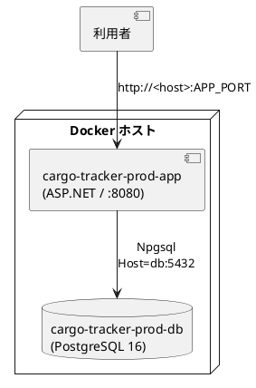

# PostgreSQL 本番環境デプロイ手順書

Cargo Tracker（F# 版）を PostgreSQL 16 とともにコンテナで稼働させる本番相当環境の構築・運用手順です。

## 構成



- **app**: `apps/cargo-tracker/Dockerfile` でビルド（マルチステージ: .NET SDK で publish → ASP.NET ランタイム）。起動時に forward-only マイグレーション（`db/scripts/postgresql`）を自動適用する。
- **db**: `postgres:16`。名前付きボリューム `cargo-tracker-prod-db-data` で永続化。ポートは外部公開しない。
- 本番はサンプルデータを投入せず、環境変数の管理者認証情報から **管理者 1 名のみ** を初期ブートストラップする。

## 前提

- Docker / Docker Compose v2
- リポジトリを配置済み（`apps/cargo-tracker` を含む）

## セットアップ

### 1. 環境変数ファイルの作成

リポジトリルートで setup タスクを実行すると、`.env.production.example` から `.env.production` を生成する（既存があれば上書きしない）。

```bash
npm run prod:setup          # = gulp ops:prod:setup
```

生成された `apps/cargo-tracker/.env.production` を編集し、以下を **強力な値** に設定する（`.env.production` は `.gitignore` 済み・コミット禁止）。

| 変数 | 用途 | 必須 |
| :--- | :--- | :--- |
| `POSTGRES_PASSWORD` | DB パスワード | ○ |
| `POSTGRES_USER` | DB ユーザー（既定 `cargo_tracker`） | |
| `POSTGRES_DB` | DB 名（既定 `cargo_tracker`） | |
| `APP_PORT` | アプリのホスト公開ポート（既定 8080） | |
| `ADMIN_USERNAME` | 初期管理者ユーザー名（既定 `admin`） | |
| `ADMIN_PASSWORD` | 初期管理者パスワード | ○ |

### 2. 起動

リポジトリルートから gulp タスク、または compose を直接使う。

```bash
# gulp（推奨）
npm run prod:up            # = gulp ops:prod:up

# または compose 直接
cd apps/cargo-tracker
docker compose -f docker-compose.prod.yml --env-file .env.production up -d --build
```

起動時にマイグレーションが自動適用され、`users` が空なら管理者が 1 名投入される。`http://<host>:APP_PORT/health` が `200` を返せば稼働中。

### 3. 初回ログイン

`ADMIN_USERNAME` / `ADMIN_PASSWORD` でログインし、**速やかにパスワードを変更**する。必要なロール（営業・経路設計者・荷役・追跡・経理）のユーザーは運用管理者が別途登録する。

## 運用コマンド（gulp `ops:prod:*`）

| コマンド | 内容 |
| :--- | :--- |
| `gulp ops:prod:setup` | `.env.production` を生成（既存は上書きしない） |
| `gulp ops:prod:build` | 本番イメージをビルド |
| `gulp ops:prod:up` | スタック起動（ビルド + マイグレーション自動適用） |
| `gulp ops:prod:down` | スタック停止・削除 |
| `gulp ops:prod:restart` | アプリのみ再起動 |
| `gulp ops:prod:ps` | 稼働状況表示 |
| `gulp ops:prod:logs` | アプリログ追尾（直近 200 行） |
| `gulp ops:prod:psql` | psql で DB 接続 |
| `gulp ops:prod:migrate` | アプリ再起動でマイグレーション適用 |
| `gulp ops:prod:backup` | `pg_dump`（カスタム形式）で `apps/cargo-tracker/backups/` にバックアップ |
| `gulp ops:prod:restore` | `RESTORE_FILE=<パス> gulp ops:prod:restore` で復元 |
| `gulp ops:prod:help` | ヘルプ表示 |

npm ショートカット: `npm run prod:setup` / `prod:up` / `prod:down` / `prod:logs` / `prod:backup` / `prod:help`。

### バックアップ・リストア例

```bash
# バックアップ（backups/cargo_tracker_<timestamp>.dump が生成される）
gulp ops:prod:backup

# リストア（APP_DIR 相対パスで指定）
RESTORE_FILE=backups/cargo_tracker_2026-07-17T10-00-00-000Z.dump gulp ops:prod:restore
```

`backups/` は `.gitignore` 済み（バックアップにはデータが含まれるためコミットしない）。

## マイグレーション

- スキーマ変更は `db/scripts/postgresql/NNNN_*.sql`（および `sqlite/`）に **forward-only** で追加する（ADR-0003）。
- 番号は連番。既適用スクリプトは編集しない（DbUp の SchemaVersions と不整合になる）。
- アプリ起動（`ops:prod:up` / `ops:prod:migrate`）で未適用分が自動適用される。

## 設計上の注記

- **時刻・日付列は PostgreSQL でも `TEXT`（ISO 8601 文字列）で保持する**。アプリは全時刻を `DateTimeOffset` の ISO 文字列として一貫して読み書きするため、`timestamptz` ではなく `TEXT` に統一して SQLite と挙動を揃えている（Npgsql の text→timestamp 暗黙キャスト不可を回避）。
- 金額は最小通貨単位の `BIGINT`、割引率・税率は `NUMERIC`、真偽値は `BOOLEAN` を用いる。
- 本番の秘密情報（DB パスワード・管理者パスワード）は `.env.production`（コミット禁止）で管理する。より堅牢にはシークレットマネージャ（Vault / SSM 等）への移行を推奨する。

## 関連ドキュメント

- [アプリケーション開発環境セットアップ手順書](アプリケーション開発環境セットアップ手順書.md)
- [ADR-0003（マイグレーションは forward-only）](../adr/0003-DBマイグレーションはDbUpによるforward-only方式を採用.md)
- `apps/cargo-tracker/docker-compose.prod.yml` / `apps/cargo-tracker/Dockerfile` / `ops/scripts/operate.js`
