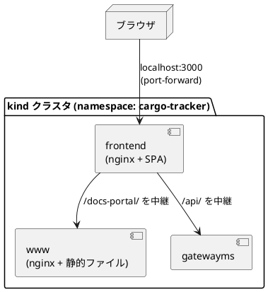

# ドキュメント環境セットアップ手順書

## 概要

国際貨物輸送管理システム（Cargo Tracker）の **ドキュメント環境** をセットアップする手順です。

**この手順書に書かれているコマンドは、実際に実行して確認したものです。** 想定ではありません。

アプリケーションそのものの構築は [アプリケーション開発環境セットアップ手順書](アプリケーション開発環境セットアップ手順書.md) を参照してください。本書はその上に載る「読むための環境」を対象とします。

### なぜポータルを置くのか

成果物が増えると、置き場所が分かれます。設計ドキュメントは MkDocs、ユーザーマニュアルは別の HTML、動いているアプリケーションは kind クラスタの中です。**どこに何があるかを知っている人しか辿り着けない状態** は、ドキュメントを書いていないのとあまり変わりません。

ポータルは 1 枚の入口として、次の 3 種類を並べます。

| 種類 | 中身 | 性質 |
| :--- | :--- | :--- |
| 設計ドキュメント | 戦略・要件・設計・開発・運用・ADR | 人が書いた **正典**。リポジトリにある |
| 生成ドキュメント | ユーザーマニュアル・JIG・ER 図 | 毎回作り直す。**コミットしない** |
| 稼働環境 | アプリケーション・公開追跡・ヘルスチェック | 動いている実物 |

設計（こう設計した）と実物（こう動いている）を並べて置くのは、突き合わせて乖離を見つけるためです。離して置くと、乖離は誰にも気づかれないまま残ります。

### 構成



**ポータルはフロントエンドと同じオリジンで開きます。** 別ポートにすると、画面のナビから開くたびに転送を張り直す必要があり、張り忘れたときに「リンクが切れている」ように見えます。同じオリジンなら、アプリを開ける人はポータルも開けます。

---

## 1. 前提条件

| ツール | バージョン | 確認コマンド | 用途 |
| :--- | :--- | :--- | :--- |
| Docker | 最新 | `docker -v` | MkDocs のビルド・ポータルのイメージ作成・jig-erd |
| Node.js | v22.x LTS | `node -v` | Gulp タスク |
| Java (JDK) | 25 | `java -version` | JIG（Gradle 経由） |
| Graphviz | 最新 | `dot -V` | jig-erd の作図 |
| kubectl | 1.3x | `kubectl version --client` | クラスタへの配置 |
| kind | 最新 | `kind version` | ローカルクラスタ |

MkDocs 本体は入れません。`docker compose` 経由で動かすため、ホストに Python 環境は要りません。

インターネット接続が要ります。PlantUML の図は既定で公開サーバ（`http://www.plantuml.com/plantuml`）でレンダリングします。社内で閉じたい場合は `.env` の `PLANTUML_SERVER_URL` を自前のサーバに向けます。

---

## 2. ディレクトリ構成

| パス | 内容 | Git |
| :--- | :--- | :--- |
| `docs/` | 設計ドキュメント（Markdown）。**正典** | 管理する |
| `docs/manual/` | ユーザーマニュアル（Markdown）とキャプチャ | 管理する |
| `apps/cargo-tracker/www/index.html` `style.css` | ポータルのトップページ | 管理する |
| `apps/cargo-tracker/www/Dockerfile` `default.conf` | ポータルの配信設定 | 管理する |
| `apps/cargo-tracker/www/docs/` | MkDocs の出力（`site/` の写し） | **無視する** |
| `apps/cargo-tracker/www/manual/` | マニュアルの HTML 出力 | **無視する** |
| `apps/cargo-tracker/www/jig/` | JIG の出力（サービス単位） | **無視する** |
| `apps/cargo-tracker/www/jig-erd/` | jig-erd の出力（サービス単位） | **無視する** |

**生成物はコミットしません。** コミットすると「コードを変えたのに図が古い」状態がリポジトリに固定され、しかもそれが正しく見えます。配るたびに作り直します。

---

## 3. ドキュメントサイトを見る（日常）

書きながら確認する用途です。ポータルもクラスタも要りません。

```bash
npx gulp mkdocs:serve   # http://localhost:8000 で配信（Docker コンテナ）
npx gulp mkdocs:open    # ブラウザで開く
npx gulp mkdocs:stop    # 止める
```

`docs/` 配下の Markdown を保存すると自動で再読み込みされます。

ナビゲーションは `mkdocs.yml` の `nav` が正典です。**ファイルを足しただけでは誰も辿り着けません。** 同じ変更で `nav` と、該当ディレクトリの `index.md` の一覧表も直します。

---

## 4. ユーザーマニュアルを作る

```bash
npx gulp manual:build
```

`docs/manual/*.md` を HTML に変換し、`apps/cargo-tracker/www/manual/` へ出力します。

変換時に次の 2 つを行います。

- **フロントマターを取り除く。** `---` で囲んだ OKF のメタ情報は文書の管理情報であり、読者向けの本文ではありません。付けたまま変換すると、区切り線と `type: Manual` の羅列が本文の先頭に出ます。読者は最初の 1 画面でそれを読むので、マニュアルが未完成に見えます
- **サイドメニューを生成する。** 全ページの一覧と、開いているページの節（`##`）を左に出します。目次ページへ戻らないと隣の章へ行けない状態にしないためです。マニュアルは手順の途中で「前の章の言葉」を確かめに戻る読み方をされます

画面キャプチャは手で差し替えません。実物から撮り直します。

```bash
npx gulp manual:capture   # apps/cargo-tracker/frontend の Playwright で撮る
```

撮影にはアプリケーションが動いている必要があります（[アプリケーション開発環境セットアップ手順書](アプリケーション開発環境セットアップ手順書.md) の「ローカル統合環境」）。

### 表示のカスタマイズ

`.env` で上書きします。未設定なら既定値が使われます。

| 変数 | 既定 | 用途 |
| :--- | :--- | :--- |
| `MANUAL_TITLE` | `ユーザーマニュアル` | サイトタイトル |
| `MANUAL_COPYRIGHT` | （空。出力しない） | フッターの著作権表示 |
| `MANUAL_PORTAL_URL` | `/docs-portal/` | ヘッダーの「ポータルへ戻る」の行き先 |
| `PLANTUML_SERVER_URL` | `http://www.plantuml.com/plantuml` | PlantUML のレンダリング先 |

---

## 5. ポータルの配信物をそろえる

```bash
npx gulp portal:artifacts
```

次を順に実行します（所要 5〜10 分。大半は MkDocs のビルドと Gradle です）。

| 順 | タスク | 出力 |
| :--- | :--- | :--- |
| 1 | `mkdocs:build` | `site/` |
| 2 | `portal:docs` | `site/` → `apps/cargo-tracker/www/docs/` |
| 3 | `manual:build` | `apps/cargo-tracker/www/manual/` |
| 4 | `dev:jig` | `backend/<module>/build/jig/` |
| 5 | `portal:jig` | → `apps/cargo-tracker/www/jig/<service>/` と入口の `index.html` |
| 6 | `dev:jig-erd` | `backend/<service>/build/jig-erd/` |
| 7 | `portal:jig-erd` | → `apps/cargo-tracker/www/jig-erd/<service>/` と入口の `index.html` |

**入口の `index.html` は生成します。** サービス名の一覧を手書きの HTML に持たせると、サービスを増やしたときに片方だけ直され、リンクの無いサービスができます。

JIG はテスト専用のモジュール（`contract-tests`・`acceptance-tests`）を載せません。読み手が探しているのは業務の構造で、テストの足場が並ぶと見つけにくくなるためです。ER 図は専用データベースを持つ 6 サービスだけです（Database per Service）。

確認します。

```bash
ls apps/cargo-tracker/www/{docs,manual,jig,jig-erd}/index.html
```

---

## 6. ポータルをクラスタへ配置する

### 6.1 イメージを作る

```bash
npx gulp k8s:images
```

7 サービス・フロントエンド・ポータルの 9 個を作ります。**ポータルの配信物（手順 5）が無いとここで止まります。** リンクだけあって中身が 404 のポータルを配らないためです。

ポータルだけ作り直す場合は次のとおりです。

```bash
docker build -t cargo-tracker/www:latest apps/cargo-tracker/www
```

### 6.2 クラスタへ載せる

```bash
npx gulp k8s:up     # 未作成なら kind クラスタを作り、マニフェストを適用する
npx gulp k8s:load   # イメージを load して rollout restart する
```

**`kind load` だけでは Pod は作り直されません。** タグが `latest` のまま同じなので、Kubernetes から見ると何も変わっていません。`k8s:load` は `rollout restart` まで踏みます。ここを飛ばすと、古いイメージのまま「反映した」と思い込みます。

配置を確認します。

```bash
kubectl -n cargo-tracker get deployment www
kubectl -n cargo-tracker rollout status deployment/www
```

### 6.3 開く

```bash
npx gulp k8s:open      # 転送を張る（Ctrl+C まで開いたまま）
npx gulp portal:open   # 別のターミナルから。ポータルをブラウザで開く
```

転送が張られる先です。

| 先 | URL |
| :--- | :--- |
| アプリケーション | <http://localhost:3000> |
| ドキュメントポータル | <http://localhost:3000/docs-portal/> |
| ポータル（直接） | <http://localhost:3001/docs-portal/> |
| API Gateway | <http://localhost:8080> |
| Axon Server コンソール | <http://localhost:8024> |

**ポータルは 3000 番からも開けます。** フロントエンドの nginx が `/docs-portal/` をポータルの Pod へ中継するためです。3001 番の転送は、アプリを起動せずポータルだけ見る場合と、Vite 開発サーバ（5173）から中継させる場合のために張っています。

---

## 7. アプリケーションからの導線

ログイン後の画面には、左サイドナビの「資料」にリンクがあります。

| リンク | 行き先 |
| :--- | :--- |
| ドキュメント | `/docs-portal/` |
| マニュアル | `/docs-portal/manual/` |

**ロールで出し分けていません。** 設計・手順書・マニュアルは職掌に関わらず読めてよく、隠すと「どこかにあるらしい」状態のまま問い合わせになります。業務画面の到達性（ロール別）とは別の考え方です。

別タブで開きます。作業中の画面を閉じると、入力途中の内容が失われるためです。

Vite 開発サーバ（`npx gulp dev:frontend`、5173 番）でも同じパスで開けます。転送先はポータルの port-forward（3001）なので、`npx gulp k8s:open` を張っていないときは開きません。

---

## 8. 更新の流れ

ドキュメントを直したあと、ポータルに反映するまでの手順です。

```bash
# 1. 生成物を作り直す
npx gulp portal:artifacts

# 2. イメージを作り直す
docker build -t cargo-tracker/www:latest apps/cargo-tracker/www

# 3. クラスタへ載せ直す（rollout restart まで踏む）
kind load docker-image cargo-tracker/www:latest --name cargo-tracker
kubectl -n cargo-tracker rollout restart deployment/www
kubectl -n cargo-tracker rollout status deployment/www
```

`npx gulp k8s:images && npx gulp k8s:load` でも同じことができますが、9 個すべてを作り直すため時間がかかります。ドキュメントだけの変更なら上の 3 ステップで足ります。

---

## 9. トラブルシューティング

| 症状 | 原因 | 対処 |
| :--- | :--- | :--- |
| `k8s:images` が「ポータルの配信物がありません」で止まる | `portal:artifacts` を実行していない | 手順 5 を実行する |
| ポータルは開くが「ドキュメントサイト」が 404 | `apps/cargo-tracker/www/docs/` が空のままイメージを作った | 手順 5 → 手順 8 |
| ドキュメントを直したのに古いまま見える | イメージを作り直していない、または `rollout restart` を踏んでいない | 手順 8 を最後まで実行する |
| `/docs-portal/` が SPA の画面になる | フロントエンドのイメージが古い（`nginx.conf` の中継が入っていない） | フロントエンドのイメージを作り直して載せ直す |
| `portal:docs` が「site/ がありません」で止まる | MkDocs のビルドが失敗している | `npx gulp mkdocs:build` を単体で実行して原因を見る |
| `portal:jig` が「jig の出力がありません」で止まる | `dev:jig`（Gradle）が失敗している | `npx gulp dev:jig` を単体で実行して原因を見る |
| `dev:jig-erd` が失敗する | Graphviz が無い、または Docker が起動していない | `dot -V` と `docker -v` を確認する |
| PlantUML の図が出ない | 公開サーバに繋がらない | `.env` の `PLANTUML_SERVER_URL` を確認する |
| `k8s:open` が「address already in use」 | `docker compose` の依存ミドルウェアが同じポートを使っている | `docker compose down` してから実行する |

---

## 関連ドキュメント

- [アプリケーション開発環境セットアップ手順書](アプリケーション開発環境セットアップ手順書.md) — アプリケーション本体の構築
- [ユーザーマニュアル](../../manual/index.md) — 変換元の Markdown
- [運用要件](../../design/cargo-tracker/operation.md) — 監視項目
