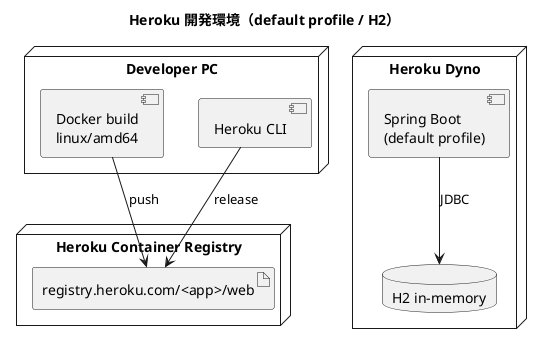

# 開発環境セットアップ手順書

## 概要

本ドキュメントは、Case Study Cargo Tracker を Heroku Container Registry で開発環境にデプロイする手順を説明します。

この開発環境では `apps/cargo-tracker` の Spring Boot アプリケーションを Heroku の `container` stack で動かし、`default` profile の H2 インメモリ構成を使用します。PostgreSQL は使わず、コンテナ単体で起動確認と画面確認を行う想定です。

> **注意**: Heroku Dev Center の [Container Registry & Runtime](https://devcenter.heroku.com/articles/container-registry-and-runtime) では、`container` stack は高度な用途向けであり、通常は buildpack ベースのデプロイを推奨しています。本プロジェクトでは Docker イメージを明示的に管理したいため、container stack を採用します。

---

## 1. 構成

| 項目 | 内容 |
| :--- | :--- |
| 実行基盤 | Heroku Container Registry / Runtime |
| デプロイ対象 | `apps/cargo-tracker` |
| プロセス種別 | `web` |
| Spring profile | `default` |
| データベース | H2（インメモリ） |
| 外部 DB | なし |
| HTTP ポート | Heroku が注入する `PORT` |



---

## 2. 前提条件

以下を満たしていることを確認してください。

| ツール | バージョン目安 | 確認コマンド |
| :--- | :--- | :--- |
| Heroku CLI | 最新 | `heroku --version` |
| Docker | 最新 | `docker version` |
| Git | 最新 | `git --version` |

Heroku Container Registry の公式ドキュメントでは、コンテナイメージを push する前に `docker ps` と `heroku login` が成功することを前提としています。また、Heroku Container Runtime は `x86_64` イメージのみサポートします。

---

## 3. アプリケーション設定

### 3.1 Spring profile

`application.yml` が `default` profile の設定として使われます。現在の構成は以下です。

- DB は H2 インメモリ `jdbc:h2:mem:cargo_tracker`
- Flyway は有効
- H2 Console は `/h2-console`
- アプリは `PORT` 環境変数を受け取り、未設定時は `8080` で起動

### 3.2 Heroku 向けの注意

Heroku Dev Center では、web プロセスは `$PORT` で HTTP を listen する必要があるとされています。`EXPOSE` はローカルテスト用途に留まり、Heroku Runtime では使用されません。

---

## 4. Dockerfile

Heroku に push する Dockerfile は `apps/cargo-tracker/Dockerfile` を使用します。

この Dockerfile は以下の方針です。

- Gradle Wrapper で `bootJar` をビルド
- テストは Docker build では実行しない
- 実行イメージは `eclipse-temurin` ベース
- 非 root ユーザーで実行

---

## 5. Heroku アプリ作成

### 5.1 ログイン

```bash
heroku login
heroku container:login
```

### 5.2 アプリ作成

```bash
heroku create <app-name> --stack container
```

既存アプリを使う場合は stack を確認し、必要なら container に切り替えます。

```bash
heroku stack:set container -a <app-name>
```

Gulp タスクで作成する場合:

```bash
npx gulp deploy:dev:app:create
```

---

## 6. Config Vars 設定

この構成では `default` profile を使うため、必須の DB 接続情報はありません。最低限、必要に応じて次を設定します。

```bash
heroku config:set \
  JAVA_OPTS="-XX:MaxRAMPercentage=75.0" \
  -a <app-name>
```

明示的に profile を固定したい場合:

```bash
heroku config:set SPRING_PROFILES_ACTIVE=default -a <app-name>
```

> **補足**: `SPRING_PROFILES_ACTIVE` を設定しなくても、`application.yml` が読み込まれるため default 構成で動作します。

### 6.1 `.env` 設定

Gulp タスクを使う場合は、プロジェクトルートの `.env` に以下を設定します。

```dotenv
DEV_HEROKU_APP_NAME=<app-name>
DEV_DOCKER_PLATFORM=linux/amd64
```

---

## 7. イメージのビルドと push

`apps/cargo-tracker` に移動して実行します。

```bash
cd apps/cargo-tracker
heroku container:push web -a <app-name>
```

Apple Silicon など非 `x86_64` 環境では、Heroku の制約に合わせて `linux/amd64` で build してください。

```bash
docker build --platform linux/amd64 -t registry.heroku.com/<app-name>/web .
docker push registry.heroku.com/<app-name>/web
```

### 7.1 Gulp タスクで実行する場合

```bash
npx gulp deploy:dev:login
npx gulp deploy:dev:build
npx gulp deploy:dev:push
```

`deploy:dev:push` は `deploy:dev:build` で作成した `registry.heroku.com/<app-name>/web` イメージを、そのまま `docker push` します。

---

## 8. リリース

```bash
heroku container:release web -a <app-name>
```

リリース後にアプリを開きます。

```bash
heroku open -a <app-name>
```

ログ確認:

```bash
heroku logs --tail -a <app-name>
```

Gulp タスク:

```bash
npx gulp deploy:dev:release
npx gulp deploy:dev:open
npx gulp deploy:dev:logs
```

---

## 9. 動作確認

### 9.1 起動確認

Heroku 上でアプリが起動したら、以下を確認します。

- ログに `Tomcat started on port(s): <PORT>` が出る
- ルート URL にアクセスできる
- ログイン画面が表示される

### 9.2 H2 の扱い

H2 はインメモリなので、dyno 再起動でデータは消えます。これは開発環境としての簡易確認用途に限定してください。

> **重要**: Heroku のファイルシステムは ephemeral です。H2 ファイル DB やアップロードファイルの永続化は前提にしないでください。

---

## 10. 更新手順

アプリ更新時は同じ手順で再 build / release します。

```bash
cd apps/cargo-tracker
heroku container:push web -a <app-name>
heroku container:release web -a <app-name>
```

または Gulp で一括実行します。

```bash
npx gulp deploy:dev
```

初回はログイン確認からまとめて実行できます。

```bash
npx gulp deploy:dev:setup
```

---

## 11. トラブルシューティング

### `R10` または起動タイムアウトになる

原因:

- アプリが `PORT` で listen していない
- build に時間がかかりすぎている

対処:

- `application.yml` で `server.port=${PORT:8080}` を確認する
- `heroku logs --tail` で bind エラーを確認する

### `unsupported architecture` が出る

原因:

- ARM64 イメージを push している

対処:

```bash
docker build --platform linux/amd64 -t registry.heroku.com/<app-name>/web .
docker push registry.heroku.com/<app-name>/web
```

### データが消える

原因:

- `default` profile の H2 はインメモリ

対処:

- 開発環境では仕様として受け入れる
- 永続化が必要になった時点で `product` profile + PostgreSQL 構成へ切り替える

### H2 Console にアクセスできない

原因:

- Spring Security や Heroku 上の公開制約

対処:

- 基本的に Heroku 開発環境では H2 Console の公開運用は行わない
- DB 内容の確認はローカル `default` profile で実施する

---

## 12. 制約

- Heroku `container` stack は base image の自動更新を行わないため、セキュリティ修正を取り込むには Docker イメージの再 build / 再 deploy が必要
- `default` profile は H2 インメモリのため、dyno 再起動で状態は失われる
- Heroku Container Runtime では `HEALTHCHECK` は使用されない

---

## 13. 関連ドキュメント

- [アプリケーション開発環境セットアップ手順書](./dev_app_instrunction.md)
- [バックエンドアーキテクチャ設計](../design/architecture_backend.md)
- [技術スタック選定](../design/tech_stack.md)
