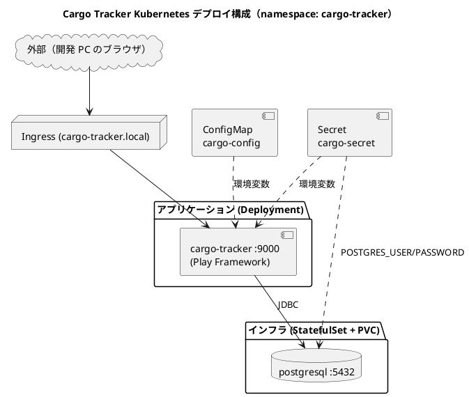

# Kubernetes 開発環境セットアップ手順書（Kustomize / Docker Desktop）

## 概要

本ドキュメントは、Case Study Cargo Tracker（Scala 版）を **Docker Desktop の Kubernetes** 上に **Kustomize** でデプロイ・運用する手順を説明します。

`docker-compose.yml` のローカル構成（Play アプリ + PostgreSQL）をそのまま Kubernetes 化したマニフェストを `ops/k8s/` で管理します。Kustomize は `kubectl` に同梱されているため（`kubectl apply -k`）、追加ツールの導入は不要です。

> **Java 版との違い**: 参考元（Java 版）はマイクロサービス構成（7 サービス + Kafka / Zookeeper）ですが、Scala 版は **Play Framework のモノリス 1 サービス + PostgreSQL** です。ドメインイベントは同一プロセス内の同期ディスパッチ（`SyncDomainEventPublisher`）のため、メッセージブローカーは不要です（[バックエンドアーキテクチャ](../design/architecture_backend.md)）。

### デプロイ構成

すべて `cargo-tracker` namespace に配置します。

| 種別 | リソース | Kubernetes 種別 | 補足 |
| :--- | :--- | :--- | :--- |
| インフラ | postgresql | StatefulSet + PVC（headless Service） | データを永続化 |
| アプリ | cargo-tracker（Play :9000） | Deployment + ClusterIP Service | ステートレス（Session は署名付き Cookie）。replicas 2 でも動作する |
| 設定 | cargo-config | ConfigMap | 非機密設定 |
| 機密 | cargo-secret | Secret | DB 認証情報・`play.http.secret.key`（開発用デフォルト値） |
| 公開 | cargo-tracker | Ingress | `/` を cargo-tracker Service に公開 |



### Gulp タスク（運用の入口）

本書のコマンドは `ops/scripts/k8s.js` の Gulp タスクとして整備します（`operating-script` で作成。未整備の間は素のコマンドを使用してください）。

```bash
npx gulp k8s:help
```

| タスク | 用途 |
| :--- | :--- |
| `k8s:images:build` | アプリイメージのビルド（Docker Desktop はロード不要） |
| `k8s:kustomize:render:local` | Kustomize レンダリング（クラスタ不要） |
| `k8s:kustomize:up:local` / `:down:local` | Kustomize のデプロイ・削除 |
| `k8s:status` / `k8s:smoke` / `k8s:port-forward` / `k8s:clean` | 状態確認・疎通待機・転送・完全削除 |

---

## 1. 前提条件

### 1.1 必要なツール

| ツール | バージョン | 確認コマンド | 用途 |
| :--- | :--- | :--- | :--- |
| Docker Desktop | 最新 | `docker -v` | Kubernetes クラスタ + イメージビルド |
| kubectl | 1.27+ | `kubectl version --client` | デプロイ（Kustomize は同梱機能を利用） |

> **補足**: Kustomize は `kubectl kustomize` / `kubectl apply -k` として kubectl に同梱されているため、追加導入は不要です。

### 1.2 Docker Desktop の Kubernetes 有効化

1. Docker Desktop → Settings → **Kubernetes** → **Enable Kubernetes** にチェック
2. **Apply & Restart** をクリック（初回はクラスタ作成に数分かかります）
3. コンテキストを確認します

```bash
# コンテキストが docker-desktop であることを確認
kubectl config current-context
# → docker-desktop

# 切り替える場合
kubectl config use-context docker-desktop

# ノード確認
kubectl get nodes
```

> **推奨スペック**: Docker Desktop の Settings → Resources で **4 CPU / 8 GB 以上**を割り当ててください（Play アプリの JVM + PostgreSQL を起動するため）。

---

## 2. イメージのビルド

Kubernetes は事前にビルド済みのイメージを参照します。アプリの Dockerfile は `apps/cargo-tracker/Dockerfile`（マルチステージビルド: `sbt stage` → `eclipse-temurin:21-jre-alpine`）です。

```bash
# アプリイメージをビルド
cd apps/cargo-tracker
docker build -t cargo-tracker/app:latest .
cd ../..
```

> **Docker Desktop の利点**: Kubernetes が Docker Desktop と**同一の Docker デーモン**を使用するため、`docker build` したイメージはロード作業なしでそのままクラスタから参照できます（minikube の `image load` や kind の `load docker-image` は不要）。マニフェスト側は `imagePullPolicy: IfNotPresent` を指定し、レジストリへの問い合わせを避けます。

> **本番運用**: 外部レジストリ（ECR 等）に push し、overlay でイメージ名・タグを差し替えます（「3.5 イメージタグの差し替え」参照）。AWS 環境のデプロイは ECS を採用しているため、Kubernetes 構成はローカル検証・学習用です。

---

## 3. Kustomize での運用

### 3.1 ディレクトリ構成

```
ops/k8s/
├── base/                  # 共通マニフェスト
│   ├── kustomization.yaml
│   ├── namespace.yaml
│   ├── configmap.yaml     # cargo-config
│   ├── secret.yaml        # cargo-secret ※開発用デフォルト値
│   ├── postgresql.yaml    # StatefulSet + PVC + headless Service
│   ├── app.yaml           # cargo-tracker Deployment + Service
│   └── ingress.yaml
└── overlays/
    └── local/             # Docker Desktop 用（NodePort 30900 を追加）
        └── kustomization.yaml
```

### 3.2 マニフェスト定義

#### base/kustomization.yaml

```yaml
apiVersion: kustomize.config.k8s.io/v1beta1
kind: Kustomization

namespace: cargo-tracker

resources:
  - namespace.yaml
  - configmap.yaml
  - secret.yaml
  - postgresql.yaml
  - app.yaml
  - ingress.yaml

images:
  - name: cargo-tracker/app
    newTag: latest
```

#### base/postgresql.yaml（抜粋）

```yaml
apiVersion: apps/v1
kind: StatefulSet
metadata:
  name: postgresql
spec:
  serviceName: postgresql
  replicas: 1
  selector:
    matchLabels:
      app: postgresql
  template:
    metadata:
      labels:
        app: postgresql
    spec:
      containers:
        - name: postgresql
          image: postgres:16-alpine
          ports:
            - containerPort: 5432
          envFrom:
            - secretRef:
                name: cargo-secret
          env:
            - name: POSTGRES_DB
              value: cargo_tracker
          volumeMounts:
            - name: data
              mountPath: /var/lib/postgresql/data
          readinessProbe:
            exec:
              command: ["pg_isready", "-U", "cargo_tracker"]
            initialDelaySeconds: 5
            periodSeconds: 5
  volumeClaimTemplates:
    - metadata:
        name: data
      spec:
        accessModes: ["ReadWriteOnce"]
        resources:
          requests:
            storage: 1Gi
---
apiVersion: v1
kind: Service
metadata:
  name: postgresql
spec:
  clusterIP: None   # headless
  selector:
    app: postgresql
  ports:
    - port: 5432
```

#### base/app.yaml（抜粋）

```yaml
apiVersion: apps/v1
kind: Deployment
metadata:
  name: cargo-tracker
spec:
  replicas: 1
  selector:
    matchLabels:
      app: cargo-tracker
  template:
    metadata:
      labels:
        app: cargo-tracker
    spec:
      containers:
        - name: cargo-tracker
          image: cargo-tracker/app:latest
          imagePullPolicy: IfNotPresent
          ports:
            - containerPort: 9000
          env:
            - name: DB_URL
              value: jdbc:postgresql://postgresql:5432/cargo_tracker
            - name: DB_USER
              valueFrom:
                secretKeyRef: { name: cargo-secret, key: POSTGRES_USER }
            - name: DB_PASSWORD
              valueFrom:
                secretKeyRef: { name: cargo-secret, key: POSTGRES_PASSWORD }
            - name: PLAY_HTTP_SECRET_KEY
              valueFrom:
                secretKeyRef: { name: cargo-secret, key: PLAY_HTTP_SECRET_KEY }
          readinessProbe:
            httpGet: { path: /health, port: 9000 }
            initialDelaySeconds: 20
            periodSeconds: 10
          livenessProbe:
            httpGet: { path: /health, port: 9000 }
            initialDelaySeconds: 60
            periodSeconds: 30
          resources:
            requests: { cpu: 250m, memory: 512Mi }
            limits: { memory: 1Gi }
---
apiVersion: v1
kind: Service
metadata:
  name: cargo-tracker
spec:
  selector:
    app: cargo-tracker
  ports:
    - port: 9000
      targetPort: 9000
```

> **ポイント**:
>
> - ヘルスチェックは自作の `/health`（DB 疎通込み）を readiness / liveness の両方に使用します
> - flyway-play が起動時にマイグレーションを適用するため、`initialDelaySeconds` に余裕を持たせます
> - Play Session は署名付きクライアントサイド Cookie のため、`replicas: 2` 以上でもスティッキーセッション不要です。ただし全 Pod に**同一の** `PLAY_HTTP_SECRET_KEY` を注入する必要があります（Secret で一元管理）
> - メモリ limit に対して JVM ヒープは `-XX:MaxRAMPercentage=75.0` で制御します（Dockerfile の `JAVA_OPTS`）

#### base/secret.yaml（開発用デフォルト値）

```yaml
apiVersion: v1
kind: Secret
metadata:
  name: cargo-secret
type: Opaque
stringData:
  POSTGRES_USER: cargo_tracker
  POSTGRES_PASSWORD: dev-only-password
  PLAY_HTTP_SECRET_KEY: dev-only-secret-key-please-override
```

#### base/ingress.yaml

```yaml
apiVersion: networking.k8s.io/v1
kind: Ingress
metadata:
  name: cargo-tracker
spec:
  ingressClassName: nginx
  rules:
    - host: cargo-tracker.local
      http:
        paths:
          - path: /
            pathType: Prefix
            backend:
              service:
                name: cargo-tracker
                port:
                  number: 9000
```

#### overlays/local/kustomization.yaml（Docker Desktop 用）

```yaml
apiVersion: kustomize.config.k8s.io/v1beta1
kind: Kustomization

resources:
  - ../../base

patches:
  - patch: |-
      apiVersion: v1
      kind: Service
      metadata:
        name: cargo-tracker
      spec:
        type: NodePort
        ports:
          - port: 9000
            targetPort: 9000
            nodePort: 30900
    target:
      kind: Service
      name: cargo-tracker
```

> `overlays/local` はアプリ Service を NodePort 30900 で公開します（Ingress Controller なしでも `http://localhost:30900` でアクセス可能）。

### 3.3 レンダリング確認（クラスタ不要）

apply 前に、生成されるマニフェストを目視確認できます。

```bash
kubectl kustomize ops/k8s/overlays/local
```

### 3.4 デプロイ

```bash
# デプロイ
kubectl apply -k ops/k8s/overlays/local

# 起動状況の監視
kubectl -n cargo-tracker get pods -w

# 全 Deployment が Available になるまで待機
kubectl -n cargo-tracker wait deployment/cargo-tracker --for=condition=Available --timeout=300s
```

> **起動順序**: PostgreSQL の readinessProbe が通るまで、アプリ Pod は Flyway の DB 接続に失敗してクラッシュループします。これは想定どおりで、依存が立ち上がると `restartPolicy` により自己回復します。初回は全 Pod が Running/Ready になるまで数分かかります。

### 3.5 イメージタグの差し替え

`base/kustomization.yaml` の `images:` セクションで集中管理します。CI でビルドしたタグや外部レジストリへ差し替える場合は、overlay 側に追記します。

```yaml
images:
  - name: cargo-tracker/app
    newName: <ACCOUNT_ID>.dkr.ecr.ap-northeast-1.amazonaws.com/cargo-tracker
    newTag: "1.2.0"
```

### 3.6 環境差分の追加

新しい環境（staging 等）を追加する場合は `overlays/staging/kustomization.yaml` を作り、`../../base` を参照して patch を重ねます（replicas・イメージタグ・リソース制限等）。

---

## 4. アクセス確認

### 4.1 ポートフォワード（最も簡単）

```bash
kubectl -n cargo-tracker port-forward svc/cargo-tracker 9000:9000

# 別ターミナルで確認
curl http://localhost:9000/health
# → {"status":"UP"}
# ブラウザで http://localhost:9000 を開くとログイン画面が表示される
```

### 4.2 NodePort（local overlay）

`overlays/local` はアプリ Service を NodePort 30900 で公開します。Docker Desktop ではノードが localhost のため、そのままアクセスできます。

```bash
curl http://localhost:30900/health
```

### 4.3 Ingress（本来の公開経路）

Docker Desktop には Ingress Controller が含まれないため、ingress-nginx を導入します。

```bash
# ingress-nginx の導入（Docker Desktop 向けマニフェスト）
kubectl apply -f https://raw.githubusercontent.com/kubernetes/ingress-nginx/main/deploy/static/provider/cloud/deploy.yaml

# 起動を待機
kubectl -n ingress-nginx wait deployment/ingress-nginx-controller --for=condition=Available --timeout=180s

# Ingress の名前解決を hosts に登録（Docker Desktop は 127.0.0.1）
echo "127.0.0.1 cargo-tracker.local" | sudo tee -a /etc/hosts

# アクセス確認
curl http://cargo-tracker.local/health
```

> Windows の hosts ファイルは `C:\Windows\System32\drivers\etc\hosts` です（編集には管理者権限が必要）。
> hosts を編集せず疎通だけ確認するなら `curl -H "Host: cargo-tracker.local" http://127.0.0.1/health` が使えます。

---

## 5. 機密管理

`base/secret.yaml` の値は**開発・ローカル検証専用**です。共有環境で使う場合は以下のいずれかで `cargo-secret` を上書きしてください（ハードコーディング禁止の原則。本番相当の機密管理は [非機能要件定義](../design/non_functional.md) の AWS Secrets Manager 方針と整合させます）。

| 方式 | 手順 |
| :--- | :--- |
| `.env` から生成 | `kubectl create secret generic cargo-secret --from-env-file=.env -n cargo-tracker` |
| Sealed Secrets | 暗号化済み `SealedSecret` をリポジトリ管理し、コントローラが復号 |
| External Secrets Operator | AWS Secrets Manager 等から `cargo-secret` を同期 |

`cargo-secret` に必要なキー:

| キー | 用途 |
| :--- | :--- |
| `POSTGRES_USER` / `POSTGRES_PASSWORD` | PostgreSQL 認証（アプリの DB 接続と共用） |
| `PLAY_HTTP_SECRET_KEY` | Play Session / CSRF トークンの署名鍵。**全 Pod で同一値**が必須。ローテーションすると全セッションが無効化される |

---

## 6. 運用操作

### 6.1 スケール

```bash
# 手動スケール（一時的）。ステートレスのため複数レプリカで動作する
kubectl -n cargo-tracker scale deployment/cargo-tracker --replicas=2

# 恒久的には overlay の patch で replicas を変更
```

### 6.2 ローリングアップデート

```bash
# 新イメージをビルドして反映
cd apps/cargo-tracker && docker build -t cargo-tracker/app:1.0.1 . && cd ../..
kubectl -n cargo-tracker set image deployment/cargo-tracker cargo-tracker=cargo-tracker/app:1.0.1
kubectl -n cargo-tracker rollout status deployment/cargo-tracker

# やり直し（直前のリビジョンへ）
kubectl -n cargo-tracker rollout undo deployment/cargo-tracker
```

> **タグ運用の注意**: `latest` タグの上書きビルドでは Deployment が変更を検知しません（`IfNotPresent` のため再取得もされません）。更新時はバージョンタグを発行して `set image` するか、`kubectl rollout restart deployment/cargo-tracker` で Pod を再作成してください。

### 6.3 ログ確認

```bash
kubectl -n cargo-tracker logs -f deployment/cargo-tracker
kubectl -n cargo-tracker logs -f statefulset/postgresql

# JSON 構造化ログを jq で整形
kubectl -n cargo-tracker logs deployment/cargo-tracker | jq -r '.message'
```

### 6.4 状態確認

```bash
kubectl -n cargo-tracker get pods,svc,statefulset,ingress
kubectl -n cargo-tracker describe pod <pod-name>
kubectl -n cargo-tracker get pvc
```

### 6.5 DB への接続

```bash
kubectl -n cargo-tracker exec -it postgresql-0 -- psql -U cargo_tracker -d cargo_tracker

# Flyway の適用状況を確認
kubectl -n cargo-tracker exec -it postgresql-0 -- \
  psql -U cargo_tracker -d cargo_tracker -c "SELECT version, description, success FROM flyway_schema_history ORDER BY installed_rank;"
```

---

## 7. アンインストール

```bash
# マニフェストの削除（PVC は保持される）
kubectl delete -k ops/k8s/overlays/local

# PVC ごと完全削除（PostgreSQL のデータが失われる）
kubectl -n cargo-tracker delete pvc --all
kubectl delete namespace cargo-tracker
```

> **注意**: PVC を削除すると PostgreSQL のデータが失われます。検証環境のリセット時のみ実施してください。

---

## 8. トラブルシューティング

| 症状 | 原因 | 対処 |
| :--- | :--- | :--- |
| Pod が `ImagePullBackOff` | イメージ未ビルド、またはコンテキストが docker-desktop でない | 「2. イメージのビルド」を実施。`kubectl config current-context` を確認。`imagePullPolicy: IfNotPresent` を確認 |
| アプリが `CrashLoopBackOff` を繰り返す | PostgreSQL がまだ Ready でない（Flyway が接続失敗） | 数分待つ。依存が安定すれば自己回復。`kubectl logs` で接続エラーを確認 |
| `Configuration error: play.http.secret.key` で起動失敗 | `cargo-secret` の `PLAY_HTTP_SECRET_KEY` 不足 | 「5. 機密管理」の必須キーを確認 |
| readinessProbe が失敗し続ける | `/health` が 503（DB 疎通失敗） | `DB_URL` の Service 名（`postgresql`）と Secret の認証情報を確認 |
| Ingress にアクセスできない | ingress-nginx 未導入 / hosts 未登録 | 「4.3 Ingress」を実施 |
| `OOMKilled` で再起動する | メモリ limit に対して JVM ヒープが過大 | `JAVA_OPTS=-XX:MaxRAMPercentage=75.0` を確認。limit を 1Gi 以上に増やす |
| 更新したのに反映されない | `latest` タグの上書き | バージョンタグで `set image`、または `rollout restart`（6.2 の注意参照） |
| 再デプロイ後にログインが全て無効 | `PLAY_HTTP_SECRET_KEY` が変わった | Secret を固定値で管理する（生成し直さない） |

---

## 9. Docker Compose との使い分け

| 観点 | Docker Compose（日常開発） | Kubernetes（本書） |
| :--- | :--- | :--- |
| 用途 | TDD・画面確認の日常開発 | コンテナオーケストレーションの検証・学習、複数レプリカでのセッション/楽観ロック挙動確認 |
| 起動 | `docker compose up -d postgres` + `sbt run`（ホットリロード） | ビルド済みイメージをデプロイ |
| 速度 | 速い（コード変更が即反映） | イメージ再ビルドが必要 |
| 本番との近さ | 低（プロセス直接実行） | 高（probe・rolling update・replicas を検証可能） |

> 日常開発は Docker Compose + `sbt run` を使い、Kubernetes はデプロイ・運用挙動（ローリングアップデート、ヘルスチェック、複数レプリカでの Cookie セッション動作）の確認に使う、という使い分けを推奨します。本番デプロイ先は AWS ECS です（[インフラストラクチャアーキテクチャ](../design/architecture_infrastructure.md)）。

---

## 関連ドキュメント

- [アプリケーション開発環境セットアップ手順書](./dev_app_instruction.md)
- [開発環境セットアップ手順書](./dev_infra_instruction.md)
- [バックエンドアーキテクチャ設計](../design/architecture_backend.md)
- [インフラストラクチャアーキテクチャ](../design/architecture_infrastructure.md)
- [非機能要件定義](../design/non_functional.md) — 機密管理・ヘルスチェック方針
