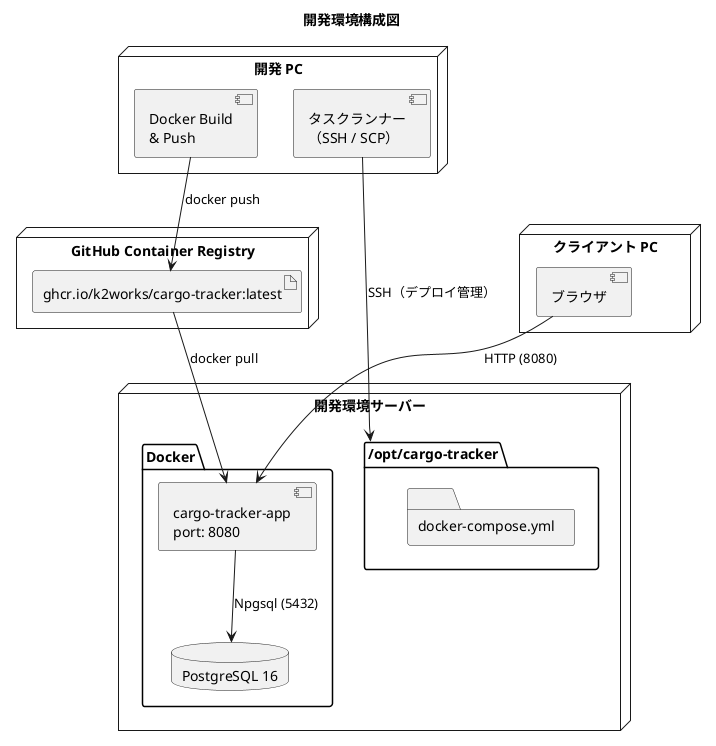
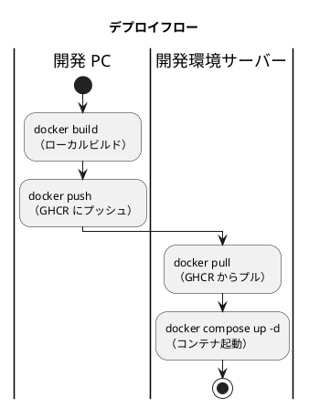

# 開発環境セットアップ手順書

## 概要

社内開発サーバーを開発環境として使用し、Cargo Tracker を Docker ベースで運用するための環境構築手順を説明します。

Docker イメージは開発 PC でビルドし、GitHub Container Registry（GHCR）経由で開発環境サーバーにデプロイします。サーバー上での Docker ビルドは不要です。

| サービス | 略称 | コンテナ名 | ポート | 説明 |
|---------|------|-----------|--------|------|
| Cargo Tracker | ct | cargo-tracker-app | 8080 | 国際貨物輸送管理システム（ASP.NET Core） |
| PostgreSQL | db | cargo-tracker-db | 5432 | データベース（PostgreSQL 16） |



### デプロイフロー



## 前提条件

- 開発環境サーバー（Linux。Docker が動作すること）
- 管理者権限を持つアカウント
- サーバーへのネットワークアクセス（SSH）
- SFTP サービスが有効（SCP ファイル転送に必要）
- GitHub アカウントと Personal Access Token（GHCR 用）
- 開発 PC に Docker Desktop がインストール済み
- 開発 PC で [アプリケーション開発環境セットアップ手順書](アプリケーション開発環境セットアップ手順書.md) が完了済み

---

## セットアップ手順

### 1. SSH・SFTP サービスの設定

#### 1.1 SSH 接続の確認

```bash
ssh <ユーザー名>@<サーバー IP>

# 接続後に確認
echo "接続成功: $(hostname) / $(date)"
docker --version
```

#### 1.2 SSH 鍵認証の設定（推奨）

```bash
# 鍵の生成（開発 PC で実行）
ssh-keygen -t ed25519 -C "your_email@example.com"

# 公開鍵をサーバーにコピー
ssh-copy-id -i ~/.ssh/id_ed25519.pub <ユーザー名>@<サーバー IP>
```

`~/.ssh/config` に設定を追記します。

```text
Host cargo-tracker-dev
    HostName <サーバー IP>
    User <ユーザー名>
    IdentityFile ~/.ssh/id_ed25519
```

設定後は `ssh cargo-tracker-dev` で接続できます。

> **Note**: 既存の Gulp タスク `ssh:ping` / `ssh:login` / `ssh:info` で接続確認・ログインを自動化できます（`.env` の `DEV_SSH_*` 変数を使用）。

---

### 2. プロジェクトディレクトリの作成

サーバー上にはソースコードや Dockerfile は配置しません。docker-compose.yml のみで管理します。

```bash
ssh <ユーザー名>@<サーバー IP>

sudo mkdir -p /opt/cargo-tracker
sudo chown $(whoami) /opt/cargo-tracker
```

```text
/opt/cargo-tracker/
└── docker-compose.yml       # Docker Compose 設定（image ベース）
```

---

### 3. GHCR（GitHub Container Registry）の設定

#### 3.1 Personal Access Token の作成

GitHub → Settings → Developer settings → Personal access tokens (classic) で作成します。

| 項目 | 設定値 |
|------|--------|
| 名前 | `cargo-tracker-dev-deploy` |
| 有効期限 | `90 days` |
| 権限 | `read:packages`、`write:packages` |

> **重要**: トークンは一度しか表示されません。紛失した場合は再発行が必要です。

#### 3.2 サーバーからの GHCR ログイン

```bash
ssh <ユーザー名>@<サーバー IP>

echo '<トークン>' | sudo docker login ghcr.io -u <GitHub ユーザー名> --password-stdin
```

#### 3.3 開発 PC の .env 設定

プロジェクトルートの `.env` に以下を設定します（`.env` は Git 管理外）。

```dotenv
# SSH 接続情報
DEV_SSH_HOST=<サーバー IP>
DEV_SSH_USER=<ユーザー名>
DEV_SSH_PORT=22
DEV_SSH_KEY=~/.ssh/id_ed25519

# Registry 認証情報
REGISTRY_USER=<GitHub ユーザー名>
REGISTRY_TOKEN=<トークン>

# オプション（デフォルト値あり）
# REGISTRY_URL=ghcr.io
# REGISTRY_OWNER=k2works
# REGISTRY_TAG=latest
# DEV_REMOTE_PROJECT_PATH=/opt/cargo-tracker
```

---

### 4. Docker Compose 設定

`/opt/cargo-tracker/docker-compose.yml` は `image:` ベースで構成します。

```yaml
services:
  app:
    image: ghcr.io/k2works/cargo-tracker:latest
    container_name: cargo-tracker-app
    restart: unless-stopped
    environment:
      ASPNETCORE_ENVIRONMENT: Staging
      ConnectionStrings__Default: "Host=db;Port=5432;Database=cargo_tracker;Username=cargo_tracker;Password=cargo_tracker"
    ports:
      - "8080:8080"
    depends_on:
      db:
        condition: service_healthy
    healthcheck:
      test: ["CMD-SHELL", "curl -fsS http://localhost:8080/health || exit 1"]
      interval: 10s
      timeout: 5s
      retries: 12
      start_period: 60s

  db:
    image: postgres:16-alpine
    container_name: cargo-tracker-db
    restart: unless-stopped
    environment:
      POSTGRES_USER: cargo_tracker
      POSTGRES_PASSWORD: cargo_tracker
      POSTGRES_DB: cargo_tracker
    volumes:
      - postgres_data:/var/lib/postgresql/data
    healthcheck:
      test: ["CMD-SHELL", "pg_isready -U cargo_tracker -d cargo_tracker"]
      interval: 10s
      timeout: 5s
      retries: 6

volumes:
  postgres_data:
```

---

### 5. イメージのビルドとプッシュ（開発 PC）

#### 5.1 イメージ構成

| サービス | Dockerfile | イメージ名 |
|---------|------------|-----------|
| Cargo Tracker | `apps/cargo-tracker/src/CargoTracker.Web/Dockerfile` | `ghcr.io/k2works/cargo-tracker:latest` |

#### 5.2 手動でのビルド・プッシュ

```bash
# GHCR にログイン
echo $REGISTRY_TOKEN | docker login ghcr.io -u $REGISTRY_USER --password-stdin

# イメージのビルドとプッシュ（ビルドコンテキストは apps/cargo-tracker）
cd apps/cargo-tracker
docker build -t ghcr.io/k2works/cargo-tracker:latest -f src/CargoTracker.Web/Dockerfile .
docker push ghcr.io/k2works/cargo-tracker:latest

# ビルドされたイメージを確認
docker images | grep cargo-tracker
```

> **Note**: Gulp によるビルド・プッシュ・デプロイの一括タスクは `operating-script` スキルで整備予定です。

---

### 6. 初回セットアップ（サーバー）

```bash
# サーバーに SSH 接続
ssh <ユーザー名>@<サーバー IP>

# GHCR にログイン
echo '<トークン>' | sudo docker login ghcr.io -u <GitHub ユーザー名> --password-stdin

# プロジェクトディレクトリに移動し docker-compose.yml を作成（セクション 4 の内容）
cd /opt/cargo-tracker
vi docker-compose.yml

# イメージをプル & コンテナ起動
sudo docker compose pull
sudo docker compose up -d

# 起動状態を確認（healthy まで約 1〜2 分）
sudo docker compose ps
# NAME               SERVICE   STATUS          PORTS
# cargo-tracker-app  app       Up (healthy)    0.0.0.0:8080->8080/tcp
# cargo-tracker-db   db        Up (healthy)    5432/tcp
```

---

### 7. 動作確認

```bash
# ヘルスチェック
curl http://<サーバー IP>:8080/health
# 期待されるレスポンス: Healthy
```

| 確認項目 | URL |
|---------|-----|
| Cargo Tracker アプリ | `http://<サーバー IP>:8080/` |
| ヘルスチェック | `http://<サーバー IP>:8080/health` |

---

### 8. 個別デプロイ（更新手順）

```bash
# 1. 開発 PC でイメージをビルド
cd apps/cargo-tracker
docker build -t ghcr.io/k2works/cargo-tracker:latest -f src/CargoTracker.Web/Dockerfile .

# 2. GHCR にプッシュ
docker push ghcr.io/k2works/cargo-tracker:latest

# 3. サーバーでプル & 再起動
ssh <ユーザー名>@<サーバー IP> \
  "cd /opt/cargo-tracker && sudo docker compose pull app && sudo docker compose up -d app"
```

---

### 9. Docker 管理コマンド

```bash
cd /opt/cargo-tracker

docker compose ps                     # コンテナの状態確認
docker compose up -d                  # 全コンテナの起動
docker compose down                   # 全コンテナの停止
docker compose restart app            # アプリのみ再起動
docker compose pull && docker compose up -d   # 最新イメージで更新
docker compose logs -f app            # アプリログ（リアルタイム）
docker compose logs --tail=100 app    # アプリログ（直近 100 行）
docker compose exec db psql -U cargo_tracker -d cargo_tracker   # DB に接続
docker image prune -f                 # 未使用イメージの削除
```

---

### 10. 環境のクリーンアップ

```bash
cd /opt/cargo-tracker

# コンテナの停止・削除（イメージも削除。DB ボリュームは保持）
docker compose down --rmi all

# DB データも含めて完全削除する場合
docker compose down --rmi all --volumes

# GHCR ログアウト
docker logout ghcr.io
```

---

### 11. トラブルシューティング

#### GHCR からプルできない（401 Unauthorized）

| 原因 | 対処 |
|------|------|
| トークンの権限不足 | `read:packages` 権限があるか確認 |
| トークンの有効期限切れ | 新しいトークンを発行し、`.env` とサーバーのログインを更新 |
| GHCR 未ログイン | `docker login ghcr.io` を実行 |

#### コンテナが起動しない

```bash
cd /opt/cargo-tracker
docker compose logs app
```

| 症状 | 原因 | 対処 |
|------|------|------|
| `image not found` | イメージ未プル / パッケージが private | `docker compose pull`、GHCR パッケージの可視性を確認 |
| `EADDRINUSE` | ポート 8080 が使用中 | `docker compose down` で既存コンテナを停止 |
| `healthcheck` が失敗 | アプリ起動に時間がかかる | `start_period` を延長 |
| DB 接続エラー | `db` サービスが未起動 | `docker compose ps` で db が healthy か確認 |

---

## ポート一覧

| サービス | ポート | 外部公開 | 備考 |
|---------|--------|---------|------|
| Cargo Tracker | 8080 | はい | HTTP |
| PostgreSQL | 5432 | いいえ | コンテナ間通信のみ |
| SSH | 22 | 制限付き | 管理者のみ |

---

## セキュリティチェックリスト

- [ ] SSH 鍵認証を設定した
- [ ] ファイアウォールで不要なポートをブロックした（5432 は外部非公開）
- [ ] GHCR のトークンを安全に管理している（`.env` は Git 管理外）
- [ ] GHCR のトークンの有効期限を把握している
- [ ] DB パスワードを開発環境専用の値に変更した

---

## 関連ドキュメント

- [アプリケーション開発環境セットアップ手順書](アプリケーション開発環境セットアップ手順書.md)
- [インフラストラクチャ](../design/architecture_infrastructure.md)
- [ADR-0003 開発 SQLite / 本番 PostgreSQL の二方言運用](../adr/0003-開発SQLite本番PostgreSQLの二方言運用.md)
