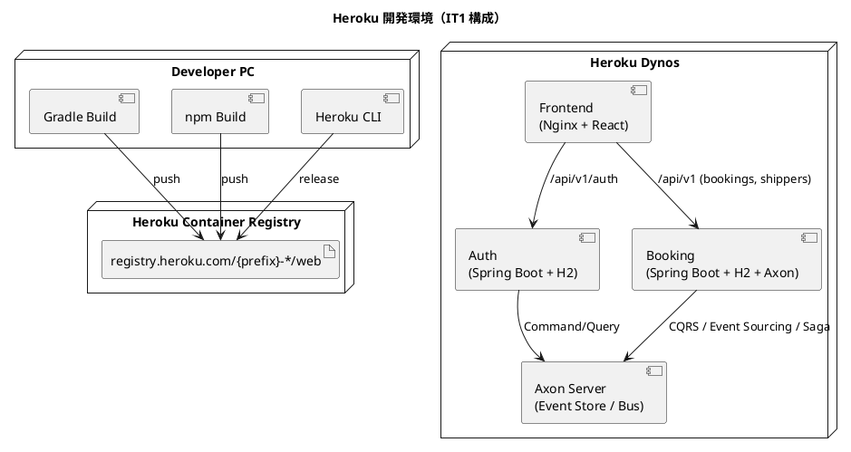

# 開発環境セットアップ手順書

## 概要

本ドキュメントは、**国際貨物輸送管理システム（case-study-cargo-tracker）** の開発環境を Heroku Container Registry でセットアップする手順を説明します。

IT1 完了状態（authms + bookingms + frontend）を対象とし、**Axon Server を専用 Heroku アプリ**として起動し、バックエンドサービスは **H2 インメモリ DB** + **Axon Server 接続**で動作させます。

> **IT1 以降の状況**: routingms / trackingms / handlingms / billingms / gatewayms は雛形（`.gitkeep`）のみで起動不可。各サービスの実装が完了次第、本手順書を更新してアプリを追加します。

---

## 1. 構成

| 項目 | 内容 |
| :--- | :--- |
| 実行基盤 | Heroku Container Registry / Runtime |
| デプロイ方式 | サービスごとに個別の Heroku アプリ |
| 命名規則 | `{prefix}-{service}`（例: `ct-axonserver`） |
| バックエンド | Spring Boot 4.0.x / Java 25 |
| フロントエンド | React 19 + Vite + Nginx |
| データベース | H2（インメモリ） |
| イベントストア / バス | Axon Server 2026.0.0（専用 Heroku アプリ） |
| HTTP ポート | Heroku が注入する `$PORT` |

### サービス一覧（IT1 時点）

| サービス | Heroku アプリ名 | ローカルポート | 説明 |
| :--- | :--- | :--- | :--- |
| Axon Server | `{prefix}-axonserver` | 8024（UI）/ 8124（gRPC） | Event Store・Command/Query/Event Bus |
| Auth Service | `{prefix}-authms` | 8081 | ユーザー認証・JWT 発行 |
| Booking Service | `{prefix}-bookingms` | 8082 | 貨物予約・荷主管理・Saga |
| Frontend | `{prefix}-frontend` | 5173 | React SPA |



---

## 2. 前提条件

| ツール | バージョン目安 | 確認コマンド |
| :--- | :--- | :--- |
| Heroku CLI | 最新 | `heroku --version` |
| Docker | 最新 | `docker version` |
| Java | 25 | `java -version` |
| Node.js | 24 | `node -v` |
| Git | 最新 | `git --version` |

Heroku Container Runtime は `x86_64` イメージのみサポートします。Apple Silicon 環境では `linux/amd64` でビルドする必要があります。

---

## 3. アプリケーション設定

### 3.1 Spring profile（`heroku`）

Heroku 環境用の新しいプロファイル `heroku` を各バックエンドサービスに追加します。このプロファイルでは：

- H2 インメモリ DB を使用（PostgreSQL 不要）
- Axon Server に環境変数 `AXON_AXONSERVER_SERVERS` で接続
- `server.port=${PORT:8080}` で Heroku の動的ポートに対応

#### authms の `application-heroku.yml`

`apps/backend/authms/src/main/resources/application-heroku.yml`:

```yaml
# Heroku 開発環境プロファイル（H2 + Axon Server）
spring:
  datasource:
    url: jdbc:h2:mem:authms;DB_CLOSE_DELAY=-1;DB_CLOSE_ON_EXIT=FALSE;MODE=PostgreSQL
    driver-class-name: org.h2.Driver
    username: sa
    password: ""
  flyway:
    enabled: true
    locations: classpath:db/migration
  h2:
    console:
      enabled: false    # 本番向けに無効化

server:
  port: ${PORT:8081}
```

#### bookingms の `application-heroku.yml`

`apps/backend/bookingms/src/main/resources/application-heroku.yml`:

```yaml
# Heroku 開発環境プロファイル（H2 + Axon Server）
spring:
  datasource:
    url: jdbc:h2:mem:bookingms;DB_CLOSE_DELAY=-1;DB_CLOSE_ON_EXIT=FALSE;MODE=PostgreSQL
    driver-class-name: org.h2.Driver
    username: sa
    password: ""
  flyway:
    enabled: true
    locations: classpath:db/migration
  h2:
    console:
      enabled: false

server:
  port: ${PORT:8082}

axon:
  axonserver:
    servers: ${AXON_AXONSERVER_SERVERS:localhost:8124}
```

> **注意**: `local-h2` プロファイルとの違いは `server.port` を `$PORT` で動的に設定する点と、H2 コンソールを無効化している点です。

### 3.2 Axon Server の Heroku 対応

Axon Server は Docker イメージ `axoniq/axonserver:2026.0.0` をそのまま Heroku にデプロイします。ただし以下の制約があります：

- Heroku のエフェメラルファイルシステムのため、**Event Store データは dyno 再起動で消えます**（H2 同様に開発確認用途に限定）
- 開発モード（`AXONIQ_AXONSERVER_DEVMODE_ENABLED=true`）で起動します
- gRPC ポート（8124）は Heroku では外部公開できません。**バックエンドサービスは同じ Heroku 内でイントラネット通信するため `{appname}.herokuapp.com` ではなく `AXON_AXONSERVER_SERVERS` 環境変数で Axon Server の DNS 名を指定します**

> **制約**: Heroku の Web Dyno は HTTP のみ外部公開されます。gRPC（8124）は外部からアクセスできません。Axon Server とバックエンドサービスが **同じ Heroku プライベートネットワーク内（Heroku Private Space / ECO dyno）** にいない限り、gRPC 直接通信はできません。
>
> **回避策（IT1 暫定）**: Axon Server の HTTP API（8024）を経由する REST ベースのコマンド送信、または Axon Framework の `SimpleCommandBus`（ローカルバス）モードを使用します。IT1 では bookingms 単体で動作するため **ローカルバスモード**（Axon Server 接続なし）が推奨です（後述 §3.3 参照）。

### 3.3 ローカルバスモード（推奨 / Axon Server 不要）

Heroku では gRPC ポートが外部公開されないため、Axon Framework のローカルコマンド/クエリバスを使用する構成が実用的です。

`application-heroku.yml` に以下を追加することで Axon Server への接続を無効化できます：

```yaml
# bookingms/authms 共通
axon:
  axonserver:
    enabled: false    # Axon Server を使わずローカルバスを使用
```

この場合、Event Store は `InMemoryEventStorageEngine`（Axon Framework 内蔵）を使用します。

```yaml
# bookingms application-heroku.yml（ローカルバスモード完全版）
spring:
  datasource:
    url: jdbc:h2:mem:bookingms;DB_CLOSE_DELAY=-1;DB_CLOSE_ON_EXIT=FALSE;MODE=PostgreSQL
    driver-class-name: org.h2.Driver
    username: sa
    password: ""
  flyway:
    enabled: true
    locations: classpath:db/migration
  h2:
    console:
      enabled: false

server:
  port: ${PORT:8082}

axon:
  axonserver:
    enabled: false
```

> **IT1 推奨**: ローカルバスモードにより Axon Server デプロイが不要になり、シンプルな構成で開発環境を実現できます。

### 3.4 フロントエンド

フロントエンドは Nginx で静的ファイルを配信し、`/api/v1/auth` を authms に、`/api/` を bookingms にプロキシします。

`apps/frontend/nginx.conf` で `API_BASE_URL` 環境変数を使用して各サービスの URL を設定します。

### 3.5 Heroku 向けの注意

- web プロセスは `$PORT` で HTTP を listen する必要がある
- `EXPOSE` はローカルテスト用途のみ。Heroku Runtime では使用されない
- `HEALTHCHECK` は Heroku Container Runtime では使用されない
- Eco dyno（512MB）に収めるため `JAVA_OPTS` でヒープ・メタスペースを明示的に制限する

---

## 4. Dockerfile の確認

### バックエンドサービス

既存の `apps/backend/{service}/Dockerfile` をそのまま使用します。ただし、Heroku 向けに `CMD` での `$PORT` 利用を確認します。

```dockerfile
ENTRYPOINT ["sh", "-c", "exec java $JAVA_OPTS -jar /app/*.jar"]
```

`JAVA_OPTS` は Heroku Config Vars で設定します。

### フロントエンド（Nginx）

`apps/frontend/Dockerfile.heroku`（新規作成が必要）:

```dockerfile
# Stage 1: ビルド
FROM node:24-alpine AS builder
WORKDIR /app
COPY package*.json ./
RUN npm install
COPY . .
RUN npm run build

# Stage 2: Nginx で配信
FROM nginx:alpine
COPY --from=builder /app/dist /usr/share/nginx/html
COPY nginx.heroku.conf /etc/nginx/conf.d/default.conf
EXPOSE 80
CMD ["sh", "-c", "envsubst '${PORT} ${AUTH_API_URL} ${BOOKING_API_URL}' < /etc/nginx/conf.d/default.conf > /tmp/nginx.conf && nginx -c /tmp/nginx.conf -g 'daemon off;'"]
```

`apps/frontend/nginx.heroku.conf`:

```nginx
server {
    listen ${PORT};

    root /usr/share/nginx/html;
    index index.html;

    location /api/v1/auth {
        proxy_pass ${AUTH_API_URL};
    }

    location /api/ {
        proxy_pass ${BOOKING_API_URL};
    }

    location / {
        try_files $uri $uri/ /index.html;
    }
}
```

---

## 5. 環境変数の設定

### 5.1 `.env` 設定

プロジェクトルートの `.env` に以下を追加します。

```dotenv
# Heroku 開発環境
DEV_HEROKU_APP_PREFIX=ct
DEV_DOCKER_PLATFORM=linux/amd64
```

| 変数名 | 必須 | 説明 |
| :--- | :--- | :--- |
| `DEV_HEROKU_APP_PREFIX` | はい | Heroku アプリ名のプレフィックス（例: `ct`） |
| `DEV_DOCKER_PLATFORM` | いいえ | Docker プラットフォーム（デフォルト: `linux/amd64`） |

### 5.2 命名規則

アプリ名は `{prefix}-{service}` の形式です。

例: `DEV_HEROKU_APP_PREFIX=ct` の場合

- `ct-authms`, `ct-bookingms`, `ct-frontend`

---

## 6. Heroku ログインとアプリ作成

### 6.1 ログイン

```bash
heroku login
heroku container:login
```

> **注意**: `heroku login` はブラウザ認証が必要なため、手動で実行してください。

### 6.2 アプリ作成

```bash
# IT1 対象サービス（authms + bookingms + frontend）
heroku create ct-authms --stack container
heroku create ct-bookingms --stack container
heroku create ct-frontend --stack container
```

Axon Server をデプロイする場合は追加:

```bash
heroku create ct-axonserver --stack container
```

### 6.3 Config Vars 設定

```bash
# authms
heroku config:set \
  SPRING_PROFILES_ACTIVE=heroku \
  JAVA_OPTS="-XX:MaxRAMPercentage=50.0 -XX:ReservedCodeCacheSize=64m -XX:MaxMetaspaceSize=128m -Dfile.encoding=UTF-8 -Duser.timezone=Asia/Tokyo" \
  JWT_SECRET="$(openssl rand -base64 64)" \
  JWT_ISSUER=case-study-cargo-tracker \
  -a ct-authms

# bookingms（ローカルバスモードの場合）
heroku config:set \
  SPRING_PROFILES_ACTIVE=heroku \
  JAVA_OPTS="-XX:MaxRAMPercentage=50.0 -XX:ReservedCodeCacheSize=64m -XX:MaxMetaspaceSize=128m -Dfile.encoding=UTF-8 -Duser.timezone=Asia/Tokyo" \
  -a ct-bookingms

# bookingms（Axon Server 接続モードの場合）
heroku config:set \
  SPRING_PROFILES_ACTIVE=heroku \
  AXON_AXONSERVER_SERVERS=ct-axonserver.herokuapp.com:443 \
  JAVA_OPTS="-XX:MaxRAMPercentage=50.0 -XX:ReservedCodeCacheSize=64m -XX:MaxMetaspaceSize=128m -Dfile.encoding=UTF-8 -Duser.timezone=Asia/Tokyo" \
  -a ct-bookingms

# frontend
heroku config:set \
  AUTH_API_URL=https://ct-authms.herokuapp.com \
  BOOKING_API_URL=https://ct-bookingms.herokuapp.com \
  -a ct-frontend
```

---

## 7. ビルドとデプロイ

### 7.1 初回セットアップ（手動手順）

```bash
# 1. バックエンド JAR をビルド
cd apps/backend
./gradlew :authms:bootJar :bookingms:bootJar
cd ../..

# 2. authms をビルド・プッシュ・リリース
cd apps/backend/authms
heroku container:push web -a ct-authms
heroku container:release web -a ct-authms
cd ../../..

# 3. bookingms をビルド・プッシュ・リリース
cd apps/backend/bookingms
heroku container:push web -a ct-bookingms
heroku container:release web -a ct-bookingms
cd ../../..

# 4. frontend をビルド・プッシュ・リリース
cd apps/frontend
heroku container:push web -a ct-frontend
heroku container:release web -a ct-frontend
cd ..
```

### 7.2 Gulp タスク経由（推奨）

`ops/scripts/deploy.js` に以下のタスクを追加します（`operating-script` スキル参照）。

```bash
# 初回セットアップ（アプリ作成 + Config Vars + ビルド + デプロイ）
npx gulp deploy:dev:setup

# 更新デプロイ（全サービス）
npx gulp deploy:dev

# 個別操作
npx gulp deploy:dev:push:authms
npx gulp deploy:dev:release:authms
```

### 7.3 Apple Silicon 対応

Apple Silicon 環境では `linux/amd64` プラットフォームを明示してビルドします。

```bash
DOCKER_DEFAULT_PLATFORM=linux/amd64 heroku container:push web -a ct-authms
```

Gulp タスクでは `.env` の `DEV_DOCKER_PLATFORM=linux/amd64` が自動適用されます。

---

## 8. 動作確認

### 8.1 起動確認

```bash
# 各サービスのログを確認
heroku logs --tail -a ct-authms
heroku logs --tail -a ct-bookingms
heroku logs --tail -a ct-frontend
```

### 8.2 ブラウザアクセス

| 確認項目 | URL |
| :--- | :--- |
| フロントエンド | `https://ct-frontend.herokuapp.com/` |
| authms Actuator | `https://ct-authms.herokuapp.com/actuator/health` |
| authms Swagger UI | `https://ct-authms.herokuapp.com/swagger-ui.html` |
| bookingms Actuator | `https://ct-bookingms.herokuapp.com/actuator/health` |
| bookingms Swagger UI | `https://ct-bookingms.herokuapp.com/swagger-ui.html` |
| bookingms Ping | `https://ct-bookingms.herokuapp.com/api/ping` |

```bash
# ヘルスチェック
curl https://ct-authms.herokuapp.com/actuator/health
curl https://ct-bookingms.herokuapp.com/actuator/health
```

### 8.3 初期ユーザー

authms の起動時に以下の初期ユーザーが Flyway マイグレーション（V005）で作成されます。

| ユーザー名 | パスワード | ロール | 用途 |
| :--- | :--- | :--- | :--- |
| `admin` | `password` | ROLE_ADMIN | 管理者操作 |
| `shipper` | `password` | ROLE_SHIPPER | 荷主操作（予約・荷主登録） |

### 8.4 H2 の扱い

H2 はインメモリのため、dyno 再起動でデータは消えます。開発環境での簡易確認用途に限定してください。永続化が必要な場合は Heroku Postgres アドオンを追加し、bookingms/authms の `application-heroku.yml` に `spring.datasource.url=${DATABASE_URL}` を設定します。

---

## 9. デプロイスクリプト一覧

```bash
# 初回セットアップ
npx gulp deploy:dev:setup

# 更新デプロイ（全サービス）
npx gulp deploy:dev

# 個別操作
npx gulp deploy:dev:push:<service>       # 特定サービスを push
npx gulp deploy:dev:release:<service>    # 特定サービスをリリース

# 確認
npx gulp deploy:dev:status               # 全サービスの状態確認
npx gulp deploy:dev:open                 # フロントエンドを開く
npx gulp deploy:dev:logs                 # ログ確認コマンド表示
npx gulp deploy:dev:help                 # ヘルプ表示
```

サービス名: `authms`, `bookingms`, `frontend`

---

## 10. トラブルシューティング

### `R10` または起動タイムアウトになる

| 原因 | 対処 |
| :--- | :--- |
| アプリが `PORT` で listen していない | `application-heroku.yml` で `server.port: ${PORT:8082}` を確認 |
| JAR が存在しない | `./gradlew bootJar` を実行してからデプロイ |
| 起動時間が 60 秒を超える | `JAVA_OPTS` に `-Dspring.main.lazy-initialization=false` が設定されていないか確認 |

### `unsupported architecture` が出る

| 原因 | 対処 |
| :--- | :--- |
| ARM64 イメージを push している | `.env` に `DEV_DOCKER_PLATFORM=linux/amd64` を設定 |

### データが消える

| 原因 | 対処 |
| :--- | :--- |
| `heroku` profile の H2 はインメモリ | 開発環境では仕様として受け入れる。永続化が必要な場合は Heroku Postgres アドオンを使用 |

### Axon Server に接続できない

| 原因 | 対処 |
| :--- | :--- |
| gRPC（8124）が Heroku で外部公開されない | ローカルバスモード（`axon.axonserver.enabled: false`）に切り替える |
| `AXON_AXONSERVER_SERVERS` が未設定 | Config Vars を確認（§6.3 参照） |

### `Error R14 (Memory quota exceeded)` が出る

| 原因 | 対処 |
| :--- | :--- |
| `JAVA_OPTS` が未設定または `MaxRAMPercentage=75` のまま | `npx gulp deploy:dev:config` で最適化版に更新 |
| それでも超過する | dyno を Standard-2X（1024MB）にアップグレード |

### authms への CORS エラーが出る

| 原因 | 対処 |
| :--- | :--- |
| `allowedOriginPatterns` に Heroku の URL が含まれていない | `SecurityConfig.java` の `corsConfigurationSource` に `https://*.herokuapp.com` が含まれているか確認 |

---

## 11. 制約

- Heroku `container` stack は base image の自動更新を行わないため、セキュリティ修正には再 build / 再 deploy が必要
- `heroku` profile は H2 インメモリ DB のため、dyno 再起動で状態は失われる
- gRPC（8124）は Heroku で外部公開されないため、Axon Server との接続はローカルバスモードが実用的
- Eco dyno（512MB）に収めるため `MaxRAMPercentage=50` まで絞っている
- `spring.main.lazy-initialization=true` は `@CommandHandler` / `@QueryHandler` の初期化を遅延させるため設定禁止
- IT1 時点では gatewayms が未実装のため、フロントエンドは直接 authms / bookingms にアクセスする
- routingms / trackingms / handlingms / billingms は Phase 1 で実装後に追加

---

## 12. 関連ドキュメント

- [アプリケーション開発環境セットアップ手順書](./アプリケーション開発環境セットアップ手順書.md)
- [バックエンドアーキテクチャ設計](../design/architecture_backend.md)
- [フロントエンドアーキテクチャ設計](../design/architecture_frontend.md)
- [インフラストラクチャアーキテクチャ](../design/architecture_infrastructure.md)
- [技術スタック選定](../design/tech_stack.md)
- [ADR-0001: Axon Framework 5 採用](../adr/0001-axon-framework-adoption.md)
- [ADR-0003: Docker 構成・シークレット管理](../adr/0003-docker-compose-secrets.md)
