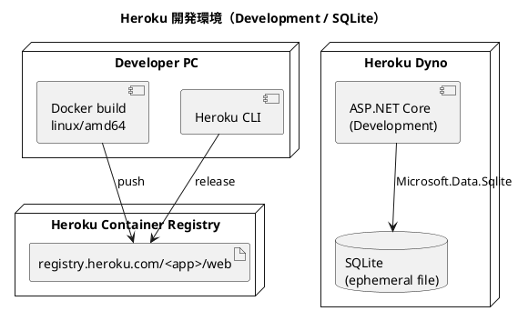

# 開発環境セットアップ手順書

## 概要

本ドキュメントは、Cargo Tracker を Heroku Container Registry で開発環境にデプロイする手順を説明します。

この開発環境では `apps/cargo-tracker` の ASP.NET Core アプリケーションを Heroku の `container` stack で動かし、SQLite（コンテナ内ファイル DB）構成を使用します。PostgreSQL は使わず、コンテナ単体で起動確認と画面確認を行う想定です（ADR-0003 の開発 DB 方針に準拠）。

> **注意**: Heroku Dev Center の [Container Registry & Runtime](https://devcenter.heroku.com/articles/container-registry-and-runtime) では、`container` stack は高度な用途向けであり、通常は buildpack ベースのデプロイを推奨しています。本プロジェクトでは Docker イメージを明示的に管理したいため、container stack を採用します。

---

## 1. 構成

| 項目 | 内容 |
| :--- | :--- |
| 実行基盤 | Heroku Container Registry / Runtime |
| デプロイ対象 | `apps/cargo-tracker` |
| プロセス種別 | `web` |
| ASPNETCORE_ENVIRONMENT | `Development` |
| データベース | SQLite（コンテナ内ファイル DB・エフェメラル） |
| 外部 DB | なし |
| HTTP ポート | Heroku が注入する `PORT` |



---

## 2. 前提条件

以下を満たしていることを確認してください。

| ツール | バージョン目安 | 確認コマンド |
| :--- | :--- | :--- |
| Heroku CLI | 最新 | `heroku --version` |
| Docker | 最新 | `docker version` |
| Git | 最新 | `git --version` |

Heroku Container Registry の公式ドキュメントでは、コンテナイメージを push する前に `docker ps` と `heroku login` が成功することを前提としています。また、Heroku Container Runtime は `x86_64` イメージのみサポートします。

---

## 3. アプリケーション設定

### 3.1 実行プロファイル

`ASPNETCORE_ENVIRONMENT=Development` の設定として動作します。現在の構成は以下です。

- DB は SQLite ファイル DB（`cargo_tracker.db`。DbUp が `Scripts/sqlite/` を適用 — IT1 で配線予定）
- ヘルスチェックは `/health`
- アプリは `PORT` 環境変数を受け取り、未設定時は `8080` で起動（Dockerfile の `ENTRYPOINT` で `ASPNETCORE_URLS=http://+:${PORT:-8080}` を設定）

### 3.2 Heroku 向けの注意

Heroku Dev Center では、web プロセスは `$PORT` で HTTP を listen する必要があるとされています。`EXPOSE` はローカルテスト用途に留まり、Heroku Runtime では使用されません（`HEALTHCHECK` も同様にローカル用です）。

---

## 4. Dockerfile

Heroku に push する Dockerfile は `apps/cargo-tracker/src/CargoTracker.Web/Dockerfile` を使用します（ビルドコンテキストは `apps/cargo-tracker`）。

この Dockerfile は以下の方針です。

- `dotnet publish` によるマルチステージビルド（`sdk:10.0` → `aspnet:10.0`）
- テストは Docker build では実行しない
- 非 root ユーザー（`app`）で実行
- `$PORT` 未設定時は 8080 で listen（ローカル互換）

---

## 5. Heroku アプリ作成

### 5.1 ログイン

```bash
heroku login
heroku container:login
```

### 5.2 アプリ作成

```bash
heroku create <app-name> --stack container
```

既存アプリを使う場合は stack を確認し、必要なら container に切り替えます。

```bash
heroku stack:set container -a <app-name>
```

---

## 6. Config Vars 設定

この構成では SQLite を使うため、必須の DB 接続情報はありません。環境を明示する場合は次を設定します。

```bash
heroku config:set ASPNETCORE_ENVIRONMENT=Development -a <app-name>
```

### 6.1 `.env` 設定

Gulp タスクを使う場合は、プロジェクトルートの `.env` に以下を設定します。

```dotenv
DEV_HEROKU_APP_NAME=<app-name>
DEV_DOCKER_PLATFORM=linux/amd64
```

---

## 7. イメージのビルドと push

`apps/cargo-tracker` に移動して実行します。

```bash
cd apps/cargo-tracker
heroku container:push web -a <app-name> --recursive=false \
  --context-path . --dockerfile src/CargoTracker.Web/Dockerfile
```

> **Note**: `heroku container:push` はデフォルトでカレントの `Dockerfile` を探すため、本プロジェクトでは `--dockerfile` でパスを明示します。CLI バージョンによりオプションが異なる場合は、以下の手動 build / push を使用してください。

Apple Silicon など非 `x86_64` 環境では、Heroku の制約に合わせて `linux/amd64` で build してください。

```bash
cd apps/cargo-tracker
docker build --platform linux/amd64 \
  -t registry.heroku.com/<app-name>/web \
  -f src/CargoTracker.Web/Dockerfile .
docker push registry.heroku.com/<app-name>/web
```

### 7.1 Gulp タスクで実行する場合

```bash
npx gulp deploy:dev:login
npx gulp deploy:dev:build
npx gulp deploy:dev:push
```

`deploy:dev:push` は `deploy:dev:build` で作成した `registry.heroku.com/<app-name>/web` イメージを、そのまま `docker push` します。

---

## 8. リリース

```bash
heroku container:release web -a <app-name>
```

リリース後にアプリを開きます。

```bash
heroku open -a <app-name>
```

ログ確認:

```bash
heroku logs --tail -a <app-name>
```

Gulp タスク:

```bash
npx gulp deploy:dev:release
npx gulp deploy:dev:open
npx gulp deploy:dev:logs
```

---

## 9. 動作確認

### 9.1 起動確認

Heroku 上でアプリが起動したら、以下を確認します。

- ログに `Now listening on: http://[::]:<PORT>` が出る
- ルート URL にアクセスできる（トップページが表示される）
- `https://<app-name>.herokuapp.com/health` が `Healthy` を返す

### 9.2 SQLite の扱い

SQLite はコンテナ内のファイル DB のため、dyno 再起動でデータは消えます。これは開発環境としての簡易確認用途に限定してください。

> **重要**: Heroku のファイルシステムは ephemeral です。SQLite ファイル DB やアップロードファイルの永続化は前提にしないでください。永続化が必要になった時点で Heroku Postgres（または AWS ステージング環境）へ切り替えます。

---

## 10. 更新手順

アプリ更新時は同じ手順で再 build / release します。

```bash
cd apps/cargo-tracker
docker build --platform linux/amd64 \
  -t registry.heroku.com/<app-name>/web \
  -f src/CargoTracker.Web/Dockerfile .
docker push registry.heroku.com/<app-name>/web
heroku container:release web -a <app-name>
```

Gulp タスクで一括実行できます。

```bash
npx gulp deploy:dev          # build → push → release
npx gulp deploy:dev:setup    # 初回（login → app:create → build → push → release）
npx gulp deploy:dev:help     # タスク一覧
```

---

## 11. トラブルシューティング

### `R10` または起動タイムアウトになる

原因:

- アプリが `PORT` で listen していない
- build に時間がかかりすぎている

対処:

- Dockerfile の `ENTRYPOINT` が `ASPNETCORE_URLS=http://+:${PORT:-8080}` を設定していることを確認する
- `heroku logs --tail` で bind エラーを確認する

### `unsupported architecture` が出る

原因:

- ARM64 イメージを push している

対処:

```bash
docker build --platform linux/amd64 \
  -t registry.heroku.com/<app-name>/web \
  -f src/CargoTracker.Web/Dockerfile .
docker push registry.heroku.com/<app-name>/web
```

### データが消える

原因:

- 開発構成の SQLite はエフェメラル（dyno 再起動で初期化）

対処:

- 開発環境では仕様として受け入れる
- 永続化が必要になった時点で PostgreSQL 構成（ステージング環境）へ切り替える

### SQLite ファイルに書き込めない

原因:

- 非 root ユーザー（`app`）が書き込めないパスに DB ファイルを配置している

対処:

- SQLite の接続文字列は作業ディレクトリ（`/app`）配下または `/tmp` を指すようにする

---

## 12. 制約

- Heroku `container` stack は base image の自動更新を行わないため、セキュリティ修正を取り込むには Docker イメージの再 build / 再 deploy が必要
- 開発構成の SQLite はエフェメラルのため、dyno 再起動で状態は失われる
- Heroku Container Runtime では `HEALTHCHECK` は使用されない（ローカル Docker 専用）

---

## 13. 関連ドキュメント

- [アプリケーション開発環境セットアップ手順書](アプリケーション開発環境セットアップ手順書.md)
- [インフラストラクチャ](../design/architecture_infrastructure.md)
- [ADR-0003 開発 SQLite / 本番 PostgreSQL の二方言運用](../adr/0003-開発SQLite本番PostgreSQLの二方言運用.md)
