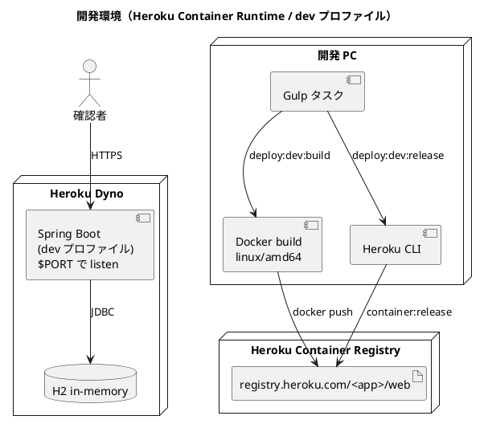
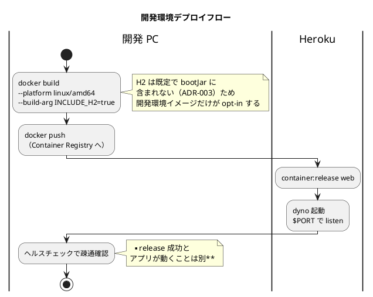

# 開発環境セットアップ手順書

## 概要

国際貨物輸送管理システム（cargo-tracker）を **Heroku Container Registry / Runtime** 上の開発環境にデプロイする手順を説明します。

この開発環境では `apps/cargo-tracker` の Spring Boot アプリケーションを Heroku の `container` stack で動かし、**`dev` プロファイル（H2 インメモリ）**で起動します。PostgreSQL は使わず、コンテナ単体での起動確認と画面確認を目的とします。

> Heroku Dev Center の [Container Registry & Runtime](https://devcenter.heroku.com/articles/container-registry-and-runtime) では、`container` stack は高度な用途向けであり通常は buildpack ベースを推奨しています。本プロジェクトでは **Docker イメージを明示的に管理したい**ため container stack を採用します。

**本ドキュメントは手順であり、実施状況ではありません。** 現時点の整備状況は [現在の整備状況](#現在の整備状況) を参照してください。

---

## 1. 構成

| 項目 | 内容 |
| :--- | :--- |
| 実行基盤 | Heroku Container Registry / Runtime |
| デプロイ対象 | `apps/cargo-tracker` |
| プロセス種別 | `web` |
| Spring プロファイル | `dev` |
| データベース | H2（インメモリ。ADR-003） |
| 外部 DB | なし |
| HTTP ポート | Heroku が注入する `$PORT` |



### デプロイフロー



---

## 2. 前提条件

| ツール | バージョン目安 | 確認コマンド |
| :--- | :--- | :--- |
| Heroku CLI | 最新 | `heroku --version` |
| Docker | 最新 | `docker version` |
| Git | 最新 | `git --version` |

前段の[アプリケーション開発環境](アプリケーション開発環境セットアップ手順書.md)が構築済みであることが前提です。**環境は段階的に構築します**（アプリケーション開発環境 → 開発環境 → ステージング → 本番）。

Heroku Container Registry は、イメージを push する前に `docker ps` と `heroku login` が成功していることを前提とします。また **Heroku Container Runtime は `x86_64` イメージのみをサポートします。**

---

## 3. アプリケーション設定

### 3.1 `dev` プロファイル

`application-dev.yml` が開発環境の設定です。ローカルの `local` プロファイルと同じく H2 インメモリを使いますが（ADR-003）、**公開環境で動くため次の点が異なります**。

| 項目 | `local`（ローカル） | `dev`（Heroku） | 理由 |
| :--- | :--- | :--- | :--- |
| H2 コンソール | 有効（`/h2-console`） | **無効** | 公開環境で DB コンソールを開けない |
| Thymeleaf キャッシュ | 無効 | 有効 | 開発時のテンプレート再読込は不要 |
| SQL デバッグログ | 出力する | 出力しない | ログ量とレスポンスの情報量を抑える |

### 3.2 `$PORT` での listen

Heroku の web プロセスは **`$PORT` で HTTP を listen しなければなりません**。listen しないと `R10`（Boot timeout）でクラッシュします。

`application.yml` で次のように設定しています。

```yaml
server:
  port: ${PORT:8080}
```

`EXPOSE` はローカル確認用途に留まり、**Heroku Runtime では使用されません**。同様に `HEALTHCHECK` も使用されません。

---

## 4. Dockerfile

`apps/cargo-tracker/Dockerfile` を使用します。方針は次のとおりです。

- Gradle Wrapper で `bootJar` をビルド（マルチステージ）
- **テストは Docker build で実行しない。** Repository のテストは Testcontainers を必要とし Docker-in-Docker が前提になるため。テストは CI と手元の `./gradlew check` で実行する
- 実行イメージは `eclipse-temurin:25-jre`
- **非 root ユーザー**（`cargotracker`）で実行
- `$PORT` と `$JAVA_OPTS` を展開するためシェル形式で起動

### 4.1 H2 の扱い（重要）

ADR-003 により **H2 は `developmentOnly` 依存であり、既定では `bootJar` に含まれません**。設定ミスで本番が H2 に接続することを防ぐためです。

一方、開発環境は H2 で起動します。そのため **開発環境イメージのビルドだけが明示的に opt-in** します。

```bash
# 開発環境イメージ（H2 を含む）
docker build --platform linux/amd64 --build-arg INCLUDE_H2=true -t <tag> .

# 既定（H2 を含まない）
docker build --platform linux/amd64 -t <tag> .
```

> **既定を安全側にしています。** 「含めない」が既定で、必要な場合だけ明示的に含めます。逆にすると、本番向けイメージを作るときに外し忘れて H2 が混入します。

---

## 5. Heroku アプリ作成

### 5.1 ログイン

```bash
heroku login
heroku container:login
```

Gulp タスク:

```bash
npx gulp deploy:dev:login
```

### 5.2 アプリ作成

```bash
heroku create <app-name> --stack container
```

既存アプリを使う場合は stack を確認し、必要なら切り替えます。

```bash
heroku stack:set container -a <app-name>
```

Gulp タスク:

```bash
npx gulp deploy:dev:app:create    # 新規作成
npx gulp deploy:dev:app:stack     # 既存アプリの stack 変更
```

---

## 6. 設定

### 6.1 `.env` 設定

プロジェクトルートの `.env` に設定します（`.env.example` を参照）。

```dotenv
DEV_HEROKU_APP_NAME=<app-name>
DEV_DOCKER_PLATFORM=linux/amd64
```

`DEV_HEROKU_APP_NAME` が未設定の場合、`deploy:dev:*` タスクは**設定を促すメッセージで停止**します。

### 6.2 Config Vars

`dev` プロファイルは H2 のため、必須の DB 接続情報はありません。

```bash
heroku config:set \
  SPRING_PROFILES_ACTIVE=dev \
  JAVA_OPTS="-XX:MaxRAMPercentage=75.0" \
  -a <app-name>
```

Gulp タスク:

```bash
npx gulp deploy:dev:config
```

> `SPRING_PROFILES_ACTIVE` は Dockerfile の `ENV` でも `dev` を指定していますが、Config Vars に明示しておくと `heroku config` で構成が読めます。

---

## 7. ビルドと push

```bash
cd apps/cargo-tracker
heroku container:push web -a <app-name>
```

Apple Silicon など非 `x86_64` 環境では、**必ず `linux/amd64` でビルド**します。

```bash
docker build --platform linux/amd64 --build-arg INCLUDE_H2=true \
  -t registry.heroku.com/<app-name>/web .
docker push registry.heroku.com/<app-name>/web
```

### 7.1 push は buildx から直接行う（重要）

**`docker build` + `docker push` では push できません。**

```text
error from registry: unsupported
```

Docker Desktop の **containerd イメージストアが OCI マニフェストで push する**一方、Heroku Container Registry は **Docker マニフェスト（schema2）しか受け付けない**ためです。レイヤーは正常に上がり、最後のマニフェスト push だけが失敗するため、原因が分かりにくい形で落ちます。

`heroku container:push` を使っても同じ理由で失敗します。

対処として buildx から直接 push し、メディアタイプを明示します。

```bash
docker buildx build --platform linux/amd64 \
  --build-arg INCLUDE_H2=true \
  --provenance=false --sbom=false \
  --output "type=image,name=registry.heroku.com/<app-name>/web,push=true,oci-mediatypes=false" .
```

| オプション | 目的 |
| :--- | :--- |
| `oci-mediatypes=false` | Docker メディアタイプを強制する |
| `provenance=false` | attestation を付けない（付くとマニフェストリストになる） |
| `sbom=false` | 同上 |

Gulp タスクはこれらを自動で付与します。

```bash
npx gulp deploy:dev:build-push    # ビルドして push
npx gulp deploy:dev:build         # ローカル確認用（push しない）
```

---

## 8. リリースと確認

```bash
heroku container:release web -a <app-name>
heroku open -a <app-name>
heroku logs --tail -a <app-name>
```

Gulp タスク:

```bash
npx gulp deploy:dev:release
npx gulp deploy:dev:verify    # ヘルスチェックで疎通を確認
npx gulp deploy:dev:open
npx gulp deploy:dev:logs
npx gulp deploy:dev:status    # dyno とリリース履歴
```

> **`deploy:dev:verify` を省略しないでください。** release が成功したことと、アプリが動いていることは別です。**ヘルスチェックで `UP` を確認するまでがデプロイです。** `deploy:dev` にはこの確認が含まれています。

### 8.1 起動確認

- ログに `Tomcat started on port(s): <PORT>` が出る
- `/actuator/health` が `{"status":"UP"}` を返す
- ルート URL にアクセスでき、ログイン画面が表示される

---

## 9. 更新手順

```bash
# 一括実行（build → push → release → verify）
npx gulp deploy:dev

# 初回はログインと Config Vars 設定から
npx gulp deploy:dev:setup
```

---

## 10. Gulp タスク一覧

```bash
npx gulp deploy:dev:help
```

| タスク | 内容 |
| :--- | :--- |
| `deploy:dev:login` | Heroku と Container Registry にログイン |
| `deploy:dev:app:create` / `deploy:dev:app:stack` | アプリ作成 / stack 変更 |
| `deploy:dev:config` | Config Vars 設定 |
| `deploy:dev:build` | ローカル確認用にビルド（push しない） |
| `deploy:dev:build-push` | ビルドして Container Registry に push |
| `deploy:dev:release` | web プロセスをリリース |
| `deploy:dev:verify` | ヘルスチェックで疎通確認 |
| `deploy:dev:open` / `deploy:dev:logs` / `deploy:dev:status` | 確認系 |
| `deploy:dev` | build-push → release → verify |
| `deploy:dev:setup` | login → config → deploy:dev |

---

## 現在の整備状況

**本節は手順ではなくスナップショットです。**

最終更新: 2026-08-06

| 項目 | 状況 | 備考 |
| :--- | :--- | :--- |
| `apps/cargo-tracker/Dockerfile` | ✅ 整備済み | マルチステージ・非 root・`$PORT` 対応 |
| `dev` プロファイル（`application-dev.yml`） | ✅ 整備済み | H2 コンソール無効・キャッシュ有効 |
| `server.port: ${PORT:8080}` | ✅ 整備済み | Heroku の `$PORT` 注入に対応 |
| H2 の opt-in ビルド（`INCLUDE_H2`） | ✅ 整備済み | 既定は含めない。開発環境イメージのみ opt-in |
| `ops/scripts/deploy.js`（Gulp タスク 13 件） | ✅ 整備済み | `gulpfile.js` に登録済み |
| `.env.example` の開発環境設定 | ✅ 整備済み | `DEV_HEROKU_APP_NAME` / `DEV_DOCKER_PLATFORM` |
| **Heroku へのデプロイ** | ✅ **実施済み** | `cargo-tracker-take-6` を container stack で作成し、デプロイと疎通確認まで完了 |

### デプロイ実績

| 項目 | 内容 |
| :--- | :--- |
| アプリ名 | `cargo-tracker-take-6`（container stack） |
| URL | `https://cargo-tracker-take-6-b878c5d99300.herokuapp.com/` |
| dyno | Eco（web.1: up） |
| 起動時間 | 5.1 秒 |
| Flyway | H2 に 1 マイグレーション適用 |
| ヘルスチェック | `{"status":"UP"}` |
| `deploy:dev` 一括実行 | 28 秒で build-push → release → verify が完了 |

### ローカルでの検証結果

| 検証 | 結果 |
| :--- | :--- |
| `linux/amd64` でのビルド | 成功（`Architecture: amd64`） |
| `$PORT` 注入での起動 | `PORT=5555` で起動し 5555 で listen |
| Flyway マイグレーション | H2 に 1 マイグレーション適用 |
| ヘルスチェック | `{"status":"UP"}`（起動 12 秒） |
| 既定ビルドの安全性 | `INCLUDE_H2` 未指定時、`app.jar` に H2 が **含まれない**ことを確認 |

### 検証で見つかった問題

#### 1. コンテナが起動しない（H2 が bootJar に無い）

**初回のビルドでは起動に失敗しました。** H2 が `developmentOnly` 依存であるため `bootJar` に含まれず、`Cannot load driver class: org.h2.Driver` でコンテナが落ちました。

ADR-003 の「本番成果物に H2 を含めない」方針と、開発環境を H2 で動かす要求が衝突していたためです。`INCLUDE_H2` ビルド引数による opt-in 方式で両立させました。**ビルドが成功したことと、コンテナが起動することは別です。**

#### 2. push が `error from registry: unsupported` で失敗する

`docker build` + `docker push` でも `heroku container:push` でも、レイヤーは上がるのにマニフェストの push だけが失敗しました。Docker Desktop の containerd イメージストアが OCI マニフェストで push する一方、Heroku Registry は Docker マニフェスト（schema2）しか受け付けないためです（[7.1](#71-push-は-buildx-から直接行う重要)）。

buildx から `oci-mediatypes=false` を指定して直接 push する方式に変更し、Gulp タスクに反映しました。**「レイヤーは上がっている」という表示に引きずられると、認証やネットワークの問題と誤診します。**

### 次に実施すること

1. ステージング環境（AWS）のセットアップ（段階 3）
2. Backend CI からの自動デプロイ（`operating-cicd` スキル）

---

## 11. トラブルシューティング

### `R10` または起動タイムアウトになる

**原因**: アプリが `$PORT` で listen していない / ビルドに時間がかかりすぎている。

**対処**:

- `application.yml` の `server.port: ${PORT:8080}` を確認する
- `heroku logs --tail -a <app-name>` で bind エラーを確認する

### `unsupported architecture` が出る

**原因**: ARM64 イメージを push している（Apple Silicon で `--platform` を指定し忘れた）。

**対処**:

```bash
docker build --platform linux/amd64 --build-arg INCLUDE_H2=true \
  -t registry.heroku.com/<app-name>/web .
docker push registry.heroku.com/<app-name>/web
```

Gulp タスクは `--platform linux/amd64` を自動で付与するため、この問題は起きません。

### `Cannot load driver class: org.h2.Driver` で起動しない

**原因**: `--build-arg INCLUDE_H2=true` を付けずにビルドした。ADR-003 により H2 は既定で `bootJar` に含まれません。

**対処**: `npx gulp deploy:dev:build` を使うか、`--build-arg INCLUDE_H2=true` を明示する。

### データが消える

**原因**: `dev` プロファイルの H2 はインメモリであり、Heroku のファイルシステムは ephemeral です。

**対処**:

- **開発環境では仕様として受け入れます**（簡易確認用途）
- 永続化が必要になった時点で Heroku Postgres + PostgreSQL 構成へ切り替えます

### H2 コンソールにアクセスできない

**原因**: `dev` プロファイルでは H2 コンソールを**意図的に無効化**しています。

**対処**: DB 内容の確認はローカルの `local` プロファイル（`/h2-console`）で行ってください。**公開環境で DB コンソールを開けてはいけません。**

---

## 12. 制約

- Heroku `container` stack は **base image の自動更新を行いません**。セキュリティ修正を取り込むにはイメージの再ビルド・再デプロイが必要です
- `dev` プロファイルは **H2 インメモリ**のため、dyno 再起動で状態は失われます
- Heroku Container Runtime では **`HEALTHCHECK` は使用されません**
- **PostgreSQL 固有のマイグレーション（`db/migration/postgresql/`）は適用されません**（ADR-003）。部分インデックスは開発環境に存在しないため、性能の確認には使えません

---

## 関連ドキュメント

- [アプリケーション開発環境セットアップ手順書](アプリケーション開発環境セットアップ手順書.md) — 前段の環境
- [ADR-003: 開発は H2、Repository のテストは Testcontainers を使う](../adr/003-database-strategy.md)
- [バックエンドアーキテクチャ設計](../design/architecture_backend.md)
- [技術スタック選定](../design/tech_stack.md)
- [インフラストラクチャ設計](../design/architecture_infrastructure.md)
