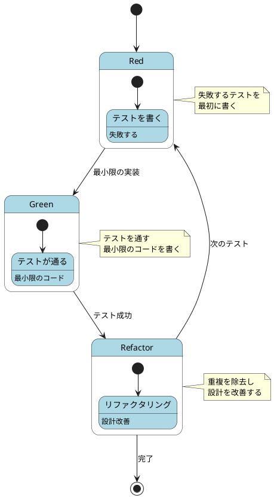
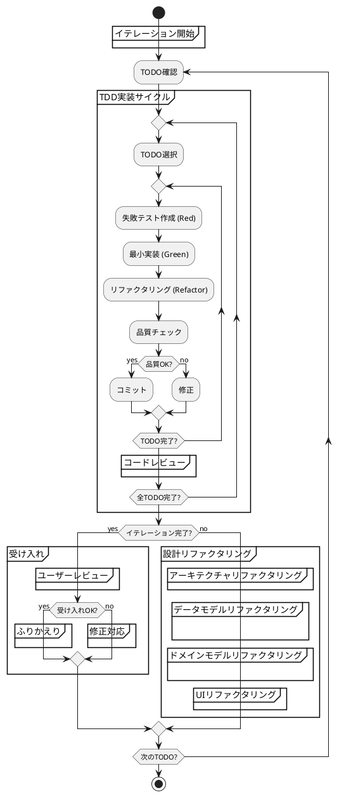
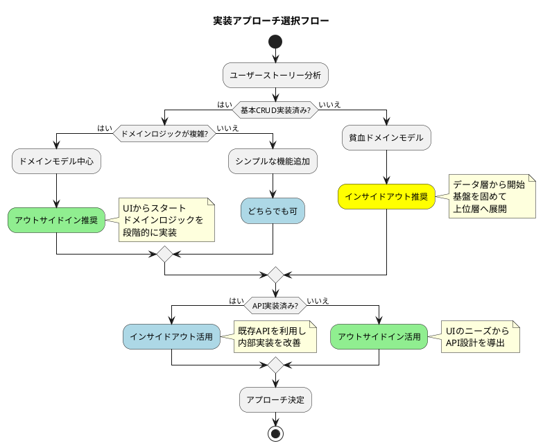
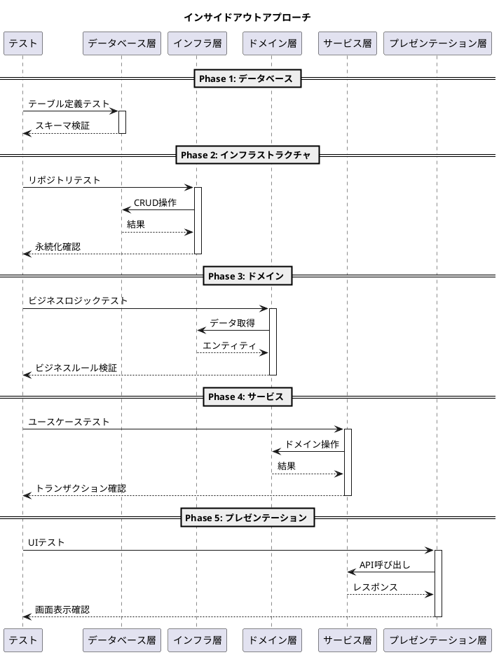
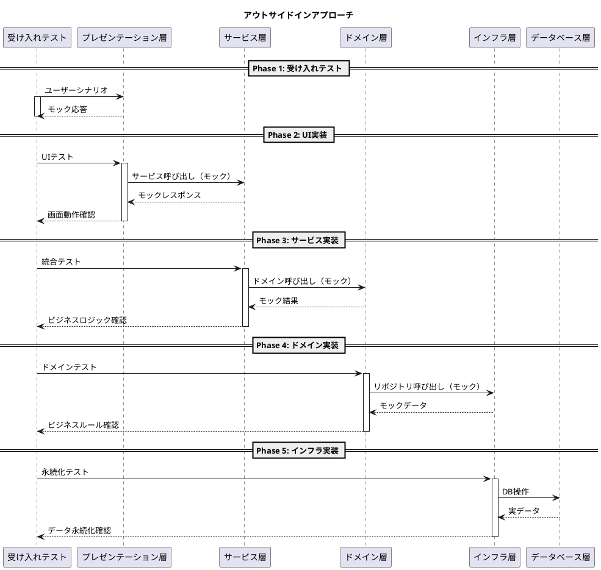
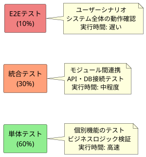
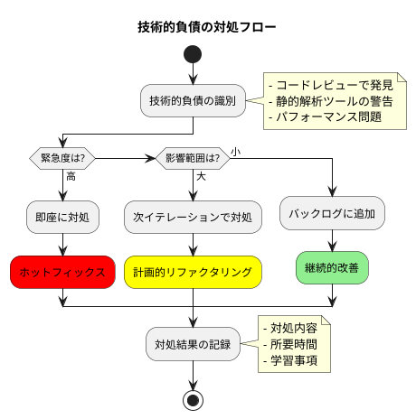

# コーディングとテストガイド

## 概要

このガイドは、開発ガイドのコーディングとテスト部分を詳細化したドキュメントです。TDD（テスト駆動開発）を中核とした実装プロセスの具体的な手順と、品質を維持するための規律を定義します。

## 基本原則

### TDD（Test-Driven Development）の三つの原則

1. **失敗するテストを書くまで、プロダクションコードを書いてはならない**
2. **失敗するテストは、失敗するのに十分なだけ書く**
3. **現在失敗しているテストを成功させる以上のプロダクションコードを書いてはならない**

### Red-Green-Refactor サイクル



## イテレーション開発フロー

### 全体プロセス



## アプローチ戦略

### インサイドアウト vs アウトサイドイン



### インサイドアウトアプローチ



### アウトサイドインアプローチ



## TDD実装の詳細手順

### 1. TODO作成

```markdown
## TODOリストの例

- [ ] ユーザー登録機能
  - [ ] Userエンティティの作成
    - [ ] 必須フィールドの検証
    - [ ] メールアドレスの形式検証
    - [ ] パスワードの強度チェック
  - [ ] UserRepositoryの実装
    - [ ] save()メソッド
    - [ ] findByEmail()メソッド
    - [ ] existsByEmail()メソッド
  - [ ] UserServiceの実装
    - [ ] register()メソッド
    - [ ] 重複チェック
    - [ ] パスワードハッシュ化
  - [ ] UserControllerの実装
    - [ ] POST /users エンドポイント
    - [ ] バリデーション
    - [ ] エラーハンドリング
```

### 2. Red フェーズ（失敗するテストを書く）

```java
// UserTest.java
@Test
void ユーザー作成時に必須フィールドが検証される() {
    // Given
    String email = "test@example.com";
    String password = "SecurePass123!";
    String name = "山田太郎";

    // When
    User user = new User(email, password, name);

    // Then
    assertThat(user.getEmail()).isEqualTo(email);
    assertThat(user.getName()).isEqualTo(name);
    // パスワードはハッシュ化されている
    assertThat(user.getPassword()).isNotEqualTo(password);
}

@Test
void 無効なメールアドレスで例外が発生する() {
    // Given
    String invalidEmail = "invalid-email";

    // When/Then
    assertThrows(IllegalArgumentException.class, () -> {
        new User(invalidEmail, "password", "name");
    });
}
```

### 3. Green フェーズ（最小限の実装）

```java
// User.java
public class User {
    private String email;
    private String password;
    private String name;

    public User(String email, String password, String name) {
        if (!isValidEmail(email)) {
            throw new IllegalArgumentException("無効なメールアドレス");
        }
        this.email = email;
        this.password = hashPassword(password);
        this.name = name;
    }

    private boolean isValidEmail(String email) {
        return email != null && email.contains("@");
    }

    private String hashPassword(String password) {
        // 簡単なハッシュ化の実装（後で改善）
        return "hashed_" + password;
    }

    // getters...
}
```

### 4. Refactor フェーズ（設計改善）

```java
// User.java (リファクタリング後)
public class User {
    private final Email email;
    private final Password password;
    private final Name name;

    public User(String email, String password, String name) {
        this.email = new Email(email);
        this.password = new Password(password);
        this.name = new Name(name);
    }

    // getters...
}

// Email.java (値オブジェクト)
public class Email {
    private static final Pattern VALID_EMAIL_PATTERN =
        Pattern.compile("^[A-Za-z0-9+_.-]+@[A-Za-z0-9.-]+\\.[A-Za-z]{2,}$");

    private final String value;

    public Email(String value) {
        if (value == null || !VALID_EMAIL_PATTERN.matcher(value).matches()) {
            throw new IllegalArgumentException("無効なメールアドレス: " + value);
        }
        this.value = value;
    }

    public String getValue() {
        return value;
    }
}

// Password.java (値オブジェクト)
public class Password {
    private static final int MIN_LENGTH = 8;
    private final String hashedValue;

    public Password(String rawPassword) {
        validate(rawPassword);
        this.hashedValue = BCrypt.hashpw(rawPassword, BCrypt.gensalt());
    }

    private void validate(String password) {
        if (password == null || password.length() < MIN_LENGTH) {
            throw new IllegalArgumentException(
                "パスワードは" + MIN_LENGTH + "文字以上必要です"
            );
        }
    }

    public boolean matches(String rawPassword) {
        return BCrypt.checkpw(rawPassword, hashedValue);
    }
}
```

## 品質チェックリスト

### コミット前の必須確認事項

```bash
# 1. テスト実行
./gradlew test  # または npm test

# 2. コードフォーマット
./gradlew spotlessApply  # または npm run format

# 3. 静的解析
./gradlew check  # または npm run lint

# 4. ビルド確認
./gradlew build  # または npm run build

# 5. カバレッジ確認
./gradlew jacocoTestReport  # または npm run test:coverage
```

### 品質基準

| 項目 | 基準 | 必須/推奨 |
|------|------|-----------|
| テストカバレッジ | 80%以上 | 必須 |
| 循環的複雑度 | 10以下 | 必須 |
| メソッドの行数 | 20行以下 | 推奨 |
| クラスの行数 | 200行以下 | 推奨 |
| 重複コード | 0% | 必須 |
| コンパイラ警告 | 0個 | 必須 |
| Linter警告 | 0個 | 必須 |

### 運用上の注意

#### JaCoCo カバレッジレポートの生成（retro Try T3）

JaCoCo の XML レポートは **フルの `./gradlew check`（または `test jacocoTestReport`）で生成** する。`./gradlew :<svc>:test --tests <Class>` のような部分実行をすると、`build/reports/jacoco/test/jacocoTestReport.xml` が **その一部のテストのみの古いカバレッジ** になり、SonarQube スキャン（`sonar.coverage.jacoco.xmlReportPaths`）に誤った値が渡る。

- TDD 中の部分実行（`--tests`）はサイクル高速化のため可。ただし **カバレッジ判定・SonarQube スキャンの前に必ずフル `check` で再生成** する。
- 受け入れ・コミット前の品質確認は `./gradlew check`（全テスト + JaCoCo + ArchUnit）で行う。

#### フロントエンド編集後の E2E 実行チェックリスト（retro Try T5）

Vite の HMR（Hot Module Replacement）が沈静化する前に E2E を実行すると、再ビルド競合で **偽陽性（実際は正常なのに失敗）** が発生する。フロント編集後に E2E を実行する際は次を守る。

- [ ] フロント編集直後は **HMR の沈静化を待つ**、または `dev` サーバーを再起動してから E2E を実行する
- [ ] 編集直後の E2E 失敗は HMR 競合の可能性があるため、**結論づける前に再実行** して再現性を確認する
- [ ] 合否判定時は出力をパイプしても **exit code を失わない**（PowerShell なら実行直後に `$LASTEXITCODE` を確認する。`| Select-Object` 等でラップした値で判定しない）
- [ ] cross-service を伴う E2E（`CROSS_SERVICE_E2E=1`）は Kafka と全サービスの起動が前提。実行前に health 疎通を確認する

## コミット規約

### コミットメッセージフォーマット

```
<type>(<scope>): <subject>

<body>

<footer>
```

### タイプ一覧

| タイプ | 説明 | 例 |
|--------|------|-----|
| feat | 新機能追加 | `feat(auth): ユーザー認証機能を追加` |
| fix | バグ修正 | `fix(api): NullPointerExceptionを修正` |
| docs | ドキュメント変更 | `docs(readme): インストール手順を更新` |
| style | コードスタイル変更 | `style: インデントを修正` |
| refactor | リファクタリング | `refactor(user): Userクラスを値オブジェクトに分割` |
| test | テスト追加・修正 | `test(user): ユーザー登録のテストを追加` |
| chore | ビルド・ツール変更 | `chore(gradle): 依存関係を更新` |

### コミット単位

- **1コミット = 1論理的変更**
- TODOリストの項目単位でコミット
- Red-Green-Refactorサイクル完了時にコミット
- ビルドが通る状態でコミット

### TDD 分離コミット運用（IT7 retrospective Try T1 反映）

IT7 で `feat: <実装>` と `test: <テスト>` を同コミットに同居させる運用（T4.1 / T4.3 / T4.6）が
発生し、後追いで T4.8 にテストを集約せざるを得なくなった。これは TDD の Red→Green→Refactor
サイクルがコミット履歴に表れない問題で、リファクタリング時の安全網が遅れるリスクがある。

#### 推奨運用: 1 タスク 3 コミット

```
1. Red コミット   → 失敗するテストを追加（コンパイル PASS / テスト FAIL / コミットメッセージは test: prefix）
2. Green コミット → 最小実装でテストを通す（feat: prefix）
3. Refactor コミット → 重複削除・命名改善（refactor: prefix、テストは変更しない）
```

#### コミットメッセージ例

```
test(billing): IssueInvoiceCommand 受理で InvoiceIssuedEvent 発火（IT N T4.1 Red）
feat(billing): IssueInvoiceCommand ハンドラ追加（IT N T4.1 Green）
refactor(billing): Issue ハンドラのガード句を BillingStatus に集約（IT N T4.1 Refactor）
```

#### Refactor が不要な場合の例外

- 既存パターンの追加（同型ハンドラの 2 件目以降）: Red + Green の 2 コミットでも可
- Refactor 不要を明示するため Green コミットメッセージに `(Refactor 不要: 既存パターン)` を付記

#### pre-commit hook での簡易検証（IT8 で実装予定）

- `test:` で始まるコミットには新規テストファイル変更（src/test 配下）が含まれることを確認
- `feat:`／`refactor:` で始まるコミットには既存テストが PASS することを確認
- 直前コミットが `test:` で当該テストが FAIL していたら次の `feat:` が通った時点で TDD サイクル完了と判定

#### 反例（IT7 で発生）

- T4.1 commit `0cb4bc16`: feat + test 同居（理想は Red コミット先行）
- T4.3 commit `32205609`: feat + test 同居
- T4.6 commit `c754654d`: feat + test 同居
- T4.8 commit `a2fe8c83`: test 後追い投入

#### 良い例（IT7 で実施）

- review M1 対応 commit `43270c3e`: 既存テストの assertion 拡張は同コミットで可（リファクタリングの一部）
- review H1 対応 commit `657e4a5a`: feat 削除 + test 修正は構造変更の一部として 1 コミット可

## テストの種類と戦略

### テストピラミッド



### テスト作成のベストプラクティス

#### 1. AAA パターン（Arrange-Act-Assert）

```java
@Test
void 商品の在庫が減少する() {
    // Arrange（準備）
    Product product = new Product("商品A", 10);
    int orderQuantity = 3;

    // Act（実行）
    product.reduceStock(orderQuantity);

    // Assert（検証）
    assertThat(product.getStock()).isEqualTo(7);
}
```

#### 2. テストの命名規則

```java
// パターン1: 日本語での説明的な名前
@Test
void 在庫が不足している場合は注文できない() { }

// パターン2: Given-When-Then形式
@Test
void given在庫10個_when15個注文_then在庫不足例外() { }

// パターン3: メソッド名_条件_期待結果
@Test
void reduceStock_在庫不足_IllegalStateException() { }
```

##### Java identifier の禁止パターン（IT9 retrospective T6 反映）

日本語と ASCII 文字を混在させると Java identifier として無効になり `'(' がありません` エラーになるパターンが頻発した。以下は **禁止**：

```java
// ❌ NG: 数字 + 日本語の直接結合
@Test
void 200_OK_応答を返す() { }   // → '(' がありません

// ❌ NG: 大文字英単語 + 日本語の直接結合
@Test
void Event_ID_衝突は副作用なく受理する() { }   // → '(' がありません

// ❌ NG: 数字混在
@Test
void 5xx応答時は failure counter が increment される() { }   // → '(' がありません
```

**OK パターン**: 日本語のみ、または英数字のみで連結する：

```java
// ✅ OK: 全て日本語
@Test
void 成功応答を返す() { }
void 同一イベント識別子の再送は副作用なく受理する() { }

// ✅ OK: 英数字のみ、アンダースコア区切り
@Test
void returns_200_when_signature_is_valid() { }

// ✅ OK: 日本語が完全に分離されたパート
@Test
void WireMockが5xx応答時はfailure_counterがincrementされる() { }
// ↑ 「5xx」「failure_counter」「increment」がそれぞれ japonized されている
```

判別法: テストメソッド名を `xxd` 等で見たとき、**日本語コードポイント直後に ASCII 数字が来る境界、または ASCII 大文字 + 日本語の境界**で Java identifier 解釈が破綻する。これを避けるには「日本語と ASCII の境界で必ず space は使えないので、別 word として明示する（_ 区切り）」か、「完全に日本語のみ」が安全。

#### 3. テストデータの準備

```java
// テストフィクスチャの使用
public class UserTestFixture {
    public static User createDefaultUser() {
        return new User(
            "test@example.com",
            "password123",
            "テストユーザー"
        );
    }

    public static User createUserWithEmail(String email) {
        return new User(
            email,
            "password123",
            "テストユーザー"
        );
    }
}
```

## リファクタリングパターン

### よく使うリファクタリング手法

| パターン | 適用場面 | 例 |
|----------|----------|-----|
| メソッド抽出 | 長いメソッドの分割 | 検証ロジックを別メソッドへ |
| 変数抽出 | 複雑な式の簡略化 | 計算結果を一時変数へ |
| クラス抽出 | 責務の分離 | 値オブジェクトの抽出 |
| メソッド移動 | 適切なクラスへの配置 | ユーティリティメソッドの移動 |
| 条件記述の分解 | 複雑な条件式の整理 | if文の条件をメソッド化 |
| ループの分割 | 単一責任の原則適用 | 異なる処理を別ループへ |

### リファクタリング実施のタイミング

1. **Rule of Three（3回ルール）**

     - 1回目: そのまま実装
     - 2回目: 重複に気づくが我慢
     - 3回目: リファクタリング実施

2. **コードの臭い（Code Smells）を検知したとき**

     - 長すぎるメソッド（20行以上）
     - 大きすぎるクラス（200行以上）
     - 長すぎるパラメータリスト（4個以上）
     - データの群れ（同じ引数の組み合わせ）
     - スイッチ文の重複

## 継続的な改善

### ふりかえりでの確認項目

```markdown
## イテレーションふりかえりテンプレート

### Keep（継続すること）
- [ ] TDDサイクルの実践
- [ ] コードレビューの実施
- [ ] 品質基準の維持

### Problem（問題点）
- [ ] テスト作成に時間がかかった箇所
- [ ] リファクタリングが不十分な箇所
- [ ] 技術的負債の発生箇所

### Try（次に試すこと）
- [ ] 新しいテスト手法の導入
- [ ] リファクタリングの自動化
- [ ] 品質メトリクスの改善

### 数値指標
- テストカバレッジ: ___%
- ビルド成功率: ___%
- バグ発生率: ___件/イテレーション
- 平均サイクルタイム: ___時間
```

### 技術的負債の管理



## 外部 SDK 統合時の手順（IT9 retrospective T2 反映）

外部 SDK（Stripe / SendGrid / AWS / Resilience4j 等）を統合する際、API ドキュメントだけでは「テストでの差し替え可能性」「拡張点」「内部経路」が読み取れず、後から「制約があって統合テストが書けない」と判明することがある（IT8 H1 SendGrid Client.buildUri が host のみ受理する問題）。これを予防するため、SDK 統合時は **最初にソース展開して拡張点を確認**するルーチンを徹底する。

### 必須ステップ

1. **依存追加直後に Maven Central から sources.jar を取得**

   ```bash
   # 例: SendGrid SDK 4.10.3 のソース展開
   find ~/.gradle/caches -name 'sendgrid-java-4.10.3-sources.jar'
   mkdir -p /tmp/sdk-src/sendgrid && cd /tmp/sdk-src/sendgrid
   unzip -o -q ~/.gradle/caches/modules-2/files-2.1/com.sendgrid/sendgrid-java/4.10.3/<hash>/sendgrid-java-4.10.3-sources.jar
   ```

2. **拡張点（コンストラクタ・抽象メソッド）を `grep` で確認**

   ```bash
   grep -nE 'public|protected|abstract|interface' /tmp/sdk-src/sendgrid/com/sendgrid/Client.java
   ```

   - `public Client(...)` コンストラクタの引数 → 差し替え対象を特定（HttpClient / boolean test 等）
   - `protected URI buildUri(...)` のような protected メソッド → サブクラスで override 可能
   - `public final` でメソッドが封印されているか確認 → サブクラス化不可

3. **既存のテスト用 fixture / wrapper パターンを GitHub で検索**

   ```bash
   # SendGrid SDK の WireMock 統合パターンを GitHub で検索
   # site:github.com "extends com.sendgrid.Client" buildUri
   ```

4. **拡張ポイントが見つからない場合の代替実装方針を起票**

   - 例: SendGrid SDK の Client が override 不可なら、RestTemplate ベース別実装 ACL を新規作成
   - 起票先: ADR or iteration_plan の「リスクと対策」

### IT9 A4.1 の教訓

IT8 で SendGrid SDK の Client.buildUri が host のみ受理（port 不可）と判明し、Mockito Request キャプチャで代替したが、SDK 内部の URL 構築ロジックが検証されない盲点が残った（H1 持ち越し）。IT9 で SDK ソース展開すると `public URI buildUri(...)` が public で override 可能と判明、`WireMockCompatibleSendGridClient` で port 指定問題を解決できた。**ソース確認を最初に行えば IT8 内で解消できた問題**。

## まとめ

コーディングとテストは、よいソフトウェアを作るための最も基本的で重要な活動です。TDDを中心としたこれらの規律を守ることで：

1. **品質の作り込み** - バグの早期発見と修正
2. **設計の改善** - 継続的なリファクタリング
3. **変更容易性** - テストによる安全網
4. **ドキュメント性** - テストが仕様書として機能

これらの実践により、「変更を楽に安全にできて役に立つソフトウェア」の実現を目指します。