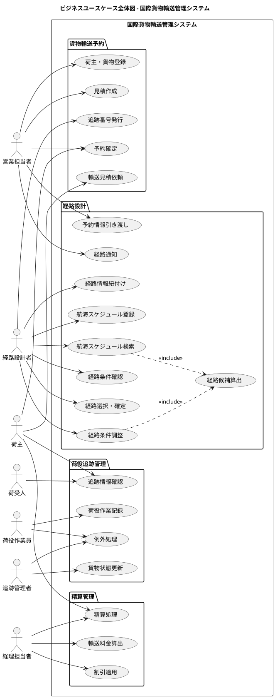

# ビジネスユースケース - 国際貨物輸送管理システム

要件定義書のシステム外部環境（層 2）を起点に、業務レベルのユースケースを定義する。

## ビジネスユースケース全体図

---

## ビジネスユースケース一覧

### 貨物輸送予約

| ID | BUC 名 | 主アクター | 概要 |
|:---|:-------|:----------|:-----|
| BUC01 | 輸送見積依頼 | 荷主 | 荷主が出発地・目的地・期限・貨物種別を指定し、輸送見積を依頼する |
| BUC02 | 見積作成 | 営業担当者 | 荷主の輸送要件を確認し、輸送料金の見積書を作成して提示する |
| BUC03 | 荷主・貨物登録 | 営業担当者 | 荷主情報と貨物仕様（種別・重量・寸法等）をシステムに登録する |
| BUC04 | 予約確定 | 荷主、営業担当者 | 荷主がルートを承認し、営業担当者が予約を確定する |
| BUC05 | 追跡番号発行 | 経路設計者 | 確定予約に対して追跡番号を発行し、荷主に通知する |

### 経路設計

| ID | BUC 名 | 主アクター | 概要 |
|:---|:-------|:----------|:-----|
| BUC21 | 航海スケジュール登録 | 経路設計者 | 各運送会社が公開している航海スケジュールを収集・確認し、経路設計システムに登録する |
| BUC06 | 予約情報引き渡し | 営業担当者 | 仮受付された予約の出発地・目的地・期限・貨物仕様を経路設計者に引き渡す |
| BUC07 | 経路条件確認 | 経路設計者 | 予約情報をもとに経路設計の制約条件（航海スケジュール・寄港地接続・港湾制約・貨物種別対応・期限）を確認する |
| BUC08 | 航海スケジュール検索 | 経路設計者 | 利用可能な航海スケジュールを検索し、経路候補算出の入力とする |
| BUC09 | 経路候補算出 | 経路設計システム | 制約条件を考慮して最適な経路候補を算出・提示する |
| BUC10 | 経路選択・確定 | 経路設計者 | 算出された経路候補から最適なものを選択し、経路を確定する |
| BUC11 | 経路条件調整 | 経路設計者 | 最適な経路候補がない場合に条件を調整し、経路候補を再算出する |
| BUC12 | 経路情報紐付け | 経路設計者 | 確定した経路情報を貨物予約に紐付ける |
| BUC13 | 経路通知 | 営業担当者 | 確定した経路情報を荷主に通知する |

### 荷役・追跡管理

| ID | BUC 名 | 主アクター | 概要 |
|:---|:-------|:----------|:-----|
| BUC14 | 荷役作業記録 | 荷役作業員 | 積込・荷降し・受領・引取等の荷役作業を実施し、作業記録をシステムに登録する |
| BUC15 | 貨物状態更新 | 追跡管理者 | 荷役作業記録を受けて貨物の現在状態と追跡情報を更新する |
| BUC16 | 追跡情報確認 | 荷主、荷受人 | 追跡番号を使って貨物の現在位置・状態・到着予定を確認する |
| BUC17 | 例外処理 | 荷役作業員、追跡管理者 | 遅延・破損・紛失等の例外発生時に記録し、関係者に報告・対応を行う |

### 精算管理

| ID | BUC 名 | 主アクター | 概要 |
|:---|:-------|:----------|:-----|
| BUC18 | 輸送料金算出 | 経理担当者 | 配送完了後に輸送距離・重量・貨物種別をもとに料金を算出する |
| BUC19 | 割引適用 | 経理担当者 | 法人荷主の契約条件に基づき割引を適用する |
| BUC20 | 精算処理 | 経理担当者、荷主 | 精算書を荷主に提示し、支払いを処理して精算を完了する |

---

## アクター・目的リスト

| アクター | 種別 | 目的 | レベル | 優先度 |
|:--------|:-----|:-----|:------:|:------:|
| 荷主 | 主アクター | 輸送見積を依頼する | 🌊 | 高 |
| 荷主 | 主アクター | ルートを選択・予約を確定する | 🌊 | 高 |
| 荷主 | 主アクター | 貨物の現在状態を追跡確認する | 🌊 | 高 |
| 荷主 | 主アクター | 精算書を確認・支払いをする | 🌊 | 中 |
| 荷受人 | 主アクター | 貨物の到着予定を確認する | 🌊 | 中 |
| 営業担当者 | 主アクター | 輸送見積を作成する | 🌊 | 高 |
| 営業担当者 | 主アクター | 荷主・貨物情報を登録する | 🌊 | 高 |
| 営業担当者 | 主アクター | 予約を確定する | 🌊 | 高 |
| 営業担当者 | 主アクター | 予約情報を経路設計者に引き渡す | 🌊 | 高 |
| 営業担当者 | 主アクター | 確定経路を荷主に通知する | 🌊 | 高 |
| 経路設計者 | 主アクター | 航海スケジュールを登録する | 🌊 | 高 |
| 経路設計者 | 主アクター | 経路設計条件を確認する | 🌊 | 高 |
| 経路設計者 | 主アクター | 航海スケジュールを検索する | 🌊 | 高 |
| 経路設計者 | 主アクター | 経路候補から最適経路を選択・確定する | 🌊 | 高 |
| 経路設計者 | 主アクター | 経路条件を調整して再算出する | 🌊 | 高 |
| 経路設計者 | 主アクター | 経路情報を予約に紐付ける | 🌊 | 高 |
| 経路設計者 | 主アクター | 追跡番号を発行する | 🌊 | 高 |
| 追跡管理者 | 主アクター | 貨物状態を更新する | 🌊 | 高 |
| 追跡管理者 | 主アクター | 例外対応を記録・報告する | 🌊 | 高 |
| 荷役作業員 | 主アクター | 荷役作業を記録する | 🌊 | 高 |
| 荷役作業員 | 主アクター | 例外（破損・紛失）を報告する | 🌊 | 中 |
| 経理担当者 | 主アクター | 輸送料金を算出・精算する | 🌊 | 中 |
| 通知システム | 支援アクター | 荷主・荷受人へ状態変更を通知する | 🌊 | 高 |
| 経路設計システム | 支援アクター | 制約条件に基づき経路候補を算出する | 🌊 | 高 |
| 港湾管理システム | 支援アクター | 港湾の利用状況を提供する | 🌊 | 中 |
| 決済機関 | 支援アクター | 精算の決済を処理する | 🌊 | 中 |
| 税関 | オフステージ | 輸出入申告情報の連携を受け付ける | 🌊 | 低 |

---

## 参照

- [要件定義書](requirements_definition.md)
- [システムユースケース](system_usecase.md)
