# 要件定義 - 国際貨物輸送管理システム

## システム価値

### システムコンテキスト

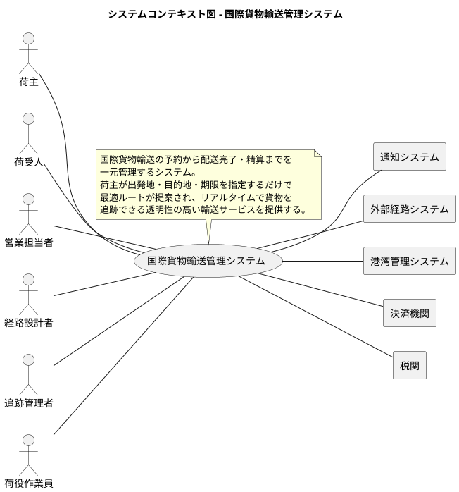

### 要求モデル

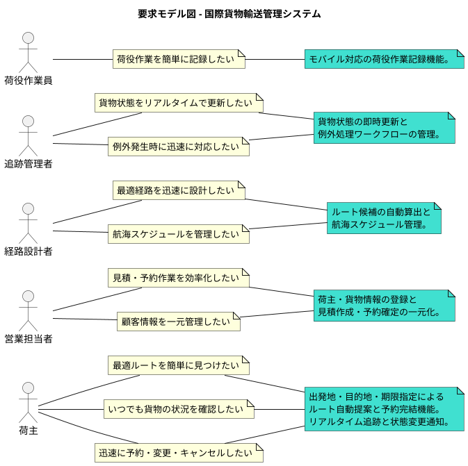

## システム外部環境

### ビジネスコンテキスト

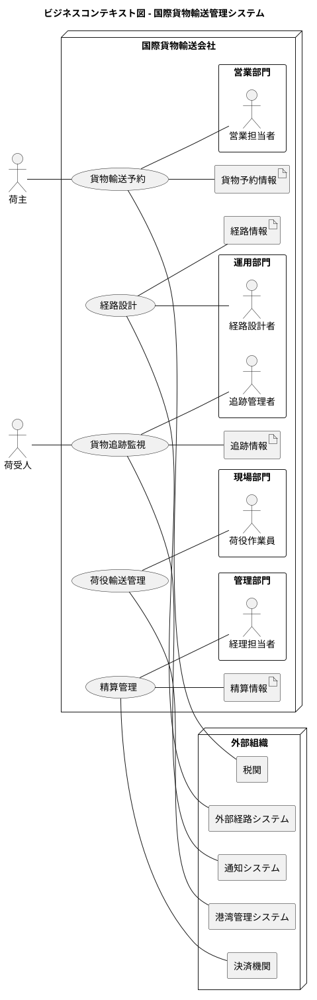

### ビジネスユースケース

#### 貨物輸送予約

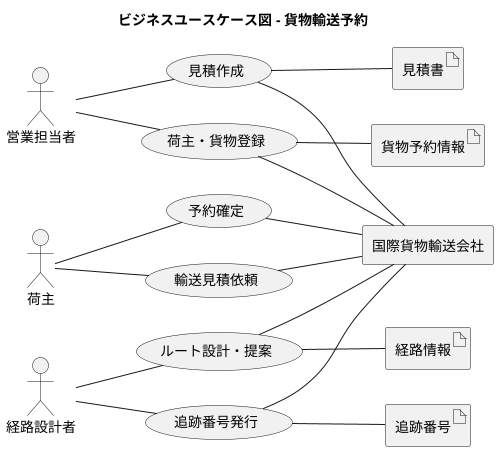

#### 荷役・追跡管理

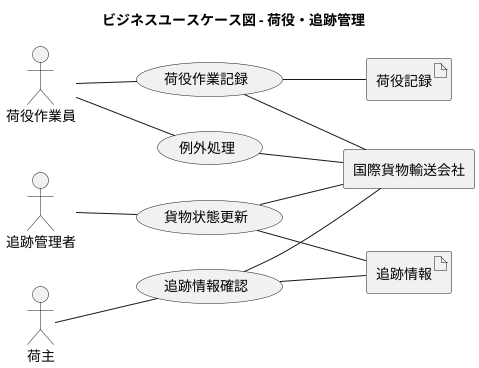

#### 精算管理

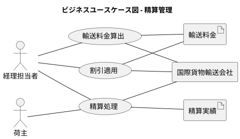

### 業務フロー

#### 貨物輸送予約の業務フロー

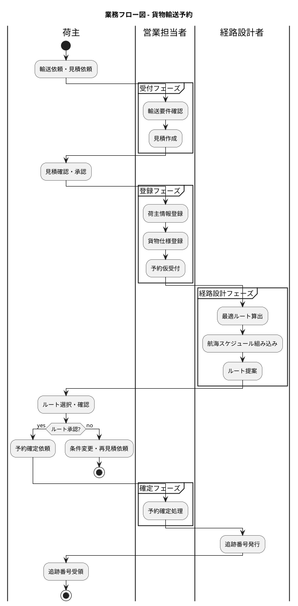

#### 荷役・追跡の業務フロー

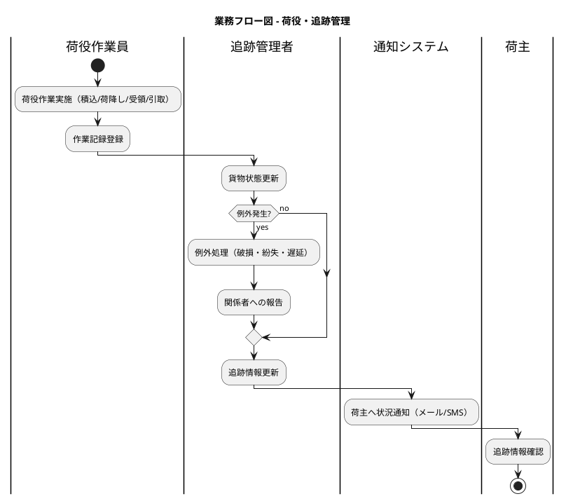

#### 精算の業務フロー

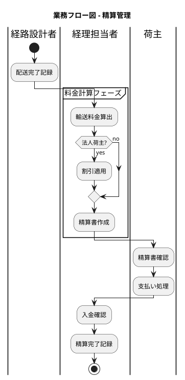

### 利用シーン

#### 貨物輸送予約の利用シーン

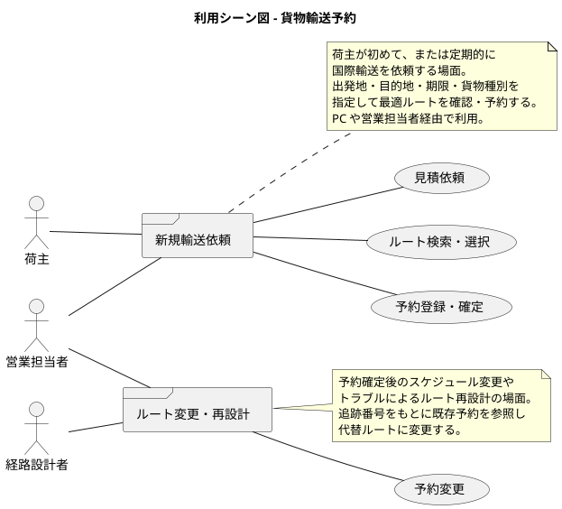

#### 貨物追跡の利用シーン

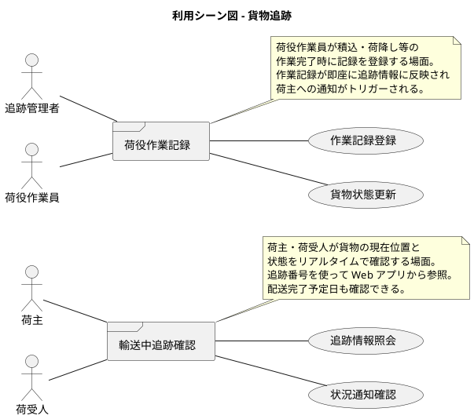

### バリエーション・条件

#### 貨物種別

| 貨物種別 | 説明 |
|----------|------|
| 一般貨物 | 通常の取扱いで輸送可能な貨物 |
| 危険物 | 法規制に基づく特別な取扱いが必要な貨物 |
| 冷凍・冷蔵貨物 | 温度管理が必要な貨物 |

#### 荷主種別

| 荷主種別 | 説明 |
|----------|------|
| 個人荷主 | 個人として輸送を依頼する荷主 |
| 法人荷主 | 法人契約により割引が適用される荷主 |

#### 輸送例外種別

| 例外種別 | 説明 |
|----------|------|
| 遅延 | スケジュールより遅れが発生した状態 |
| 破損 | 輸送中に貨物が破損した状態 |
| 紛失 | 貨物の所在が確認できない状態 |

## システム境界

### ユースケース複合図

#### 貨物輸送予約

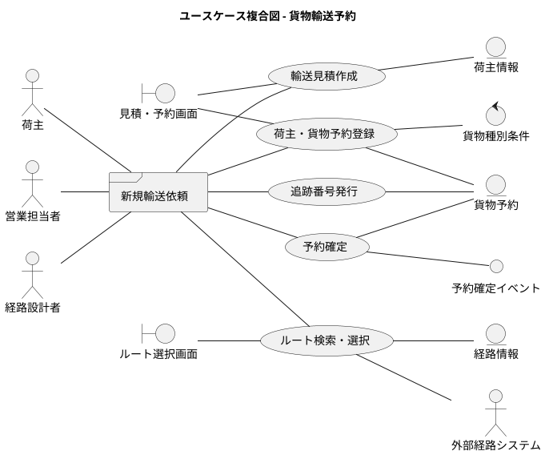

#### 荷役・追跡管理

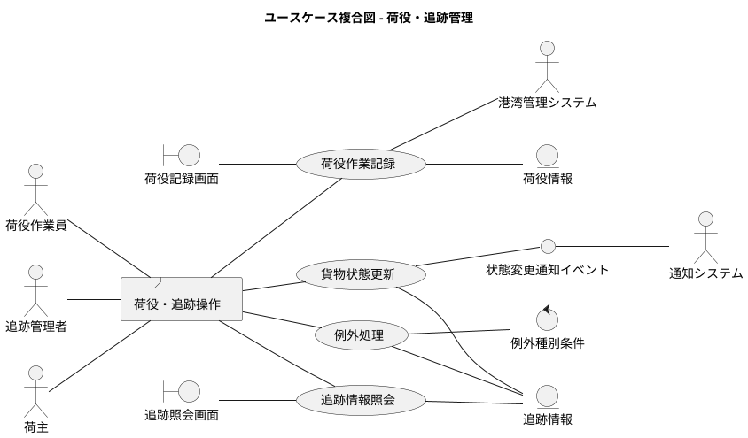

#### 精算管理

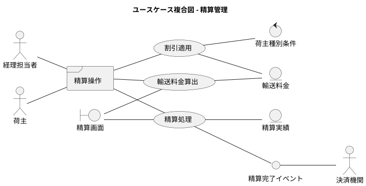

## システム

### 情報モデル

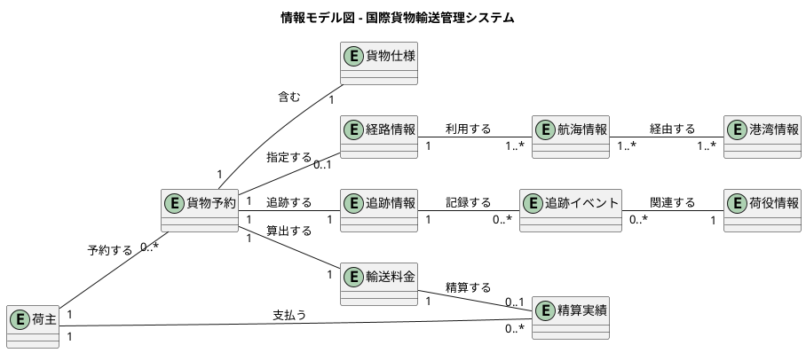

### 状態モデル

#### 貨物予約の状態遷移

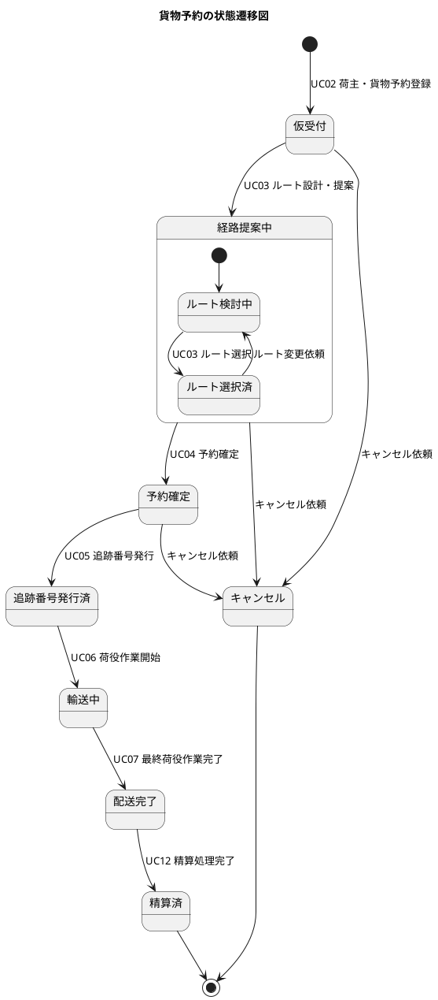

#### 追跡情報（貨物状態）の状態遷移

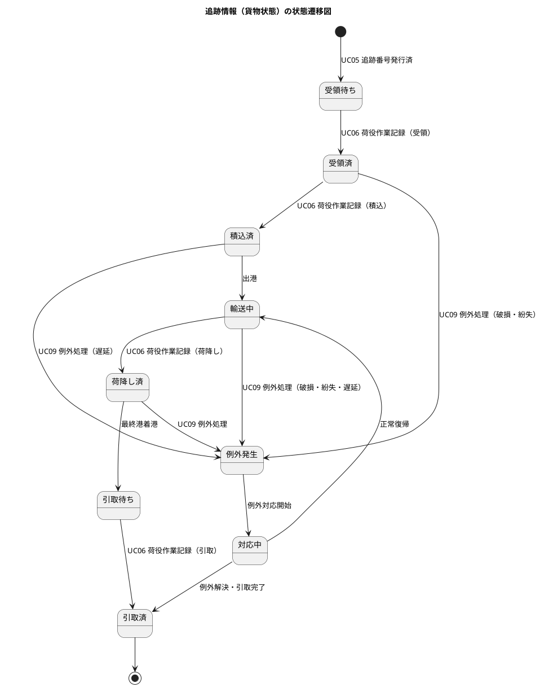

---

## 記入ガイド（参照）

本ドキュメントは `docs/template/要件定義.md` テンプレートをベースに、
`docs/strategy/business_architecture.md` のビジネスアーキテクチャ分析書を入力として作成しました。

### アクター一覧

| 種別 | アクター | 役割 |
| :--- | :--- | :--- |
| ヒューマン | 荷主 | 貨物の輸送を依頼し、見積確認・ルート選択・予約確定・追跡確認を行う |
| ヒューマン | 荷受人 | 貨物の到着を待ち、追跡情報を確認する |
| ヒューマン | 営業担当者 | 見積作成・荷主情報登録・貨物予約登録・予約確定を行う |
| ヒューマン | 経路設計者 | 最適ルート設計・航海スケジュール管理・追跡番号発行を行う |
| ヒューマン | 追跡管理者 | 貨物状態更新・追跡情報管理・例外対応を行う |
| ヒューマン | 荷役作業員 | 積込・荷降し・受領・引取等の荷役作業を実施し記録する |
| ヒューマン | 経理担当者 | 輸送料金算出・割引適用・精算処理を行う |
| コンピュータ | 通知システム | 荷主・荷受人への状況変更通知（メール/SMS）を送信する |
| コンピュータ | 外部経路システム | ルート候補の算出を支援する |
| コンピュータ | 港湾管理システム | 港湾施設の利用状況を提供する |
| コンピュータ | 決済機関 | 精算処理の決済を実行する |
| コンピュータ | 税関 | 輸出入申告情報の連携を受け付ける |

### ユースケース一覧

| ID | ユースケース名 | 対応 BUC | 主要アクター |
| :--- | :--- | :--- | :--- |
| UC01 | 輸送見積作成 | 貨物輸送予約 | 営業担当者 |
| UC02 | 荷主・貨物予約登録 | 貨物輸送予約 | 営業担当者 |
| UC03 | ルート検索・選択 | 貨物輸送予約 | 経路設計者、荷主 |
| UC04 | 予約確定 | 貨物輸送予約 | 営業担当者、荷主 |
| UC05 | 追跡番号発行 | 貨物輸送予約 | 経路設計者 |
| UC06 | 荷役作業記録 | 荷役・追跡管理 | 荷役作業員 |
| UC07 | 貨物状態更新 | 荷役・追跡管理 | 追跡管理者 |
| UC08 | 追跡情報照会 | 荷役・追跡管理 | 荷主、荷受人 |
| UC09 | 例外処理 | 荷役・追跡管理 | 追跡管理者、荷役作業員 |
| UC10 | 輸送料金算出 | 精算管理 | 経理担当者 |
| UC11 | 割引適用 | 精算管理 | 経理担当者 |
| UC12 | 精算処理 | 精算管理 | 経理担当者、荷主 |
