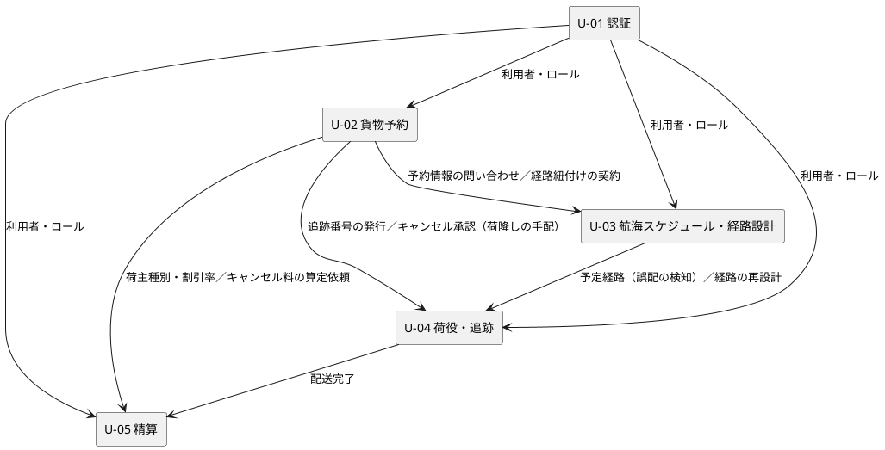

# Unit 定義：国際貨物輸送管理システム

[ユーザーストーリー](user_story.md) 31 本を、独立して開発・デプロイできる単位（Unit）にまとめます。Unit の境界はユースケースや画面の境界ではなく、「他の Unit の内部を変えずに開発・デプロイできるか」で決めています。迷った箇所は小さく切らず、依存を共有するストーリーを同じ Unit にまとめました。

- 用語は [用語集](../design/glossary.md)、リスクは [リスク台帳](risk_register.md) の ID で参照します。ガードレールの本文はこの文書に書き写しません
- NFR は非機能要件定義（`docs/design/` の非機能要件、未作成）で数値にします。ここでは Unit 固有の性質だけを書きます
- 測定基準はインセプションデッキのビジネス目標にトレースします。目標値はビジネス目標に数値が無いため未定です
- Unit の境界は 2026-09-16 に承認済みです（AI-DLC 移行ステップ 6）。各「AI の仮定」の要確認は、該当する Bolt の計画で確かめます

## Intent

インセプションデッキのプロダクトビジョン「荷主が出発地・目的地・期限を指定するだけで、制約を考慮した最適経路が自動提案され、いつでも貨物をリアルタイムで追跡できる、透明性の高い国際貨物輸送サービスを実現する」を、フェーズ 1（MVP）〜フェーズ 3 の段階的リリースで届けます。

## Unit 一覧

### U-01：認証

- **Intent**: 業務データを本人確認済みの利用者だけが、ロールに応じて扱えるようにする
- **目的**: 利用者がログイン・ログアウトし、ロールに応じた機能だけを使える。認証失敗が続いたアカウントを保護する
- **含まれるストーリー**: US26 システムにログインする、US27 システムからログアウトする、US31 認証失敗が続いたアカウントを保護する
- **NFR**: 認証失敗とロックで同じメッセージを返す（アカウントの存在を知らせない）。ログイン・ロック・解除を監査ログに残す
- **リスク**: R-02（認証・認可の方式）、R-10（接続情報）
- **測定基準**: 不正ログインの検知件数、ロックの発生件数（ビジネス目標に直接の対応は無い。業務データ保護の前提）
- **推奨 Bolt**: Bolt A（US26 のログインとロール別の画面誘導を、認証方式の ADR 承認後に UI から DB まで通す）、Bolt B（US27・US31）
- **エントロピー評価**: 意図 LOW／構造 MED／検証 LOW／リスク HIGH／仮定 MED
- **AI の仮定**: ロールはアクターと 1 対 1 に対応する。他の Unit はこの Unit の認証済みの利用者情報（利用者 ID・ロール）だけに依存し、方式の詳細には依存しない（要確認）

### U-02：貨物予約

- **Intent**: 見積から予約確定までをシステム化し、営業担当者の手作業を減らす
- **目的**: 営業担当者が荷主を登録し、見積を作り、貨物予約を登録して経路設計者に引き渡し、荷主の承認を受けて予約を確定し、追跡番号を発行できる。予約をキャンセルできる
- **含まれるストーリー**: US01 輸送見積を作成する、US02 荷主を登録する、US03 法人荷主を登録する、US04 貨物予約を登録する、US05 危険物・冷凍・冷蔵貨物の予約を登録する、US06 予約情報を経路設計者に引き渡す、US13 予約を確定する、US14 追跡番号を発行する、US30 輸送中の予約キャンセルを承認する
- **NFR**: 予約状態の遷移は要件定義書の状態モデルに従い、それ以外の遷移を許さない。荷主の個人情報（氏名・住所・連絡先）を扱う
- **リスク**: R-03（スキーマ変更）、R-05（危険物・冷凍・冷蔵貨物の規制）、R-06（状態モデル）
- **測定基準**: 見積作成から予約確定までのリードタイム、予約 1 件あたりの営業担当者の入力回数（ビジネス目標 1「予約業務の効率化」）
- **推奨 Bolt**: Bolt 1（ウォーキングスケルトン：US02 と US04 の基本形で、荷主登録から予約登録「仮受付」までを UI・API・ドメイン・DB に通す）、Bolt 2（US06）、Bolt 3（US13・US14。U-03 の経路紐付けに依存）、Bolt 4（US01 見積。U-03 の航海検索に依存）、Bolt 5（US03・US05）、Bolt 6（US30。U-04 に依存）
- **エントロピー評価**: 意図 MED／構造 LOW／検証 LOW／リスク MED／仮定 MED
- **AI の仮定**: 追跡番号の発行（US14）は予約確定を前提とするため、実施者が経路設計者でもこの Unit に置き、発行を追跡情報の開始として U-04 に知らせる。US30 のキャンセルは予約状態の遷移が中心のためこの Unit に置き、陸揚げ地への荷降しの手配は U-04、キャンセル料は U-05 に渡す。US13 AC-04 のキャンセルは US30 に統合する候補（要確認）

### U-03：航海スケジュール・経路設計

- **Intent**: 航海スケジュール・寄港地の接続・港湾制約・貨物種別を考慮した経路候補を自動で算出し、経路設計者の属人的な作業を減らす
- **目的**: 経路設計者が航海スケジュールを登録・更新・検索し、制約条件を満たす経路候補を算出して選択・確定し、予約に紐付けて荷主に通知できる
- **含まれるストーリー**: US07 航海スケジュールを検索する、US08 経路候補を算出する、US09 経路を選択・確定する、US10 経路条件を調整して再算出する、US11 経路情報を予約に紐付ける、US12 確定経路を荷主に通知する、US24 航海スケジュールを新規登録する、US25 既存航海スケジュールを更新する
- **NFR**: 経路候補の算出は制約条件 5 つをすべて満たす。港湾は UN/LOCODE で識別する。算出時間の上限は非機能要件定義で決める
- **リスク**: R-04（制約条件の追加・省略）、R-09（UN/LOCODE）、R-01（通知の外部連携）
- **測定基準**: 経路設計 1 件あたりの所要時間、算出した候補から選ばれた経路の割合、再算出（US10）の発生率（ビジネス目標 4「最適ルート自動設計」）
- **推奨 Bolt**: Bolt 1（US24 と US07：航海スケジュールの登録と検索を通す）、Bolt 2（US08：乗り継ぎ無しの経路から制約条件を 1 つずつ加える。インセプションデッキのリスク #6 の対応方針に合わせる）、Bolt 3（US09・US11・US12）、Bolt 4（US10・US25）
- **エントロピー評価**: 意図 MED／構造 HIGH／検証 MED／リスク HIGH／仮定 MED
- **AI の仮定**: 航海スケジュールの管理（US24・US25）は経路算出だけが使うため、独立した Unit に分けずここにまとめる。経路の状態（確定・誤配）はこの Unit が持つ（ドメインモデル設計で要確認。R-06）

### U-04：荷役・追跡

- **Intent**: 荷役作業の記録を即座に貨物状態に反映し、荷主が 24 時間いつでも貨物の位置と状態を確かめられるようにする。例外を関係者へすぐ共有する
- **目的**: 荷役作業員が荷役作業と通関申告を記録し、追跡管理者が貨物状態と例外を管理し、荷主・荷受人が追跡情報を照会できる。誤配を検知して経路の再設計につなげる
- **含まれるストーリー**: US15 荷役作業を記録する、US16 引取作業を記録する、US17 貨物状態を手動更新する、US18 追跡情報を照会する、US19 遅延例外を処理する、US20 破損・紛失例外を処理する、US28 誤配を検知して経路を再設計する、US29 通関申告を登録・管理する
- **NFR**: 荷役作業の記録が追跡情報に即座に反映される（インセプションデッキのリスク #3。反映までの時間は非機能要件定義で決める）。追跡照会はログイン無しで使えるため、追跡番号の推測に耐える
- **リスク**: R-06（貨物状態 9 状態）、R-08（リアルタイム反映の方式）、R-02（ログイン無しの照会）、R-09（作業場所の UN/LOCODE）、R-01（通知の外部連携）
- **測定基準**: 荷役作業から追跡情報への反映時間、荷主からの問い合わせ件数、例外の発生から荷主への通知までの時間（ビジネス目標 2「リアルタイム貨物追跡」、3「輸送状況通知の自動化」、5「例外対応の迅速化」）
- **推奨 Bolt**: Bolt 1（US18 と US17：MVP の基本追跡として手動更新と照会を通す）、Bolt 2（US15・US16）、Bolt 3（US19・US20）、Bolt 4（US29）、Bolt 5（US28。U-03 に依存）
- **エントロピー評価**: 意図 MED／構造 MED／検証 MED／リスク MED／仮定 MED
- **AI の仮定**: 追跡番号の発行（U-02）を受けて追跡情報を作る。通関（US29）は引取の前提条件で貨物状態と密に結び付くため、独立した Unit にしない。誤配（US28）は検知が荷役作業の記録で起きるためこの Unit に置き、再設計の画面は U-03 の経路割り当てを呼び出す（要確認）

### U-05：精算

- **Intent**: 輸送料金の自動算出と割引の適用で精算ミスを防ぎ、経理業務の負担を減らす
- **目的**: 経理担当者が配送完了した予約の輸送料金を算出し、法人割引を適用し、精算書を発行して入金を確認し、精算を完了できる
- **含まれるストーリー**: US21 輸送料金を算出する、US22 法人割引を適用する、US23 精算を処理する
- **NFR**: 金額計算の端数処理を一意に定める。決済機関とはポート越しに連携し、スタブで検証できる
- **リスク**: R-01（決済機関の外部連携）、R-03（スキーマ変更）
- **測定基準**: 精算の誤り（再発行・訂正）の件数、配送完了から精算済までのリードタイム（ビジネス目標 6「精算業務の正確化」）
- **推奨 Bolt**: Bolt 1（US21：基本料金の計算式が受入条件に定義された後に算出と確定を通す）、Bolt 2（US22）、Bolt 3（US23。決済機関はスタブ）
- **エントロピー評価**: 意図 HIGH／構造 MED／検証 MED／リスク HIGH／仮定 HIGH
- **AI の仮定**: 配送完了の事実（U-04）と荷主種別・割引率（U-02）だけを入力とし、他の Unit の内部に依存しない。キャンセル料（US30）の算定もこの Unit で受ける（要確認）

## 依存 DAG

矢印は「依存される側 → 依存する側」を表します。Unit 間の連携は、依存される側が公開する問い合わせか、依存される側が定義するイベント（契約）で行い、依存する側は相手の内部を参照しません。

ストーリーの流れでは U-02 と U-03 は双方向（予約情報の引き渡しと、経路情報の紐付け）に見えますが、コードの依存は U-03 → U-02 の一方向にします。U-03 は予約番号で U-02 に予約情報を問い合わせ、紐付けの結果を U-02 が定義した契約（「経路が紐付いた」イベント）で知らせます。U-02 は U-03 の内部を参照しません。同じく US30 の荷降しの手配とキャンセル料は、U-02 が公開するキャンセル承認のイベントを U-04 と U-05 が受け取ります。この連携方式は設計判断のため、アーキテクチャ設計とドメインモデル設計で確定します（R-08）。

- 並列に回せる Unit: U-01 は他と並列に開発できる（他の Unit はロールをスタブにして進める）。U-02 のウォーキングスケルトンの後、U-03 と U-04 の Bolt 1 は並列に回せる
- 最後に回す Unit: U-05（U-02 と U-04 の結果を入力にし、計算式が未定義のため）

## リリースとの対応

Unit 内の Bolt の順序です。Unit をまたいだ全体の並びは [リリース計画](../development/release_plan.md) を正とします。

| フェーズ（インセプションデッキ） | Unit と Bolt |
| :--- | :--- |
| フェーズ 1（MVP）: 予約管理、経路設計、基本的な貨物追跡、追跡番号発行 | U-01 Bolt A、U-02 Bolt 1〜4、U-03 Bolt 1〜3、U-04 Bolt 1 |
| フェーズ 2: 荷役作業管理、リアルタイム追跡、通知 | U-01 Bolt B、U-02 Bolt 5・6、U-03 Bolt 4、U-04 Bolt 2〜5 |
| フェーズ 3: 精算管理、外部連携強化 | U-05 Bolt 1〜3 |

## ストーリーマップ

| ユースケース | Unit | ストーリー | 受入条件の書式 |
| :--- | :--- | :--- | :--- |
| UC01 輸送見積を作成する | U-02 貨物予約 | US01 輸送見積を作成する | Given/When/Then |
| UC02 荷主を登録する | U-02 貨物予約 | US02 荷主を登録する | Given/When/Then |
| UC02 荷主を登録する | U-02 貨物予約 | US03 法人荷主を登録する | Given/When/Then |
| UC03 貨物予約を登録する | U-02 貨物予約 | US04 貨物予約を登録する | Given/When/Then |
| UC03 貨物予約を登録する | U-02 貨物予約 | US05 危険物・冷凍・冷蔵貨物の予約を登録する | Given/When/Then |
| UC04 予約情報を引き渡す | U-02 貨物予約 | US06 予約情報を経路設計者に引き渡す | Given/When/Then |
| UC05 航海スケジュールを検索する | U-03 航海スケジュール・経路設計 | US07 航海スケジュールを検索する | Given/When/Then |
| UC06 経路候補を算出する | U-03 航海スケジュール・経路設計 | US08 経路候補を算出する | Given/When/Then |
| UC07 経路を選択・確定する | U-03 航海スケジュール・経路設計 | US09 経路を選択・確定する | Given/When/Then |
| UC08 経路条件を調整する | U-03 航海スケジュール・経路設計 | US10 経路条件を調整して再算出する | Given/When/Then |
| UC09 経路情報を予約に紐付ける | U-03 航海スケジュール・経路設計 | US11 経路情報を予約に紐付ける | Given/When/Then |
| UC10 確定経路を荷主に通知する | U-03 航海スケジュール・経路設計 | US12 確定経路を荷主に通知する | Given/When/Then |
| UC11 予約を確定する | U-02 貨物予約 | US13 予約を確定する | Given/When/Then |
| UC12 追跡番号を発行する | U-02 貨物予約 | US14 追跡番号を発行する | Given/When/Then |
| UC13 荷役作業を記録する | U-04 荷役・追跡 | US15 荷役作業を記録する | Given/When/Then |
| UC13 荷役作業を記録する | U-04 荷役・追跡 | US16 引取作業を記録する | Given/When/Then |
| UC14 貨物状態を更新する | U-04 荷役・追跡 | US17 貨物状態を手動更新する | Given/When/Then |
| UC15 追跡情報を照会する | U-04 荷役・追跡 | US18 追跡情報を照会する | Given/When/Then |
| UC16 例外を処理する | U-04 荷役・追跡 | US19 遅延例外を処理する | Given/When/Then |
| UC16 例外を処理する | U-04 荷役・追跡 | US20 破損・紛失例外を処理する | Given/When/Then |
| UC16 例外を処理する、UC08 経路条件を調整する | U-04 荷役・追跡 | US28 誤配を検知して経路を再設計する | Given/When/Then |
| UC17 輸送料金を算出する | U-05 精算 | US21 輸送料金を算出する | Given/When/Then |
| UC17 輸送料金を算出する | U-05 精算 | US22 法人割引を適用する | Given/When/Then |
| UC18 精算を処理する | U-05 精算 | US23 精算を処理する | Given/When/Then |
| UC19 航海スケジュールを登録する | U-03 航海スケジュール・経路設計 | US24 航海スケジュールを新規登録する | Given/When/Then |
| UC19 航海スケジュールを登録する | U-03 航海スケジュール・経路設計 | US25 既存航海スケジュールを更新する | Given/When/Then |
| UC20 ユーザーを認証する | U-01 認証 | US26 システムにログインする | Given/When/Then |
| UC20 ユーザーを認証する | U-01 認証 | US27 システムからログアウトする | Given/When/Then |
| UC20 ユーザーを認証する | U-01 認証 | US31 認証失敗が続いたアカウントを保護する | Given/When/Then |
| UC21 通関申告を管理する | U-04 荷役・追跡 | US29 通関申告を登録・管理する | Given/When/Then |
| UC22 予約をキャンセルする | U-02 貨物予約 | US30 輸送中の予約キャンセルを承認する | Given/When/Then |

未配置のストーリー: なし

ストーリーの無いスコープ: インセプションデッキのスコープ 5「通知（状態変更通知のメール・SMS、荷主・荷受人への自動配信）」は、専用のストーリーが無く、各ストーリーの受入条件に通知が含まれる形になっています。通知を独立した Unit にするか（通知テンプレート・配信履歴・再送などのストーリーを追加するか）は要判断です。
