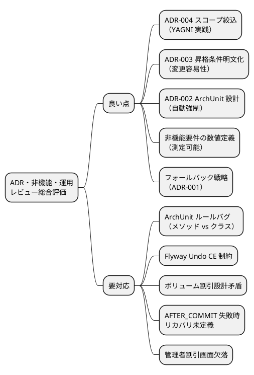
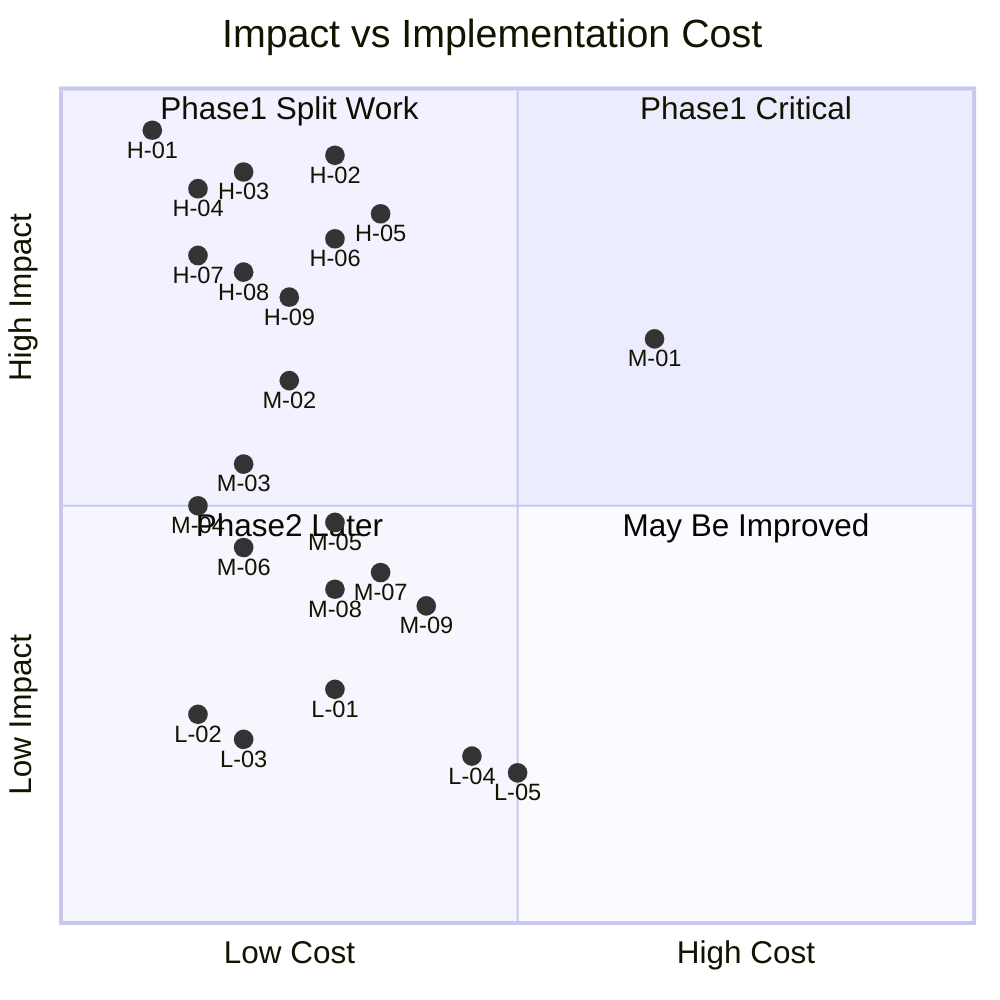

# ADR・非機能要件・運用要件 マルチパースペクティブレビュー

**レビュー日**: 2026-03-31
**レビュー対象**:

- `docs/adr/001-java-springboot-version-strategy.md`
- `docs/adr/002-transactional-event-listener.md`
- `docs/adr/003-discount-policy-as-entity.md`
- `docs/adr/004-shipper-self-service-out-of-scope.md`
- `docs/design/non_functional.md`
- `docs/design/operation.md`

**レビュー視点**: PM・アーキテクト・インタラクションデザイナー・ユーザー代表（4 視点）

---

## 1. 総合評価



| 視点 | 評価 | 主な指摘数 |
|---|---|---|
| プロダクトマネージャー | ★★★★☆ | 高 3 件 / 中 2 件 / 低 1 件 |
| アーキテクト | ★★★☆☆ | 高 4 件 / 中 3 件 / 低 2 件 |
| インタラクションデザイナー | ★★★★☆ | 高 3 件 / 中 3 件 / 低 1 件 |
| ユーザー代表 | ★★★☆☆ | 高 3 件 / 中 3 件 / 低 1 件 |

> **注記**: xp-tester エージェントは API レート制限により結果を取得できなかった。テスト観点の主要指摘はアーキテクトとユーザー代表のレビューから補完している。

---

## 2. 指摘一覧

### 2.1 高優先度（Phase 1 着手前に対応必須）

| ID | 対象 | 指摘内容 | 出所 |
|---|---|---|---|
| H-01 | ADR-002 | ArchUnit ルールが `noClasses` でクラスアノテーションを検証しているが `@EventListener` はメソッドアノテーション。`noMethods` に修正しないと禁止ルールとして機能しない | アーキテクト |
| H-02 | ADR-002 | AFTER_COMMIT リスナー失敗時のリカバリ設計が未定義。トランザクションはコミット済みのためロールバック不可。通知失敗時に荷主が追跡番号を知る手段がなくなる | PM・アーキテクト |
| H-03 | ADR-003 | ボリューム割引（過去 6 ヵ月の予約件数に基づく計算）を Phase 1 要件としながら、`applyDiscount(Money baseAmount)` の引数シグネチャでは過去履歴を参照できない設計矛盾 | アーキテクト |
| H-04 | 運用要件 | `V{n}__{desc}__undo.sql` による Flyway Undo は Community 版では動作しない（Teams / Enterprise ライセンス必須）。Community 版では forward マイグレーションで巻き戻す設計が必要 | アーキテクト |
| H-05 | ADR-003・UI | 管理者向け割引ポリシー管理画面（`/admin/discount-policies`）が `ui_design.md` の画面一覧・遷移図に存在しない | インタラクションデザイナー |
| H-06 | ADR-004 | 公開追跡 API（`GET /tracking/{trackingId}`）がブラウザアクセス時に JSON か HTML かが未定義。荷主が URL を開いても追跡できない可能性がある | インタラクションデザイナー |
| H-07 | ADR-004・US13 | US13「追跡情報を照会する（ログインなし可）」の「画面」が何か不明確。社内画面か公開 Web ページかを受入条件に明示する必要がある | ユーザー代表 |
| H-08 | ADR-003・US17 | ボリューム割引が US17 受入条件から抜けている。ADR-003 に Phase 1 要件と記述されているなら US17 に追加、スコープ外なら ADR-003 を訂正 | ユーザー代表 |
| H-09 | 非機能要件 | 荷役作業員（ROLE_HANDLER）の 30 分セッションタイムアウトは現場業務（1 シフト内でのバーコードスキャン作業）と深刻に不整合。2 時間以上への延長を要検討 | ユーザー代表 |

### 2.2 中優先度（Phase 1 着手時に判断）

| ID | 対象 | 指摘内容 | 出所 |
|---|---|---|---|
| M-01 | 非機能要件 | 追跡 API 99.99% SLA（月間 4.4 分）と RDS Multi-AZ フェイルオーバー 60〜120 秒が矛盾。月 1 回のフェイルオーバーで SLA を超過する | アーキテクト |
| M-02 | ADR-002 | AFTER_COMMIT によるイベントタイムラグ（登録後にステータス未反映）の視覚フィードバックが未設計。荷役作業員が二重登録を試みるリスクがある | インタラクションデザイナー |
| M-03 | ADR-001 | フォールバック（Java 21）への発動条件が主観的。ライブラリ対応率・バグ件数などの客観的ゲート条件を追記すること | アーキテクト・PM |
| M-04 | 全体 | ロール名表記の不一致：`ROLE_ROUTE_PLANNER` vs `ROLE_ROUTER`、`ROLE_FINANCE` vs `ROLE_BILLING` が複数ドキュメント間で混在 | ユーザー代表 |
| M-05 | 運用要件 | メンテナンスウィンドウ（毎週日曜 02:00〜04:00 JST）は 24 時間稼働の国際貨物業務と不整合。Rolling Update でダウンタイムなしなのに 503 が出る条件も不明確 | ユーザー代表 |
| M-06 | 運用要件 | 503 メンテナンスページのワイヤーフレームが存在しない。現状ではデフォルト技術エラー画面が表示されるリスク | インタラクションデザイナー |
| M-07 | ADR-003 | `DiscountPolicy` は `Invoice` 集約の外側か内側かが不明。エンティティを直接渡すか `DiscountPolicyId` を引数にするかで DDD 集約境界の扱いが変わる | アーキテクト |
| M-08 | ADR-002 | `@TestTransaction` との組み合わせでリスナーが呼ばれない問題の対策が未記載。`@Commit` + `@Sql` クリーンアップ等のテストパターンを `test_strategy.md` に追記が必要 | アーキテクト |
| M-09 | 運用要件 | ロールバック手順にビジネス影響の観点が欠落。判断基準（エラーレート何%以上で発動）・ロールバック中の作業記録の扱い・RTO 30 分との整合性確認が必要 | PM |

### 2.3 低優先度（Phase 2 以降で対応可）

| ID | 対象 | 指摘内容 | 出所 |
|---|---|---|---|
| L-01 | ADR-003 | 割引ポリシー管理のユーザーストーリー（US-ADM-01）がバックログに存在しない。管理者の CRUD 操作の受入条件を定義すること | ユーザー代表 |
| L-02 | 非機能要件 | 請求書生成 p95 1,500ms が同期 vs 非同期いずれの前提かが不明。UI にプログレスバーが必要かどうかの判断に影響 | PM |
| L-03 | ADR-004 | 荷主が公開追跡画面で問い合わせ先を探せない。連絡先情報・404 時のアクション可能なメッセージがない | インタラクションデザイナー |
| L-04 | ADR-004 | `@PreAuthorize("... authentication.principal.shipperId")` は実行時評価のため型安全でない。Phase 2 設計時に `ShipperUserDetails` の実装設計を ADR に追記 | アーキテクト |
| L-05 | 非機能要件 | 監査ログ 1 年を CloudWatch に保持するとコストが高い。S3 + Glacier エクスポートのアーカイブ方針を追記することを推奨 | アーキテクト |

---

## 3. 指摘の詳細

### H-01: ADR-002 ArchUnit ルール修正（`noClasses` → `noMethods`）

**問題**:

```java
// ❌ 現在の実装（クラスアノテーションを検証するため常に通過する）
noClasses()
    .that().resideInAPackage("..application..")
    .should().beAnnotatedWith(EventListener.class)

// ✅ 正しい実装（メソッドアノテーションを検証）
noMethods()
    .that().areDeclaredInClassesThat().resideInAPackage("..application..")
    .should().beAnnotatedWith(EventListener.class)
    .because("ドメインイベントリスナーは @TransactionalEventListener(AFTER_COMMIT) を使用すること");
```

**影響**: CI で `@EventListener` の混入を検出できず、データ不整合が無音で発生する。

---

### H-02: ADR-002 AFTER_COMMIT 失敗時のリカバリ設計

**問題**: AFTER_COMMIT 後にリスナーが例外を投げた場合、トランザクション済みのためロールバック不可。

**推奨追記内容（ADR-002 のネガティブセクション）**:

```markdown
### 失敗時のリカバリ方針

Phase 1 では try-catch でエラーを捕捉し、以下を実施する。

- 失敗ログを CloudWatch Logs に記録（`/ecs/cargo-tracker/audit` ロググループ）
- `failed_events` テーブルに失敗イベントを記録し、手動リカバリを可能にする
- 重大なイベント失敗（US09 追跡番号通知等）は CloudWatch Alarm → Slack 通知

Phase 2 では Spring Retry（通知系のみ、上限 3 回）またはアウトボックスパターンへの移行を検討する。
```

---

### H-03: ADR-003 ボリューム割引とエンティティ設計の矛盾

**問題**: `applyDiscount(Money baseAmount)` では過去 6 ヵ月の予約件数を参照できない。

**解決策（2 択）**:

| 選択肢 | 内容 |
|---|---|
| A（推奨） | Phase 1 のボリューム割引は「顧客カテゴリ（STANDARD/VOLUME）」の静的属性として扱い、動的件数計算は Phase 2 に据え置く |
| B | ボリューム割引を Phase 1 スコープから外し、ADR-003 のコンテキストから削除する |

---

### H-04: Flyway Community 版での代替ロールバック戦略

**問題**: `undo.sql` は Flyway Teams / Enterprise ライセンスが必要。

**Community 版での代替パターン（運用要件に追記）**:

```sql
-- V3__add_column_foo.sql  （カラム追加）
-- V4__remove_column_foo.sql  （ロールバック相当の新 forward マイグレーション）
```

また、**Expand-Contract パターン**（カラム追加 → 旧コード対応 → 新コード化 → 旧カラム削除）の採用を推奨する。スキーマ変更を含むリリースのロールバック手順を運用要件に別途定義すること。

---

### H-05: 管理者割引ポリシー管理画面の追加（UI 設計書）

**`docs/design/ui_design.md` への追加内容**:

| 画面名 | URL パス | アクター |
|---|---|---|
| 割引ポリシー一覧 | `/admin/discount-policies` | ROLE_ADMIN |
| 割引ポリシー登録 | `/admin/discount-policies/new` | ROLE_ADMIN |
| 割引ポリシー編集 | `/admin/discount-policies/{id}/edit` | ROLE_ADMIN |

ナビゲーションに `ROLE_ADMIN` 向け「管理設定」メニューを追加すること。

---

### H-06: 公開追跡ページの設計（ADR-004 補足）

**推奨**: 認証不要の独立した公開追跡 Web ページを追加する。

| 要素 | 内容 |
|---|---|
| URL | `/public/tracking/{trackingId}` |
| 認証 | 不要 |
| 表示内容 | TrackingNumber・TransportStatus・最終イベント・連絡先 |
| UI | モバイルファースト・最小情報 |

`ui_design.md` にワイヤーフレームを追記し、ADR-004 のコンプライアンスに「公開追跡ページが `/public/tracking/` として実装されていること」を追加すること。

---

### M-01: 追跡 API 99.99% SLA と RDS フェイルオーバー矛盾の解消策

| 対策 | 内容 | 複雑度 |
|---|---|---|
| **A: Redis キャッシュ（推奨）** | 追跡データを Redis（TTL 30 秒）でキャッシュ。フェイルオーバー中も旧データ提供可能 | 中 |
| B: Read Replica | 追跡 API は Read Replica に向ける。フェイルオーバー中は Replica が昇格 | 高 |
| C: SLA 再設定 | 追跡 API の SLA を 99.9% に下げ、RTO を許容範囲内として合意 | 低 |

Phase 1 では **C（SLA 再設定）** を推奨する。Redis キャッシュは Phase 2 のスケーリング対応で検討する。

---

### M-02: AFTER_COMMIT タイムラグの視覚フィードバック設計

**推奨する htmx インジケーター追加（追跡詳細画面）**:

```html
<div hx-get="/tracking/{trackingNumber}/status"
     hx-trigger="every 30s"
     hx-indicator="#tracking-spinner">
  <span id="tracking-spinner" class="htmx-indicator">
    <span class="spinner-border spinner-border-sm"></span> 更新中...
  </span>
  <!-- ステータスタイムライン -->
</div>
<small class="text-muted">
  最終更新: <span id="last-updated">--:--:--</span>
  （⟳ 自動更新中）
</small>
```

荷役登録成功後のフラッシュメッセージに「ステータスへの反映には最大 30 秒かかります」を追加。

---

## 4. 対応優先度マトリクス



### 凡例

| ID | 指摘内容 | 象限 |
|---|---|---|
| H-01 | ADR-002 ArchUnit `noMethods` 修正 | Phase1 Critical |
| H-02 | ADR-002 AFTER_COMMIT 失敗時リカバリ設計 | Phase1 Critical |
| H-03 | ADR-003 ボリューム割引設計矛盾解消 | Phase1 Critical |
| H-04 | Flyway Undo Community 版制約・代替戦略 | Phase1 Critical |
| H-05 | 割引ポリシー管理画面の UI 設計追加 | Phase1 Critical |
| H-06 | 公開追跡ページ設計（HTML vs JSON 決定） | Phase1 Critical |
| H-07 | US13 公開追跡ページ URL の明示 | Phase1 Critical |
| H-08 | ボリューム割引と US17 受入条件の整合 | Phase1 Critical |
| H-09 | ROLE_HANDLER セッションタイムアウト延長 | Phase1 Critical |
| M-01 | 追跡 API SLA と RDS フェイルオーバー矛盾 | Phase1 Split Work |
| M-02 | AFTER_COMMIT タイムラグ視覚フィードバック | Phase1 Split Work |
| M-03 | ADR-001 フォールバック発動条件の客観化 | Phase1 Split Work |
| M-04 | ロール名表記の統一 | Phase1 Split Work |
| M-05 | メンテナンスウィンドウと業務整合性 | Phase1 Split Work |
| M-06 | 503 ページワイヤーフレーム追加 | Phase1 Split Work |
| M-07 | DiscountPolicy 集約境界の明示 | Phase1 Split Work |
| M-08 | @TestTransaction + AFTER_COMMIT のテストパターン | Phase1 Split Work |
| M-09 | ロールバック手順のビジネス影響定義 | Phase1 Split Work |
| L-01 | US-ADM-01（割引ポリシー管理 US）追加 | Phase2 Later |
| L-02 | 請求書生成 p95 1500ms の前提明記 | May Be Improved |
| L-03 | 公開追跡画面の問い合わせ先導線 | Phase2 Later |
| L-04 | ADR-004 @PreAuthorize 型安全性設計 | Phase2 Later |
| L-05 | 監査ログ S3 アーカイブ方針 | May Be Improved |

---

## 5. スコープ外の重要発見

1. **OAuth2 とフォームベース認証の記述不一致**: 非機能要件サマリーに「OAuth2」の記述があるが、ドキュメント本文ではフォームベース認証（Spring Security セッション管理）を定義している。どちらが正しいかを統一すること。OAuth2 は Keycloak 等の外部 IdP が必要でアーキテクチャへの影響が大きい。

2. **荷受人（Consignee）のロール・認証フローが未定義**: US11（引取作業記録）では荷受人の「確認コード」が必要だが、荷受人向けのロール・通知フロー・確認コードの発行方法が非機能要件にも ADR にも記述されていない。

3. **htmx ポーリングと追跡 API RPS の掛け算**: 追跡 API 1,000 RPS + 業務担当者の htmx 30 秒ポーリングが重なると DB `SELECT` が集中する。Redis キャッシュ（TTL 30 秒）を非機能要件に追加することを推奨。

4. **追跡番号の推測困難性（エントロピー）**: 公開追跡 API は認証不要のため、連番形式では他社貨物情報への不正アクセスが可能になる。TrackingId の生成方式（UUID v4 相当のランダム性）を ADR または非機能要件に明示すること。

5. **ロールバックとスキーマ整合性**: ECS タスクをロールバックしても DB スキーマはロールバックされない。スキーマ変更を含むリリースでの旧コード + 新スキーマの組み合わせ動作を検証するテスト手順を運用要件に追加すること。

---

## 6. 推奨アクション

### Phase 1 着手前（即対応）

1. **ADR-002**: ArchUnit ルールを `noMethods()` に修正（H-01）
2. **ADR-002**: 失敗時リカバリ方針を ADR のネガティブセクションに追記（H-02）
3. **ADR-003**: ボリューム割引を「顧客カテゴリの静的属性」に限定し、設計矛盾を解消（H-03）
4. **運用要件**: Flyway Undo を forward マイグレーション方式に変更（H-04）
5. **UI 設計**: 割引ポリシー管理画面 3 件を追加（H-05）
6. **ADR-004**: 公開追跡ページ（`/public/tracking/{trackingId}`）の HTML 設計を決定（H-06/H-07）
7. **US17**: ボリューム割引のスコープを明確化し受入条件を更新（H-08）
8. **非機能要件**: ROLE_HANDLER のセッションタイムアウトを 2 時間に変更（H-09）

### Phase 1 着手時（並行対応）

9. **非機能要件**: 追跡 API SLA を 99.9% に下げるか Redis キャッシュ追加か判断（M-01）
10. **UI 設計**: AFTER_COMMIT タイムラグ用の htmx インジケーター追加（M-02）
11. **全ドキュメント**: ロール名表記を `ROLE_ROUTE_PLANNER` / `ROLE_FINANCE` に統一（M-04）
12. **test_strategy.md**: `@Commit` + `@Sql` のテストパターンを追記（M-08）

---

*レビュー実施: xp-product-manager / xp-architect / xp-interaction-designer / xp-user-representative*
*統合: GitHub Copilot CLI*
