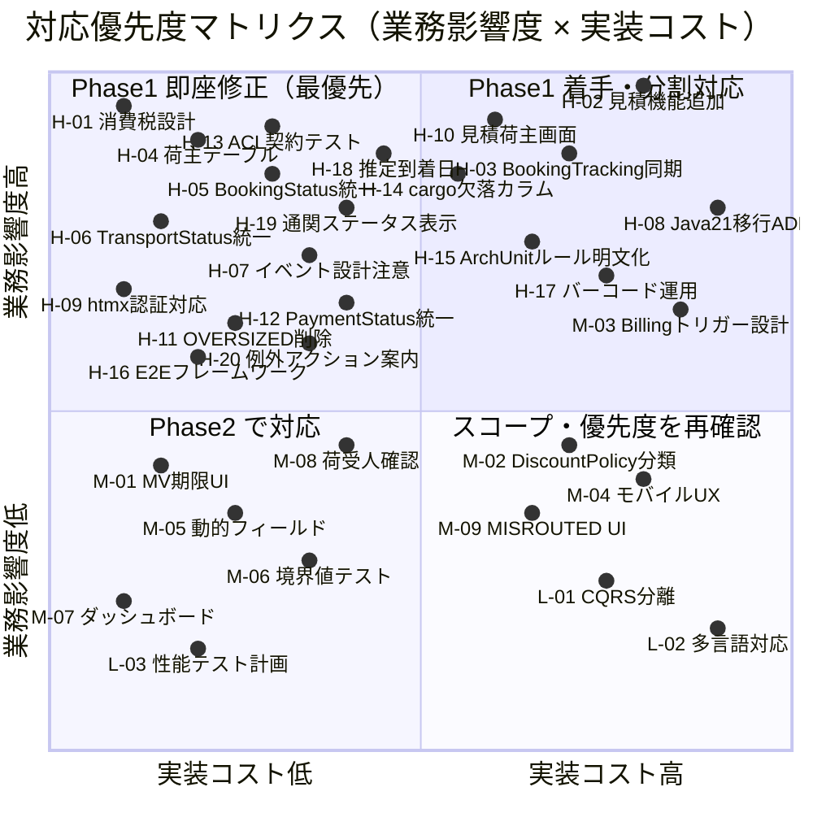

# 設計ドキュメント マルチパースペクティブレビューレポート

| 項目 | 内容 |
| :--- | :--- |
| **レビュー対象** | 国際貨物輸送管理システム 設計ドキュメント一式 |
| **レビュー日** | 2026-03-31 |
| **レビュー方式** | 5 視点マルチパースペクティブレビュー |
| **レビュアー** | PM / アーキテクト / UX / テスター / ユーザー代表 |
| **ステータス** | 🔴 要対応（Phase 1 修正完了まで実装開始不可） |

---

## 1. エグゼクティブサマリー

設計ドキュメント全体を 5 視点でレビューした結果、**合計 32 件（高 20 件・中 9 件・低 3 件）** の指摘を確認した。荷主テーブル・見積機能の欠落、`BookingStatus` / `TransportStatus` の不整合、消費税設計の欠如など、業務の基盤に直結する重大欠陥が複数存在する。実装開始前に Phase 1 の必須修正（14 件）を完了させることを強く推奨する。

---

## 2. 評価スコアボード

### 視点別スコア（5 段階評価）

| 視点 | スコア | 主要懸念点 |
| :--- | :---: | :--- |
| PM（プロダクトマネージャー） | 2 / 5 | 荷主テーブル欠落・見積機能未設計・消費税設計なし |
| アーキテクト | 2 / 5 | ステータス定義不整合・イベント処理の安全性・技術スタックリスク |
| UX（インタラクションデザイナー） | 2 / 5 | 見積・荷主登録画面欠落・htmx 認証問題・ドメイン用語不整合 |
| テスター | 2 / 5 | 契約テスト未定義・ArchUnit ルール曖昧・`cargo` テーブルのカラム欠落 |
| ユーザー代表 | 1 / 5 | 業務の最初の一歩が成立しない・追跡情報の致命的欠如 |
| **総合評価** | **2 / 5** | **Phase 1 修正完了まで実装開始不可** |

---

## 3. 重要度別指摘事項一覧

### 🔴 高（即座対応が必要）

| # | 視点 | 指摘内容 | 対応方針 |
| :--- | :--- | :--- | :--- |
| H-01 | PM | 消費税設計がない（`invoice` テーブルに `tax_rate`・`tax_amount` 未定義、法定要件） | `[修正必須]` |
| H-02 | PM | US01（輸送見積）に対応するデータモデル・画面が存在しない（`quotation` テーブル + 画面が必要） | `[修正必須]` |
| H-03 | PM | `BookingStatus` と `TrackingStatus` の二重管理（同期タイムラグ中の不整合補正ロジックが未設計） | `[修正必須]` |
| H-04 | PM | 荷主テーブルが存在しない（US02/US03 の荷主 ID 発行・法人割引率保存が実装不可） | `[修正必須]` |
| H-05 | アーキテクト | `BookingStatus` の定義が `architecture_backend.md` と `domain-model.md` で不整合 | `[修正必須]` |
| H-06 | アーキテクト | `TransportStatus` の定義が不整合 | `[修正必須]` |
| H-07 | アーキテクト | `ApplicationEventPublisher` + `@EventListener` でトランザクションコミット前にリスナー実行するリスク | `[修正必須]` |
| H-08 | アーキテクト | Java 25 / Spring Boot 4.0 の成熟度リスク（GA 前採用） | `[ADR]` |
| H-09 | UX | htmx セッションタイムアウト問題（Spring Security の 302 リダイレクトを htmx がページ内に差し込む） | `[修正必須]` |
| H-10 | UX | US01/US02/US03 に対応する画面が未設計（見積画面・荷主登録画面が欠落） | `[修正必須]` |
| H-11 | UX | `CargoType` に `OVERSIZED` が UI に登場するがドメインモデルに未定義 | `[修正必須]` |
| H-12 | UX | `PaymentStatus` 表示が `UNPAID` と `PENDING` で不整合 | `[修正必須]` |
| H-13 | テスター | 5 つの ACL ポートの契約テストシナリオが未定義 | `[修正必須]` |
| H-14 | テスター | ArchUnit の検証ルールが曖昧（最低 4 ルール未定義） | `[修正必須]` |
| H-15 | テスター | E2E テストフレームワーク（Selenium/Playwright）が `tech_stack.md` に未記載 | `[修正必須]` |
| H-16 | テスター | `cargo` テーブルに `cargo_type`・`weight_kg` カラムがない（US05・US16 が実装不可） | `[修正必須]` |
| H-17 | ユーザー代表 | 荷役登録フォームが「貨物 ID（予約番号）」入力だが現場は追跡番号でバーコードスキャン運用 | `[確認]` |
| H-18 | ユーザー代表 | 追跡詳細に「推定到着日」が表示されていない | `[修正必須]` |
| H-19 | ユーザー代表 | 通関ステータスが追跡画面で不可視（`CustomsStatus` はドメインモデルに定義済み） | `[修正必須]` |
| H-20 | ユーザー代表 | EXCEPTION 状態で荷主・荷受人への操作案内がない | `[修正必須]` |

### 🟡 中（次イテレーションで対応）

| # | 視点 | 指摘内容 | 対応方針 |
| :--- | :--- | :--- | :--- |
| M-01 | PM | MV 最終期限管理が UI に反映されていない | `[次IT]` |
| M-02 | PM | `DiscountPolicy` がドメインモデルでは値オブジェクトだが集約横断計算はドメインサービスが適切 | `[次IT]` |
| M-03 | アーキテクト | Billing Context のトリガー設計が曖昧（自動 vs 手動） | `[確認]` |
| M-04 | UX | 荷役作業員のモバイル UX（バーコードスキャン未対応、タップターゲット未最適化） | `[次IT]` |
| M-05 | UX | 貨物種別変更時の動的フィールド表示仕様が未定義 | `[次IT]` |
| M-06 | テスター | 境界値テストシナリオの記述不足 | `[次IT]` |
| M-07 | ユーザー代表 | ダッシュボードがロール非対応（荷役作業員には本日の作業予定が必要） | `[次IT]` |
| M-08 | ユーザー代表 | 引取作業登録に荷受人確認フィールドがない | `[次IT]` |
| M-09 | ユーザー代表 | MISROUTED 状態の業務フローが UI に反映されていない | `[次IT]` |

### 🟢 低（将来対応）

| # | 視点 | 指摘内容 | 対応方針 |
| :--- | :--- | :--- | :--- |
| L-01 | アーキテクト | CQRS の Read Model 分離が不完全（Mapper クラスの責務混在） | `[次IT]` |
| L-02 | UX | 多言語対応の考慮がない | `[確認]` |
| L-03 | テスター | パフォーマンステスト計画が未定義 | `[次IT]` |

---

## 4. 対応優先度マトリクス

> 縦軸：業務影響度（High / Low）、横軸：実装コスト（Low / High）



| 象限 | 方針 |
| :--- | :--- |
| **高影響・低コスト**（左上） | Phase 1 で即座修正（最優先） |
| **高影響・高コスト**（右上） | Phase 1 で着手、分割して対応 |
| **低影響・低コスト**（左下） | Phase 2 で対応 |
| **低影響・高コスト**（右下） | スコープ・優先度を再確認 |

---

## 5. 即座修正が必要な項目（Phase 1 必須）

以下 14 件は **実装開始前に設計ドキュメントを修正すること**。

| # | 修正対象ドキュメント | 修正内容 |
| :--- | :--- | :--- |
| 1 | `data-model.md` | `invoice` テーブルに `tax_rate DECIMAL`・`tax_amount DECIMAL` カラムを追加 |
| 2 | `data-model.md` | `quotation` テーブルを新規定義（見積 ID・荷主 ID・有効期限・金額・ステータス） |
| 3 | `data-model.md` | `shipper`（荷主）テーブルを新規定義（荷主 ID・法人名・割引率） |
| 4 | `data-model.md` | `cargo` テーブルに `cargo_type VARCHAR`・`weight_kg DECIMAL` カラムを追加 |
| 5 | `domain-model.md` | `CargoType` に `OVERSIZED` を追加 |
| 6 | `domain-model.md` | `PaymentStatus` の値を `UNPAID / PAID / OVERDUE` に統一（`PENDING` を削除） |
| 7 | `architecture_backend.md` | `BookingStatus` を `PRELIMINARY / ROUTE_PROPOSED / CONFIRMED / TRACKING_ISSUED / IN_TRANSIT / DELIVERED / SETTLED / CANCELLED` に修正 |
| 8 | `architecture_backend.md` | `TransportStatus` を `NOT_RECEIVED / RECEIVED / LOADED / IN_TRANSIT / UNLOADED / CUSTOMS_INSPECTION / AWAITING_CLAIM / DELIVERED / MISROUTED` に修正 |
| 9 | `architecture_backend.md` | `@EventListener` を `@TransactionalEventListener(phase = AFTER_COMMIT)` に変更、または Transactional Outbox パターンの採用を明記 |
| 10 | `ui-design.md` | 見積作成画面（US01）・荷主登録画面（US02/US03）を新規設計 |
| 11 | `ui-design.md` | 追跡詳細画面に「推定到着日」フィールドを追加 |
| 12 | `ui-design.md` | 追跡詳細画面に `CustomsStatus` の表示を追加 |
| 13 | `ui-design.md` | EXCEPTION 状態のアクション案内（荷主・荷受人向け）を追加 |
| 14 | `architecture_backend.md` または `ui-design.md` | htmx リクエスト時の `AuthenticationEntryPoint` 設定（401 返却）を明記 |

---

## 6. 次イテレーション対応項目

| # | カテゴリ | 内容 | 参照 |
| :--- | :--- | :--- | :--- |
| 1 | テスト | 5 つの ACL ポートの WireMock 契約テストシナリオを `test-strategy.md` に追記 | H-13 |
| 2 | テスト | ArchUnit 最低 4 ルールを `test-strategy.md` に定義 | H-14 |
| 3 | テスト | E2E テストフレームワーク（Playwright 推奨）を `tech_stack.md` に追記 | H-15 |
| 4 | ドメイン | `DiscountPolicy` を値オブジェクトからドメインサービスへ移動する設計変更 | M-02 |
| 5 | UI | MV 最終期限を予約詳細画面に表示するフィールドを追加 | M-01 |
| 6 | UI | 荷役作業員向けモバイル UX 改善（バーコードスキャン・タップターゲット最適化） | M-04 |
| 7 | UI | 貨物種別変更時の動的フィールド表示仕様を定義 | M-05 |
| 8 | UI | ダッシュボードにロール別ビュー（荷役作業員: 本日の作業予定）を追加 | M-07 |
| 9 | UI | 引取作業登録フォームに荷受人確認フィールドを追加 | M-08 |
| 10 | UI | MISROUTED 状態の業務フロー・対応画面を設計 | M-09 |
| 11 | テスト | 境界値テストシナリオを `test-strategy.md` に追記 | M-06 |
| 12 | アーキテクチャ | CQRS の Read Model と Mapper クラスの責務分離を再設計 | L-01 |
| 13 | インフラ | パフォーマンステスト計画（対象シナリオ・閾値・ツール）を策定 | L-03 |

---

## 7. オープン問題・決定事項

チームで意思決定が必要な未解決問題を以下に整理する。

| # | 問題 | 選択肢 | 推奨 | 参照 |
| :--- | :--- | :--- | :--- | :--- |
| OQ-01 | Java 25 / Spring Boot 4.0 採用可否 | A: Java 21 LTS + Spring Boot 3.4.x でスタートし GA 後移行<br>B: Java 25 + Spring Boot 4.0 で先行採用 | A（ADR 記録を推奨） | H-08 |
| OQ-02 | Billing Context のトリガー設計 | A: 配送完了イベントで自動発行<br>B: 担当者が手動で発行 | ビジネスルール確認が必要 | M-03 |
| OQ-03 | 荷役登録フォームの入力キー | A: 貨物 ID（予約番号）入力<br>B: 追跡番号でバーコードスキャン対応 | B（現場運用に合わせる） | H-17 |
| OQ-04 | `RouteCargoCommand` の実行者 | A: 経路設計者が実行<br>B: 営業担当者が実行 | ユースケース定義を再確認 | ユーザー代表 |
| OQ-05 | 多言語対応スコープ | A: 日本語のみ（MVP）<br>B: 日英対応（グローバル展開時） | MVP 範囲を確定する | L-02 |
| OQ-06 | `BookingStatus` 不整合補正ロジック | A: イベントソーシングで状態同期<br>B: 補正フラグ + 手動確認フロー | 設計レビュー後に決定 | H-03 |

---

## 8. 視点別詳細レビュー

### PM（プロダクトマネージャー）

#### 評価スコア: 2 / 5

PM 視点では、ユーザーストーリーとデータモデル・画面設計の整合性に重大な欠陥が確認された。

#### 🔴 高優先度

**H-01: 消費税設計の欠如**

`invoice` テーブルに `tax_rate`（税率）と `tax_amount`（税額）カラムが定義されていない。国内法定要件（消費税法）への対応が必須であり、請求書発行機能の根幹に関わる。

```sql
-- 追加が必要なカラム
ALTER TABLE invoice ADD COLUMN tax_rate    DECIMAL(5, 2) NOT NULL DEFAULT 0.10;
ALTER TABLE invoice ADD COLUMN tax_amount  DECIMAL(15, 2) NOT NULL DEFAULT 0;
```

対応方針: `[修正必須]`

---

**H-02: 見積機能（US01）の設計欠落**

US01「輸送見積を依頼する」に対応する `quotation` テーブルおよび見積作成画面が存在しない。ユーザーストーリーと実装可能な設計の間に断絶がある。

必要な追加設計:
- データモデル: `quotation` テーブル（`quotation_id`, `shipper_id`, `origin`, `destination`, `cargo_type`, `weight_kg`, `quoted_amount`, `valid_until`, `status`）
- 画面: 見積依頼フォーム・見積一覧・見積詳細

対応方針: `[修正必須]`

---

**H-03: `BookingStatus` と `TrackingStatus` の二重管理**

`HandlingActivityRegisteredEvent` によるステータス同期タイムラグ中の不整合補正ロジックが未設計。`BookingStatus: DELIVERED` と `TrackingStatus: IN_TRANSIT` が共存しうる状態を防ぐ設計が必要。

対応方針: `[修正必須]`（OQ-06 として意思決定を要求）

---

**H-04: 荷主テーブルの欠落**

US02（荷主登録）・US03（法人割引適用）が設計上実装不可な状態。`shipper` テーブル（荷主 ID・法人名・割引率・契約ステータス）の新規定義が必須。

対応方針: `[修正必須]`

---

#### 🟡 中優先度

**M-01: MV 最終期限管理の UI 未反映**

ドメインモデルで定義された MV（Mate/Vessel）最終期限がスケジュール管理画面に表示されていない。期限超過による積載ミスを防ぐためにアラート表示が望ましい。

対応方針: `[次IT]`

---

**M-02: `DiscountPolicy` の配置**

`DiscountPolicy` がドメインモデルで値オブジェクトとして定義されているが、複数集約（`Booking`・`Invoice`）をまたぐ計算が発生するため、ドメインサービスへの移動が設計上より適切。

対応方針: `[次IT]`

---

### アーキテクト

#### 評価スコア: 2 / 5

アーキテクト視点では、ステータス定義の不整合・イベント処理の信頼性・技術スタックの成熟度リスクという 3 つの重大問題が確認された。

#### 🔴 高優先度

**H-05: `BookingStatus` 定義の不整合**

`architecture_backend.md` の定義が `domain-model.md` と異なる。正しい値セットは以下のとおり:

```
PRELIMINARY / ROUTE_PROPOSED / CONFIRMED / TRACKING_ISSUED / IN_TRANSIT / DELIVERED / SETTLED / CANCELLED
```

対応方針: `[修正必須]`（`architecture_backend.md` を `domain-model.md` に合わせる）

---

**H-06: `TransportStatus` 定義の不整合**

正しい値セットは以下のとおり:

```
NOT_RECEIVED / RECEIVED / LOADED / IN_TRANSIT / UNLOADED / CUSTOMS_INSPECTION / AWAITING_CLAIM / DELIVERED / MISROUTED
```

対応方針: `[修正必須]`（`architecture_backend.md` を `domain-model.md` に合わせる）

---

**H-07: イベント処理の安全性問題**

`ApplicationEventPublisher` + `@EventListener` の組み合わせでは、トランザクションコミット前にリスナーが実行されるリスクがある。以下いずれかの採用を推奨:

- **Option A**: `@TransactionalEventListener(phase = AFTER_COMMIT)` に変更（実装コスト: 低）
- **Option B**: Transactional Outbox パターンを採用（実装コスト: 高、信頼性: 高）

対応方針: `[修正必須]`

---

**H-08: Java 25 / Spring Boot 4.0 の成熟度リスク**

GA リリース前の採用は本番環境での予期せぬバグリスクを高める。推奨:

- Java 21 LTS + Spring Boot 3.4.x でスタート
- Spring Boot 4.0 GA リリース後に移行判断
- ADR として決定経緯を記録

対応方針: `[ADR]`（→ OQ-01）

---

#### 🟡 中優先度

**M-03: Billing Context のトリガー設計が曖昧**

請求書自動発行（配送完了イベント連動）と手動発行（担当者操作）のどちらを採用するかが設計に明記されていない。業務フローへの影響が大きいため早期の意思決定が必要。

対応方針: `[確認]`（→ OQ-02）

---

#### 🟢 低優先度

**L-01: CQRS Read Model 分離の不完全性**

Mapper クラスが Command 側と Query 側の両方の責務を担っており、CQRS の利点が十分に活かされていない。Read Model 専用の Mapper/Projection クラスへの分離を検討する。

対応方針: `[次IT]`

---

### UX（インタラクションデザイナー）

#### 評価スコア: 2 / 5

UX 視点では、業務フローの起点となる画面の欠落・htmx 特有の認証問題・ドメイン用語の不整合が確認された。

#### 🔴 高優先度

**H-09: htmx セッションタイムアウト問題**

Spring Security がセッション切れ時に返す 302 リダイレクトを、htmx がページ内 DOM 更新として処理してしまう。ユーザーにはログイン画面の断片が操作画面内に表示される破滅的な UX となる。

対策:
```java
// htmx リクエスト（HX-Request ヘッダー存在時）には 401 を返す
http.exceptionHandling(e -> e.authenticationEntryPoint((request, response, ex) -> {
    if ("true".equals(request.getHeader("HX-Request"))) {
        response.sendError(HttpServletResponse.SC_UNAUTHORIZED);
    } else {
        response.sendRedirect("/login");
    }
}));
```

対応方針: `[修正必須]`

---

**H-10: 見積・荷主登録画面の欠落**

US01（見積作成）・US02（荷主登録）・US03（法人割引適用）に対応する画面が設計に存在しない。業務フローの入口となる画面のため最優先で設計が必要。

対応方針: `[修正必須]`（H-02・H-04 と連動）

---

**H-11: `CargoType` の `OVERSIZED` 定義なし**

荷物登録フォームのドロップダウンに `OVERSIZED` が表示されているが、ドメインモデルの `CargoType` に定義されていない。画面とドメインモデルの不整合。

対応方針: `[修正必須]`

---

**H-12: `PaymentStatus` の用語不整合**

請求書一覧画面では `UNPAID`、請求書詳細画面では `PENDING` が使用されている。ユーザーに混乱を与えるため `UNPAID` に統一する（または `domain-model.md` で確定した値に統一）。

対応方針: `[修正必須]`

---

#### 🟡 中優先度

**M-04: 荷役作業員のモバイル UX**

荷役登録フォームがバーコードスキャン入力に未対応、タップターゲットが最適化されていない。現場作業員の業務効率に直結するため次フェーズでの改善を推奨。

対応方針: `[次IT]`（H-17 と連動）

---

**M-05: 貨物種別変更時の動的フィールド**

`CargoType` 変更時に表示/非表示を切り替えるフィールドの仕様（例: `OVERSIZED` 選択時に寸法フィールドを追加表示）が未定義。

対応方針: `[次IT]`

---

#### 🟢 低優先度

**L-02: 多言語対応**

現設計は日本語のみを想定。国際貨物輸送システムとして英語対応のニーズが将来発生しうる。MVP スコープを明確化した上で ADR として記録することを推奨。

対応方針: `[確認]`（→ OQ-05）

---

### テスター

#### 評価スコア: 2 / 5

テスター視点では、テスト戦略の具体性不足・`cargo` テーブルのカラム欠落によるストーリー実装不可という重大問題が確認された。

#### 🔴 高優先度

**H-13: ACL 契約テストシナリオ未定義**

WireMock の採用は選定済みだが、5 つの ACL ポートに対する HTTP リクエスト/レスポンスの期待値が `test-strategy.md` に未記述。契約テストなしでは外部連携の信頼性を保証できない。

`test-strategy.md` に追記すべき最小セット:
1. 天候情報取得 API（遅延判定ユースケース）
2. 税関申告 API（通関ステータス更新）
3. 運賃計算 API（見積・請求金額算出）
4. 通知送信 API（メール・SMS）
5. 為替レート API（外貨建て請求）

対応方針: `[修正必須]`

---

**H-14: ArchUnit 検証ルールの曖昧さ**

「ArchUnit を使用する」とのみ記載され、具体的な検証ルールが未定義。最低限、以下 4 ルールを定義する:

1. ドメイン層 → インフラ層への直接依存禁止
2. ドメイン層への Spring アノテーション禁止
3. アプリケーション層 → インフラ層への直接参照禁止
4. コンテキスト間の直接参照禁止

対応方針: `[修正必須]`

---

**H-15: E2E テストフレームワーク未記載**

`tech_stack.md` に E2E テストフレームワークが記載されていない。Playwright（推奨）または Selenium の選定と採用理由を明記する。

対応方針: `[修正必須]`

---

**H-16: `cargo` テーブルのカラム欠落**

US05（貨物登録）・US16（重量超過チェック）の実装に必要な `cargo_type` と `weight_kg` が `cargo` テーブルに定義されていない。

```sql
ALTER TABLE cargo ADD COLUMN cargo_type  VARCHAR(50)    NOT NULL;
ALTER TABLE cargo ADD COLUMN weight_kg   DECIMAL(10, 2) NOT NULL;
```

対応方針: `[修正必須]`

---

#### 🟡 中優先度

**M-06: 境界値テストシナリオの不足**

重量制限・運賃計算・有効期限など境界値が存在する機能のテストシナリオが記述されていない。特に `weight_kg` の上限値・`valid_until` の当日境界を明示する。

対応方針: `[次IT]`

---

#### 🟢 低優先度

**L-03: パフォーマンステスト計画未定義**

負荷シナリオ（同時接続数・レスポンスタイム目標・スループット要件）が未定義。システム稼働後の性能問題を防ぐため次フェーズで策定を推奨。

対応方針: `[次IT]`

---

### ユーザー代表

#### 評価スコア: 1 / 5

ユーザー代表視点では、「業務の最初の一歩が成立しない」という致命的な欠陥に加え、現場オペレーションと乖離した設計が多数確認された。

#### 🔴 高優先度

**H-17: 荷役登録フォームの入力キー問題**

現在の設計では「貨物 ID（予約番号）」での入力を想定しているが、現場の荷役作業員はバーコードスキャナーを使用した追跡番号での登録が標準運用である。変更が必要かどうかはビジネスルールの確認が必要。

対応方針: `[確認]`（→ OQ-03）

---

**H-18: 追跡詳細に「推定到着日」なし**

荷受人の利用目的の約 8 割が「いつ届くか確認」であるにもかかわらず、追跡詳細画面に推定到着日（ETA）が表示されていない。ドメインモデルに ETA の概念があれば即座に画面に反映すべき。

対応方針: `[修正必須]`

---

**H-19: 通関ステータスの不可視**

`CustomsStatus` がドメインモデルに定義済みであるにもかかわらず、追跡詳細画面で表示されていない。国際貨物の荷受人にとって通関ステータスは最重要情報の一つ。

対応方針: `[修正必須]`

---

**H-20: EXCEPTION 状態のアクション案内なし**

貨物が EXCEPTION 状態に遷移した際、荷主・荷受人が次に何をすべきかの案内が画面に表示されない。ユーザーは問い合わせ先すら把握できない状態となる。

追加すべき情報: 担当者連絡先、推奨アクション（再通関依頼・引取変更等）、予想される遅延日数

対応方針: `[修正必須]`

---

**追加指摘: 経路設計者と営業担当者のアクター矛盾**

`RouteCargoCommand` の実行者について、ユースケース図では「経路設計者」、シーケンス図では「営業担当者」と矛盾した記述がある。権限設計に直結するため早期の確定が必要。

対応方針: `[確認]`（→ OQ-04）

---

**追加指摘: 請求書発行操作の UI 欠如**

請求書を「発行する」操作ボタン・画面遷移が UI 設計に存在しない。Billing Context の機能がユーザーに一切公開されていない状態。

対応方針: `[修正必須]`（H-10 と合わせて UI 設計に追加）

---

#### 🟡 中優先度

**M-07: ダッシュボードのロール非対応**

現在のダッシュボードは管理者向けの統計情報のみを表示している。荷役作業員ロールでは「本日の作業予定一覧」「未処理の荷役タスク」が必要。

対応方針: `[次IT]`

---

**M-08: 引取作業登録の荷受人確認欠如**

引取作業登録フォームに荷受人の本人確認フィールドがない。誤配送・無断引取のリスクがあるため署名または ID 確認フィールドの追加を推奨。

対応方針: `[次IT]`

---

**M-09: MISROUTED 状態の業務フロー未設計**

`TransportStatus: MISROUTED` が定義されているにもかかわらず、誤配送発生時の業務フロー（誰が・何を・どの順序で行うか）と対応画面が設計に存在しない。

対応方針: `[次IT]`

---

## 付録: 指摘件数サマリー

| 視点 | 🔴 高 | 🟡 中 | 🟢 低 | 合計 |
| :--- | :---: | :---: | :---: | :---: |
| PM | 4 | 2 | 0 | 6 |
| アーキテクト | 4 | 1 | 1 | 6 |
| UX | 4 | 2 | 1 | 7 |
| テスター | 4 | 1 | 1 | 6 |
| ユーザー代表 | 7 | 3 | 0 | 10 |
| **視点別重複除去後** | **20** | **9** | **3** | **32** |

---

*本レポートは 2026-03-31 実施のマルチパースペクティブレビューに基づき作成。*
