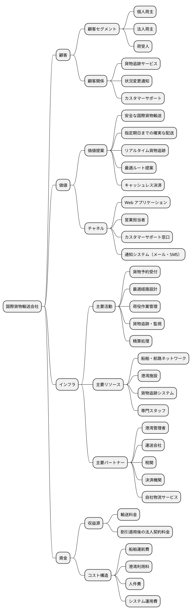
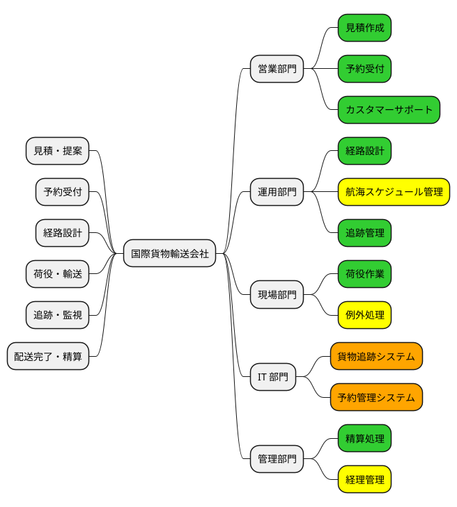
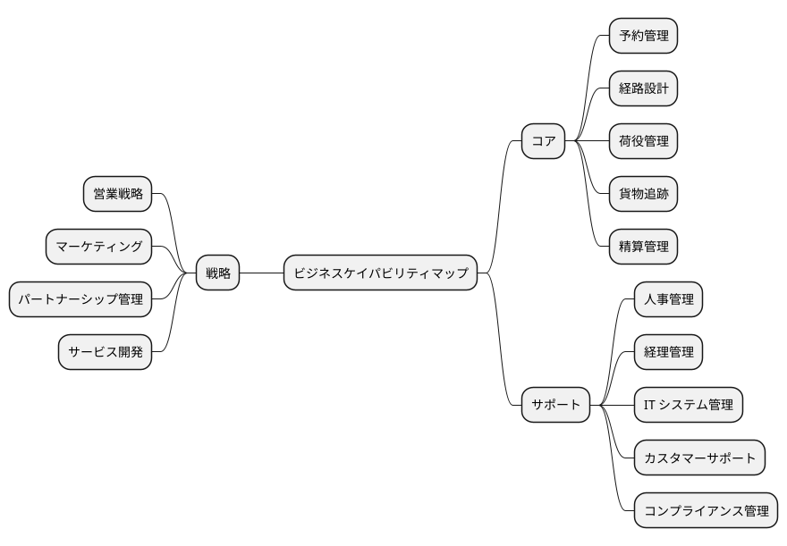
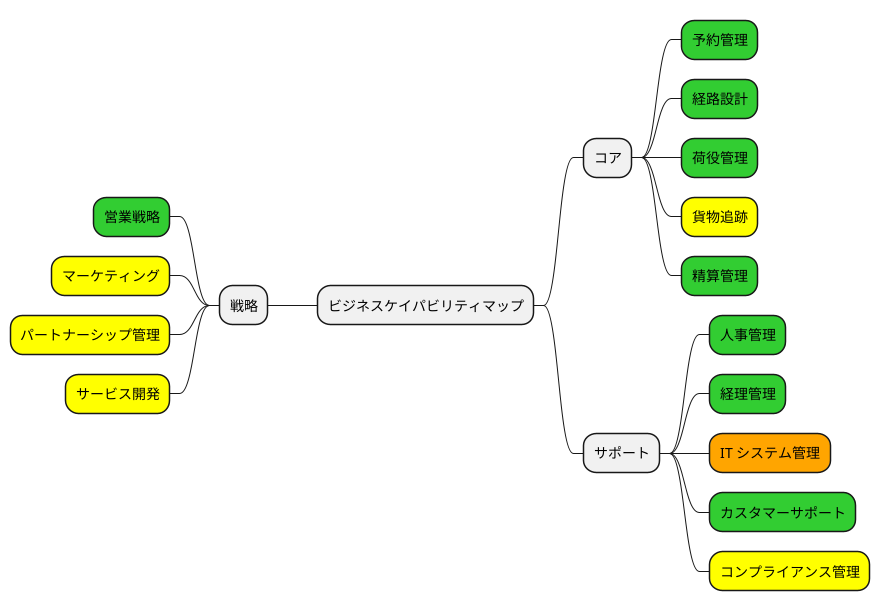
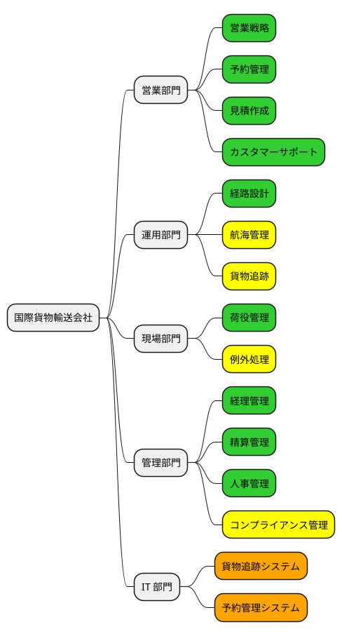
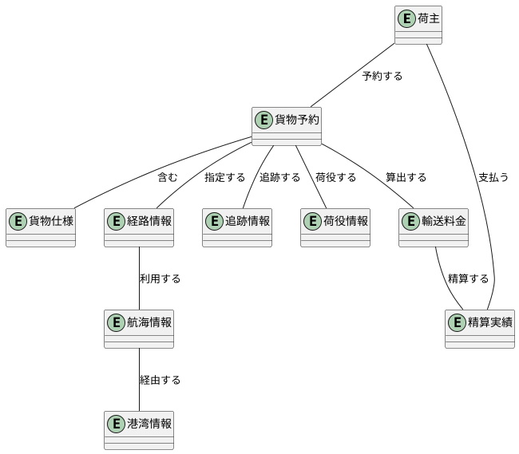
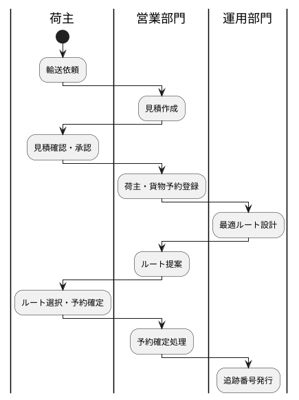
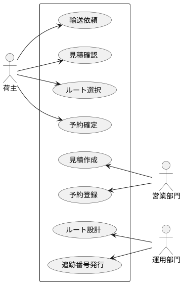
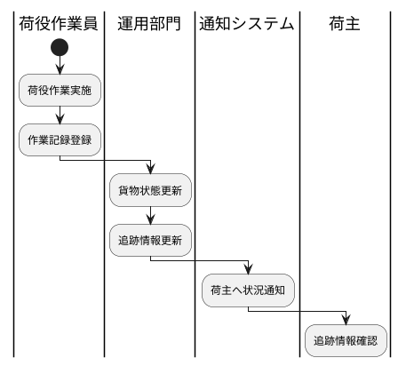
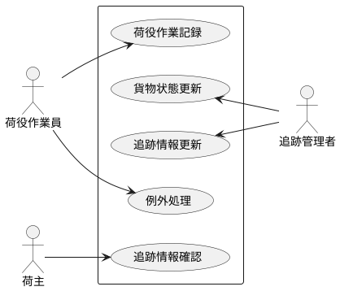

# ビジネスアーキテクチャ - 国際貨物輸送会社

## プリンシプル

### ガイディングプリンシプル

| カテゴリ | プリンシプル | 説明 |
| :--- | :--- | :--- |
| ビジネスアーキテクチャ | 顧客中心の価値提供 | すべてのビジネスプロセスは荷主・荷受人への価値提供を起点に設計する |
| アプリケーションアーキテクチャ | ドメイン駆動設計 | 境界付けられたコンテキストに基づきシステムを分割し、ビジネスドメインの変化に追従できる構造を維持する |
| データアーキテクチャ | データの一貫性と追跡可能性 | 貨物の状態・位置・履歴を一貫して追跡可能にし、透明性を確保する |
| テクノロジーアーキテクチャ | 標準準拠と相互運用性 | UN/LOCODE 等の国際標準に準拠し、港湾・税関・運送会社等の外部システムとの連携を容易にする |

### ビジネスプリンシプル

| # | プリンシプル | 説明 | 根拠 |
| :--- | :--- | :--- | :--- |
| 1 | 輸送の安全性と期日遵守 | 貨物を安全に指定期日までに届けることを最優先とする | 荷主の最も基本的な要求であり、信頼の基盤 |
| 2 | 輸送状況の透明性 | 貨物の現在位置・状態をリアルタイムで可視化する | 荷主の不安を解消し、業務判断を支援する |
| 3 | 業務の効率性と正確性 | 予約・経路設計・荷役・追跡の各業務を効率的かつ正確に処理する | 運用コスト削減と顧客満足度向上の両立 |
| 4 | 例外への迅速な対応 | 遅延・破損・紛失等の例外発生時に迅速かつ適切に対応する | 例外対応の品質がサービス全体の信頼性を左右する |

## ビジネスモデル

### ビジネスモデルキャンバス

## バリューストリーム

### バリューストリームマップ

### バリューストリーム詳細

| ステージ | 説明 | 提供価値 | 関連ケイパビリティ |
| :--- | :--- | :--- | :--- |
| 見積・提案 | 荷主の輸送要件を確認し、ルートと料金を提案する | 輸送ルートと費用の事前確認 | 見積作成、カスタマーサポート |
| 予約受付 | 荷主情報と貨物仕様を登録し、予約を確定する | 効率的な予約処理 | 予約受付、予約管理システム |
| 経路設計 | 最適な輸送経路を設計し、航海スケジュールに組み込む | 最適ルートによる効率的輸送 | 経路設計、航海スケジュール管理 |
| 荷役・輸送 | 積込・荷降し等の荷役作業を実施し、貨物を輸送する | 安全な貨物取扱い | 荷役作業、例外処理 |
| 追跡・監視 | 貨物の位置と状態をリアルタイムで追跡・監視する | リアルタイム追跡による透明性 | 追跡管理、貨物追跡システム |
| 配送完了・精算 | 貨物を荷受人に引き渡し、輸送料金を精算する | 確実な配送と正確な精算 | 精算処理、経理管理 |

## ビジネスケイパビリティ

### ビジネスケイパビリティマップ

### ヒートマッピング

- グリーン：成熟度高
- イエロー：成熟度中
- レッド：成熟度低
- オレンジ：新規に必要

### ケイパビリティ階層化

| レベル | ケイパビリティ | 分類 | 成熟度 | 説明 |
| :--- | :--- | :--- | :--- | :--- |
| L1 | 予約管理 | コア | 高 | 貨物予約の受付・確定・変更・キャンセルを管理する |
| L2 | 荷主登録 | コア | 高 | 個人・法人荷主の情報を登録・管理する |
| L2 | 貨物仕様管理 | コア | 高 | 貨物種別（一般・危険物・冷凍）と仕様を管理する |
| L2 | 見積作成 | コア | 高 | 輸送料金の見積りを作成する |
| L1 | 経路設計 | コア | 高 | 最適な輸送経路と航海スケジュールを設計する |
| L2 | 航海管理 | コア | 中 | 航海番号・スケジュール・運送会社移動を管理する |
| L2 | ルート最適化 | コア | 高 | 出発地・目的地・期限から最適ルートを算出する |
| L1 | 荷役管理 | コア | 高 | 積込・荷降し・受領・引取等の荷役作業を管理する |
| L2 | 作業記録 | コア | 高 | 荷役作業の実施記録を管理する |
| L2 | 例外処理 | コア | 中 | 破損・紛失・遅延等の例外を処理する |
| L1 | 貨物追跡 | コア | 中 | 貨物の位置と状態をリアルタイムで追跡する |
| L2 | 位置情報管理 | コア | 中 | 貨物の現在位置を UN/LOCODE 基準で管理する |
| L2 | 状態通知 | コア | 中 | 輸送状況の変更を荷主に通知する |
| L1 | 精算管理 | コア | 高 | 輸送料金の精算・割引適用を管理する |
| L1 | IT システム管理 | サポート | 新規 | 貨物追跡・予約管理等の情報システムを構築・運用する |

## 組織マップ

## 情報マップ

## ビジネスシナリオ

### 貨物輸送予約シナリオ

#### 問題の定義

| 項目 | 内容 |
| :--- | :--- |
| 問題 | 荷主が貨物を国際輸送したいが、最適なルート選定と予約手続きが煩雑である |
| 環境 | 複数の航路・港湾・運送会社が存在し、貨物種別（一般・危険物・冷凍）によって取扱いが異なる |
| ゴール | 荷主が出発地・目的地・期限を指定するだけで最適ルートが提案され、簡単に予約できること |

#### アクティビティ図

#### ユースケース図

#### アクター一覧

| 種別 | アクター | 役割 |
| :--- | :--- | :--- |
| ヒューマン | 荷主 | 貨物の輸送を依頼し、見積確認・ルート選択・予約確定を行う |
| ヒューマン | 営業担当者 | 見積作成、荷主・貨物予約の登録、ルート提案を行う |
| ヒューマン | 経路設計者 | 最適な輸送経路を設計し、航海スケジュールに組み込む |
| ヒューマン | 追跡管理者 | 追跡番号を発行し、貨物の追跡・監視を行う |
| コンピュータ | 外部経路システム | ルート候補の算出を支援する |
| コンピュータ | 通知システム | 荷主への状況通知を送信する |

### 荷役・追跡シナリオ

#### 問題の定義

| 項目 | 内容 |
| :--- | :--- |
| 問題 | 荷役作業の記録が手動で行われており、貨物状態の更新にタイムラグが生じている |
| 環境 | 複数の港湾で荷役作業が並行して行われ、破損・紛失等の例外も発生する |
| ゴール | 荷役作業をリアルタイムで記録し、貨物追跡情報が即座に更新されること |

#### アクティビティ図

#### ユースケース図

#### アクター一覧

| 種別 | アクター | 役割 |
| :--- | :--- | :--- |
| ヒューマン | 荷役作業員 | 積込・荷降し・受領・引取等の荷役作業を実施し記録する |
| ヒューマン | 追跡管理者 | 貨物状態と追跡情報を更新・管理する |
| ヒューマン | 荷主 | 貨物の追跡情報を確認する |
| コンピュータ | 港湾管理システム | 港湾施設の利用状況を提供する |
| コンピュータ | 通知システム | 荷主への状況変更通知を送信する |
